> 主要参考视频教程：https://www.bilibili.com/video/BV1nV4y1s7ZN/?spm_id_from=333.337.search-card.all.click
>
> Mybatis4个小时教程: https://www.bilibili.com/video/BV1V7411w7VW?p=2&spm_id_from=pageDriver&vd_source=690aa90dd9d490b6ec1acc1b83e239ff 

# 0. 问题记录

## 0.1 找不到org.springframework.boot 插件

解决办法：安装maven helper 插件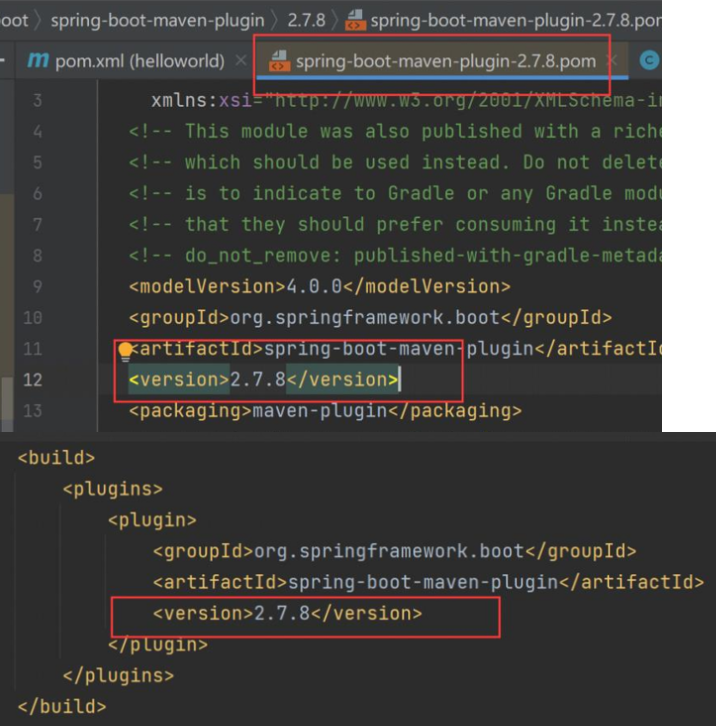z

进入插件配置文件，复制版本号，并添加在pom.xml全局配置文件中

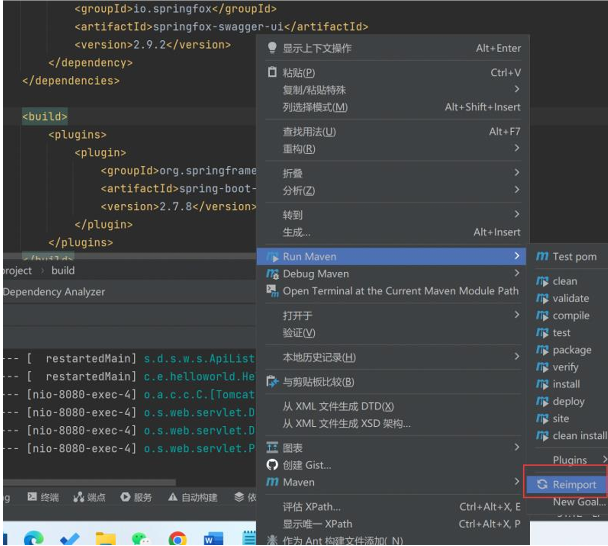


## 0.2. META-INF目录作用

```
开发中可以直接使用java class文件来运行程序，不过这样不太方便，所以出现了jar文件来提供发布和运行，jar文件实际上是class文件的zip压缩存档，有很多工具都可以操纵这种格式的文件，所以jar文件本身并不能表达应用程序的便签信息。
```
```
为了提供存档的便签信息，出现了Manifest.mf文件，jar文件中有一个特定的目录来存放标签信息：META-INF目录，主要应关注其中一个名叫manifest.mf的文件，它包含了jar文件的内容描述，在应用程序运行时向JVM提供应用程序的信息。
```

# 1.课程内容概述与环境准备

- Java EE企业级框架：SpringBoot+MyBatisPlus
- Web前端核心框架 ：Vue+ElementUI
- 公共云部署：前后端项目集成打包与部署

## 1.1 学习目标

- 掌握JavaEE企业级开发框架的使用，能够利用SpringBoot开发Web应用。
- 掌握Web前端开发框架Vue的使用，能够完成前后端分离开发。
- 掌握云端环境的配置与使用，能够完成前后端程序的打包部署。

## 1.2  Web技术基础

### 1.2.1服务器架构模式

- BS:(Browser/Server,浏览器/服务器架构模式)。
- CS:(Client/Server,客户端/服务器架构模式)。


- 架构对比
  - C/S架构主要特点是交互性强，具有安全访问模式，网络流量低，响应速度快因为客户端负责大多数业务逻辑和UI演示，所以也被称为胖客户端，C/S结构的软件需要针对不同的操作系统开发不同版本的软件。
  - 随着互联网的兴起，CS架构不适合Web，最大的原因是Web应用程序的修改和升级非常迅速，而CS架构需要每个客户端逐个升级桌面App，因此，Browser/Server模式开始流行，简称BS架构。
  - B/S架构的主要特点是分散性高、维护方便、开发简单、共享性高、总拥有成本低。

### 1.2.2 BS 架构原理

在BS架构下，客户端只需要浏览器，应用程序的逻辑和数据都存储在服务器端。浏览器只需要请求服务器，获取Web页面，并把Web页面展示给用户即可。

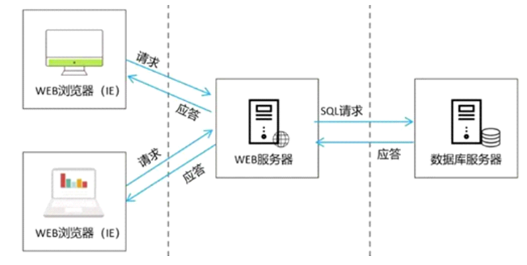

## 1.3  Java环境配置

https://www.oracle.com/java/technologies/downloads/#java8-windows

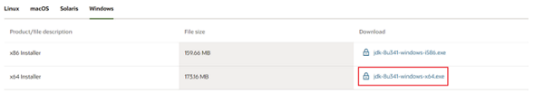

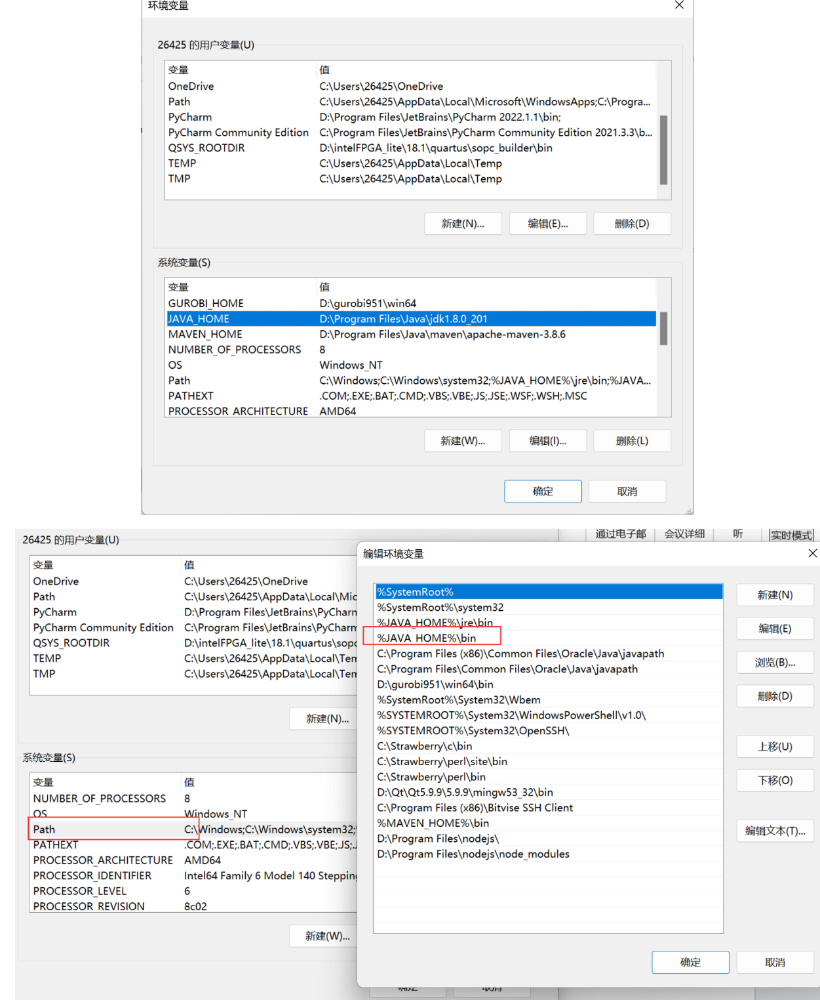

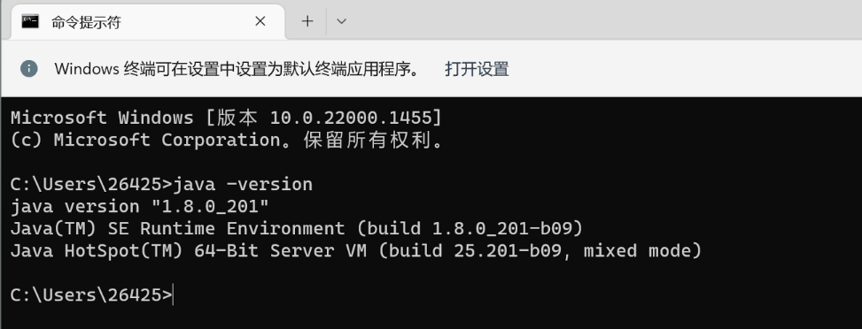

## 1.4 IDEA开发环境

https://www.jetbrains.com/idea/download/#section=windows

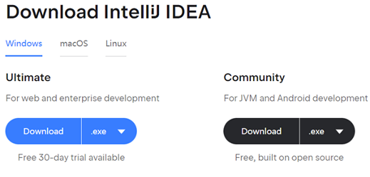

## 1.5 Maven项目管理工具

- Maven 是一个项目管理工具，可以对Java 项目进行自动化的构建（编译、运行、打包）和依赖管理（链接数据库需要下载驱动、解析Excel工具等依赖别人的框架，需要下载对应的jar包）
- pom.xml记录了本项目需要的所有依赖及其仓库地址还有版本号，maven就是依靠这个核心的pom.xml文件实现自动化构建和依赖管理
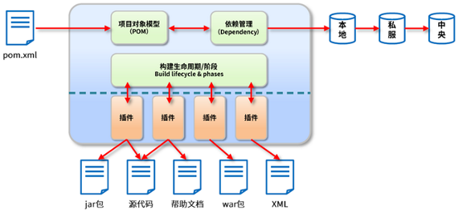
### 1.5.1 Maven的作用
- 项目构建：提供标准的，跨平台的自动化构建项目的方式
- 依赖管理：方便快捷的管理项目依赖的资源（jar包），避免资源间的版本冲突等问题
- 统一开发结构：提供标准的，统一的项目开发结构，如下图所示


### 1.5.2 Maven的配置

- 官方下载地址：http://maven.apache.org/download.cgi

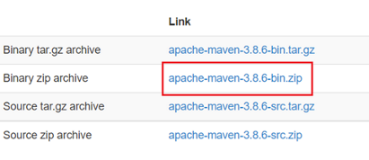

- 将压缩包直接到任意目录（注意不要使用中文路径）

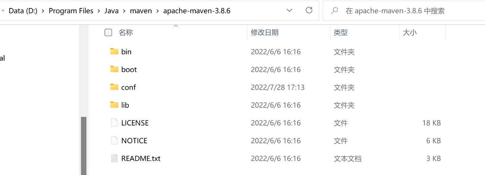

- [Maven的安装配置及其在IDEA上的配置:本地仓库配置+远程仓库配置+与IDEA集成](https://blog.csdn.net/weixin_42460596/article/details/109479342)

- 在IDEA安装Maven Helper插件

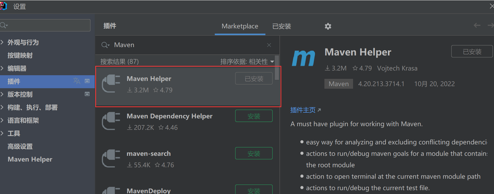


### 1.5.3 Maven仓库

运行Maven 的时候，Maven 所需要的任何构件都是直接从本地仓库获取的。如果本地仓库没有，它会首先尝试从远程仓库下载构件至本地仓库
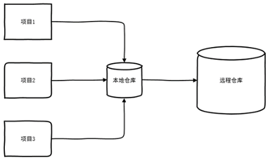

# 2. SpringBoot快速上手

**本节内容**
- 第一节SpringBoot介绍
- 第二节 快速创建SpringBoot应用
- 第三节 开发环境热部署
- 第四节 系统配置


## 2.1 SpringBoot介绍
- Spring Boot是由Pivotal团队提供的基于Spring的全新框架，旨在简化Spring应用的初始搭建和开发过程。
- Spring Boot是所有基于Spring开发项目的起点。
- Spring Boot就是尽可能地简化应用开发的门槛，让应用开发、测试、部署变得更加简单。

### 2.1.1 SpringBoot特点

- 遵循“约定优于配置”的原则，只需要很少的配置或使用默认的配置。
- 能够使用内嵌的Tomcat、Jetty服务器，不需要部署war文件。（浏览器需要向Web服务器发送请求，Tomcat就是一个Web服务器它上面运行的程序只能是war程序）
- 提供定制化的启动器Starters，简化Maven配置，开箱即用。
- 纯Java配置，没有代码生成，也不需要XML配置。
- 提供了生产级的服务监控方案，如安全监控、应用监控、健康检测等。
## 2.2 快速创建SpringBoot应用
### 2.2.1 利用IDEA提供的Spring Initializr创建SpringBoot应用

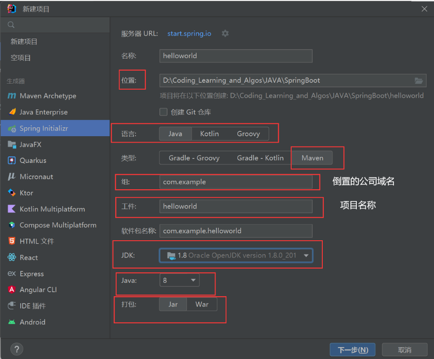

**pom.xml:**

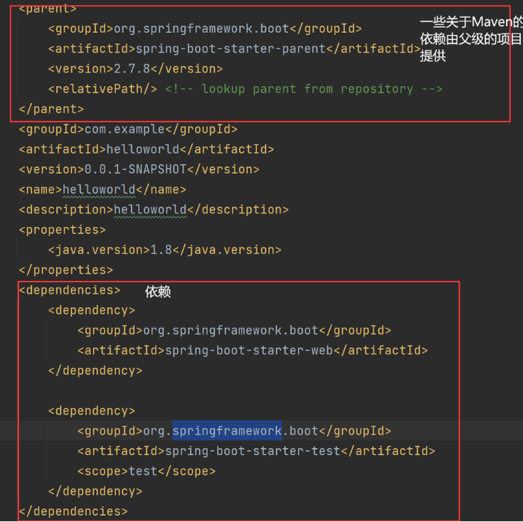

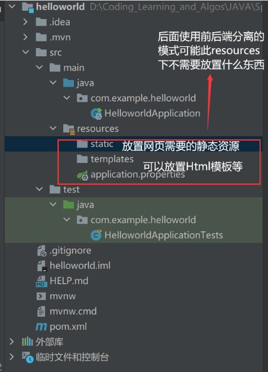


### 2.2.2 第一个helloworld程序

- 创建子目录controller: 后端项目需要接收浏览器的请求，使用控制器controller组件来接收浏览器请求

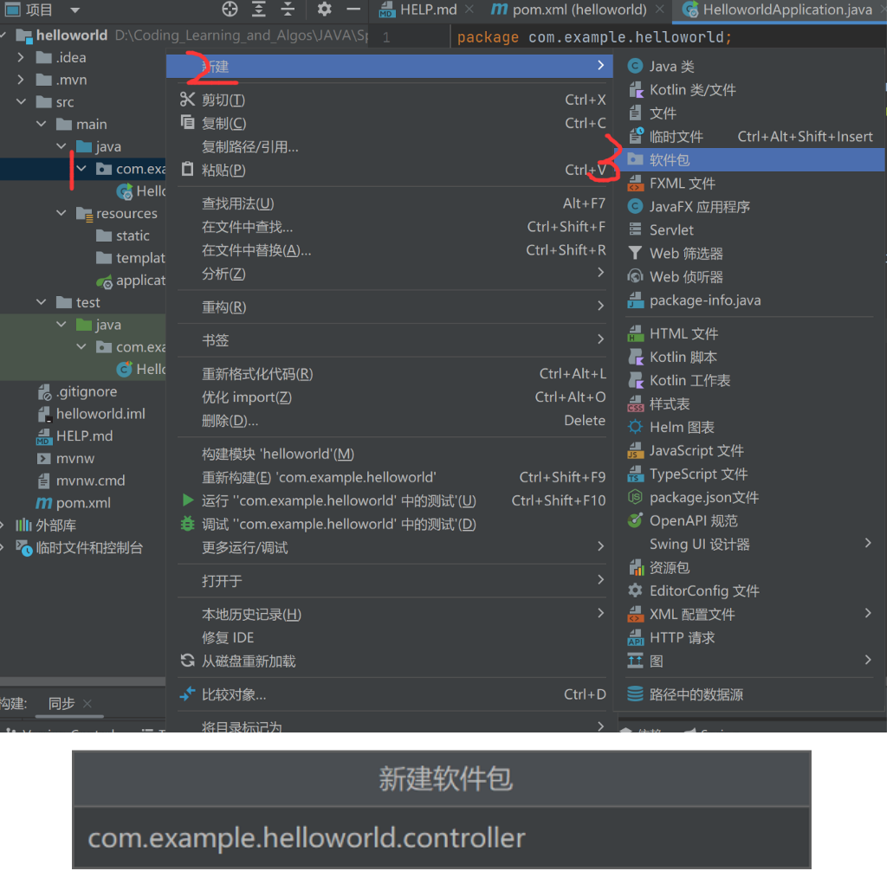

- 在目录controller中，创建HelloController.java文件

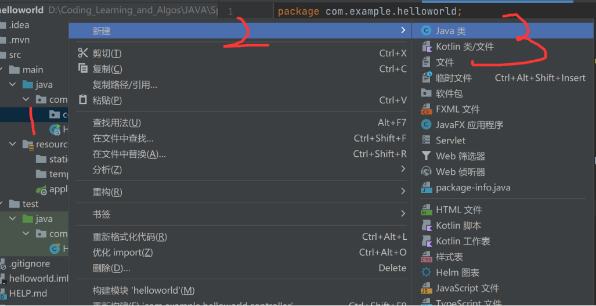

```java
import org.springframework.web.bind.annotation.GetMapping;
import org.springframework.web.bind.annotation.RestController;

// 添加 @RestController注解 使得普通类变成控制器
@RestController
public class HelloController {
    /*
     http://www.baidu.com/path
     协议+域名+路径
     /hello 就是路径
     使用GetMapping 注解：浏览器可以发送HTTP中的Get请求来访问此方法
     本地访问时默认使用 http://localhost:8080/hello
     */
    @GetMapping("/hello")
    public String hello(){
        return "你好，wwz!";
    }
}
```
-  启动项目，在浏览器窗口中输`http://localhost:8080/hello`

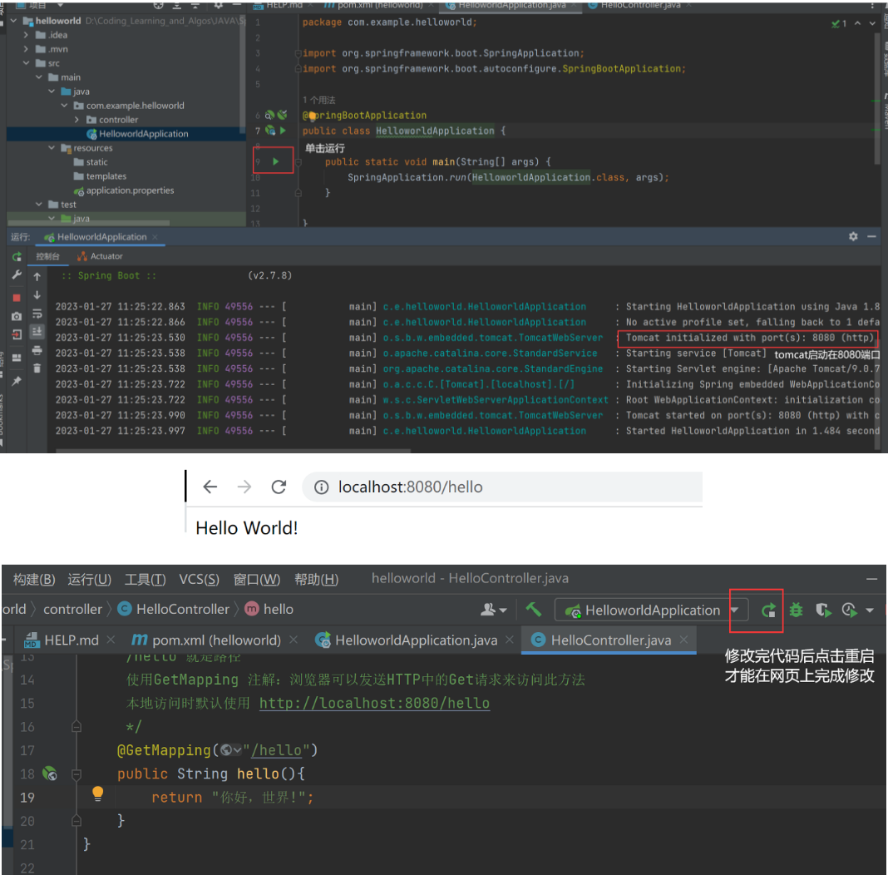

### 2.2.3 开发环境的热部署
- 在实际的项目开发调试过程中会频繁地修改后台类文件，导致需要重新编译、重新启动，整个过程非常麻烦，影响开发效率。
- Spring Boot提供了spring-boot-devtools组件，使得无须手动重启Spring Boot应用即可重新编译、启动项目，大大缩短编译启动的时间。
- devtools会监听classpath下的文件变动，触发Restart类加载器重新加载该类，从而实现类文件和属性文件的热部署。
- 并不是所有的更改都需要重启应用（如静态资源、视图模板），可以通过设置spring.devtools.restart.exclude属性来指定一些文件或目录的修改不用重启应用

**具体配置步骤**

- （ 1 ）在pom.xml配置文件中添加`dev-tools`依赖。
- （ 2 ）使用`optional=true`表示依赖不会传递，即该项目依赖devtools；其他项目如果引入此项目生成的JAR包，则不会包含devtools

```java
<!--添加热部署相关依赖devtools -->
<dependency>
<groupId>org.springframework.boot</groupId>
<artifactId>spring-boot-devtools</artifactId>
<optional>true</optional>
</dependency>
```

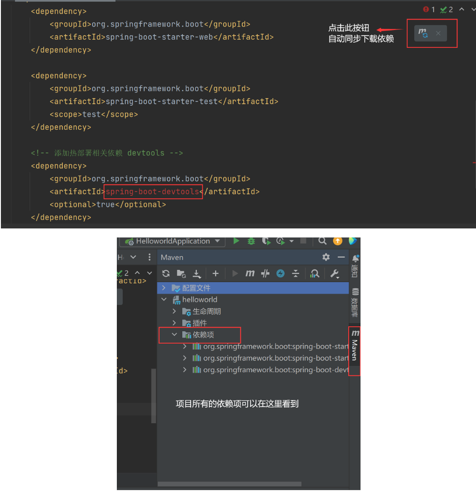

- （ 3 ）在application.properties文件中配置devtools 设置属性文件的编码格式为utf- 8

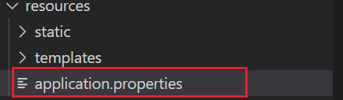

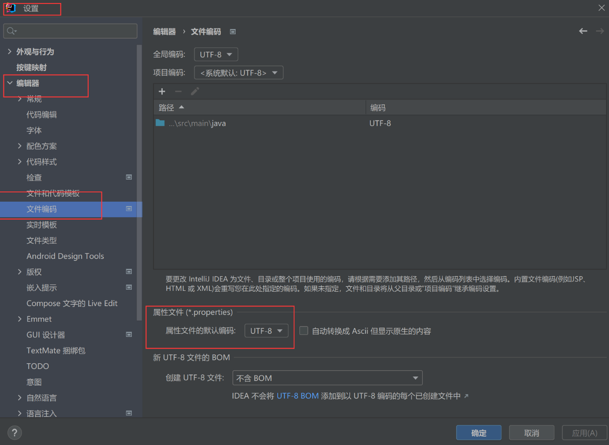

``` java
# 热部署生效
spring.devtools.restart.enabled=true
# 设置重启目录，即devtools默认监听该classpath下的文件变动
spring.devtools.restart.additional-paths=src/main/java
# 设置该classpath目录下的WEB-INF（静态文件存储目录）下的文件修改不重启
spring.devtools.restart.exclude=static
```
-  （ 4 ）如果使用了Eclipse，那么在修改完代码并保存之后，项目将自动编译并触发重启，而如果使用了IntelliJ IDEA，还需要配置项目自动编译。
- （ 5 ）打开Settings页面，在左边的菜单栏依次找到`Build,Execution,Deployment→Compile`，勾选`Build project automatically`

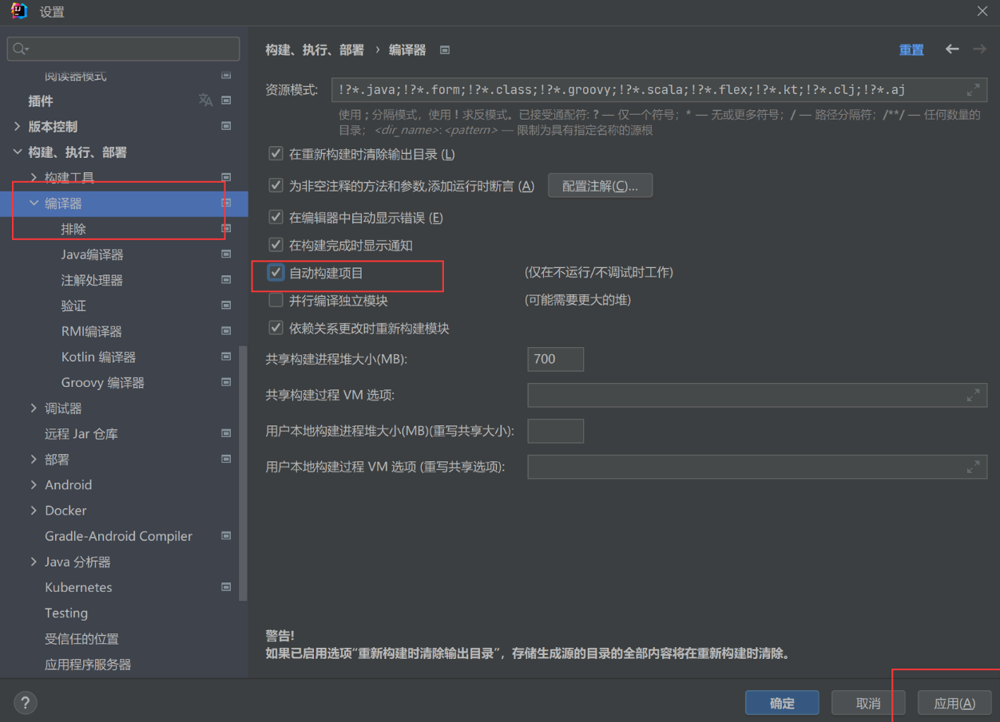

-  （ 6 ）按Ctrl+Shift+Alt+/快捷键调出`Maintenance`页面，单击`Registry`，勾选`compiler.automake.allow.when.app.running`复选框。

如果没有compiler.automake.allow.when.app.running选项则在此处设置：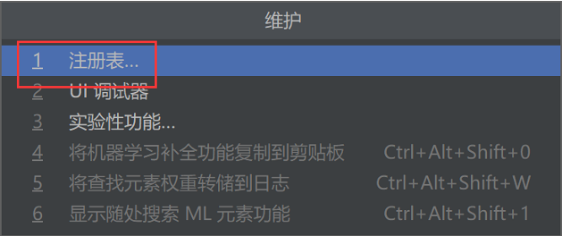

- （ 7 ）做完这两步配置之后，若开发者再次在IntelliJ IDEA中修改代码，则项目会自动重启

### 2.2.4 使用`application.properties`继续全局系统配置
项目创建成功后会默认在resources目录下生成application.properties文件。该文件包含Spring Boot项目的全局配置。配置格式如下：
```java
# 服务器端口配置
server.port= 8080
```

# 3. Web开发基础
**本节内容**
- 第一节Web入门
- 第二节 路由映射
- 第三节 参数传递
- 第四节 数据响应

## 3.1 Web入门
### 3.1.1 简介
- Spring Boot将传统Web开发的mvc、json、tomcat等框架整合，提供了spring-boot-starter-web组件，简化了Web应用配置。
- 创建SpringBoot项目勾选Spring Web选项后，会自动将spring-boot-starter-web组件加入到项目中。
- spring-boot-starter-web启动器主要包括web、webmvc、json、tomcat等基础依赖组件，作用是提供Web开发场景所需的所有底层依赖。
- webmvc为Web开发的基础框架，json为JSON数据解析组件，tomcat为自带的容器依赖。
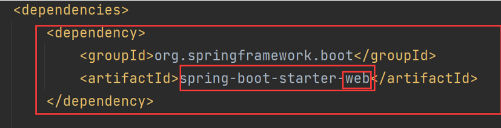
### 3.1.2 控制器controller

- Spring Boot提供了@Controller和@RestController两种注解来标识此类负责接收和处理HTTP请求。
- 如果请求的是页面和数据，使用@Controller注解即可；如果只是请求数据，则可以使用@RestController注解。
- MVC模式：M模型用于封装数据；Controller控制器用于继续协调和控制；View显示数据；
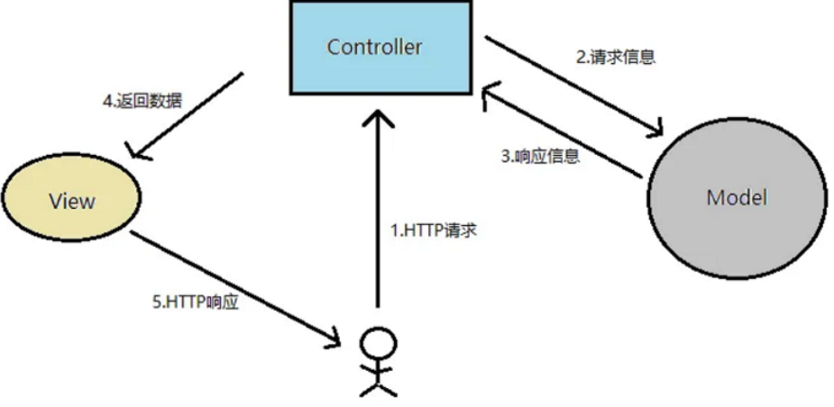
**在前后端分离的项目中，通常不使用@Controller注解，而是使用@RestController，RestController注解的类只返回数据, 不涉及到页面的处理，因而适合前后端分离的项目**

#### 3.1.2.1 @Controller 的用法
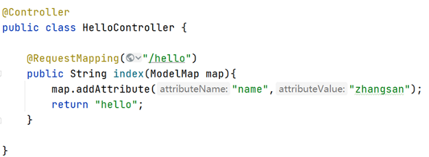
示例中返回了hello页面(hello.html)和name的数据，在前端页面中可以通过${name}参数获取后台返回的数据并显示。`@Controller`通常与`Thymeleaf`模板引擎结合使用。

#### 3.1.2.2 @RestController 用法

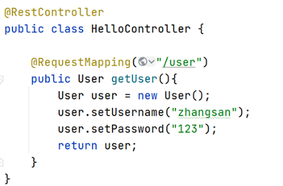

- 默认情况下，`@RestController`注解会将返回的 **对象数据转换为JSON格式**


## 3.2 路由映射：使得控制器可以接收前端请求

### 3.2.1 基础概念
- [@RequestMapping 注解使用技巧（完整详解）-CSDN博客](https://blog.csdn.net/demo_yo/article/details/123608034)
- `@RequestMapping`注解主要负责URL的路由映射。它可以添加在`Controlle`r类或者具体的方法上。
- 如果添加在`Controller`类上，则这个`Controller`中的所有路由映射都将会加上此映射规则，如果添加在方法上，则只对当前方法生效
- `@RequestMapping`注解包含很多属性参数来定义HTTP的请求映射规则。常用的属性参数如下：
  - `value`: 请求URL的路径，支持URL模板、正则表达式
  - `method`: HTTP请求方法
  - `consumes`: 请求的媒体类型（Content-Type），如`application/json`
  - `produces`: 响应的媒体类型
  - `params，headers`: 请求的参数及请求头的值
- `@RequestMapping`的value属性用于匹配URL映射，value支持简单表达式:`@RequestMapping("/user")`
- `@RequestMapping`支持使用通配符匹配URL，用于统一映射某些URL规则类似的请求：
  - `@RequestMapping("/getJson/*.json")`，当在浏览器中请求/getJson/a.json或者/getJson/b.json时都会匹配到后台的Json方法
  - `@RequestMapping`的通配符匹配非常简单实用，支持`*、?、**`等通配符: 符号`*`匹配任意字符，符号`**`匹配任意路径，符号`?`匹配单个字符
  - 有通配符的优先级低于没有通配符的，比如`/user/add.json`比/`user/*.json`优先匹配, 有`**`通配符的优先级低于有`*`通配符的
### 3.2.2 Method 匹配

- HTTP请求Method有`GET、POST、PUT、DELETE`等方式。HTTP支持的全部Method
- `@RequestMapping`注解提供了method参数指定请求的Method类型，包括:`RequestMethod.GET、RequestMethod.POST、RequestMethod.DELETE、RequestMethod.PUT`等值，分别对应HTTP请求的`Method`


- Method匹配也可以使用`@GetMapping、@PostMapping`等注解代替

## 3.3 参数传递：通过URL传递用户昵称等信息
>举例：http://localhost:8080/hello?nickname=wwz
>怎么获得wwz这个信息?
- `@RequestParam`将请求参数绑定到控制器的方法参数上，接收的参数来自HTTP请求体或请求url的`QueryString`，当请求的参数名称与Controller的业务方法参数名称一致时,`@RequestParam`可以省略
- `@PathVaraible`：用来处理动态的URL，URL的值可以作为控制器中处理方法的参数
- `@RequestBody`接收的参数是来自requestBody中，即请求体。一般用于处理非` Content-Type: application/x-www-form-urlencoded`编码格式的数据，比如：`application/json、application/xml`

### 3.3.1 代码实现
- 创建一个新的名为ParamsController的控制器类以及在entity目录下创建User类

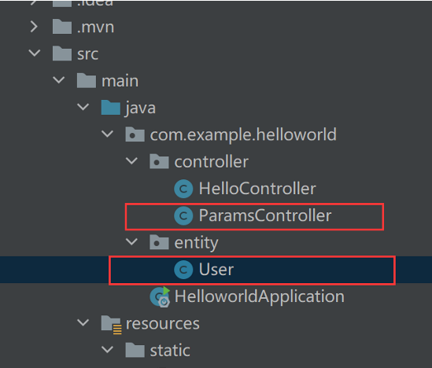

  - `User`类文件的代码：
```java
package com.example.helloworld.entity;

public class User {
    private String username;
    private String password;

    public String getUsername() {
        return username;
    }

    public void setUsername(String username) {
        this.username = username;
    }

    public String getPassword() {
        return password;
    }

    public void setPassword(String password) {
        this.password = password;
    }

    @Override
    public String toString() {
        return "User{" +
                "username='" + username + '\'' +
                ", password='" + password + '\'' +
                '}';
    }
}
```
  - `ParamsController.java `文件代码：
```java
// ParamsController.java 文件
package com.example.helloworld.controller;

import com.example.helloworld.entity.User;
import org.springframework.web.bind.annotation.*;

@RestController
public class ParamsController {

    @RequestMapping(value = "/getTest1",method = RequestMethod.GET)
    public String getTest1(){
        return "getTest1请求";
    }

    @RequestMapping(value = "/getTest2",method = RequestMethod.GET)
    // http://localhost:8080/getTest2?nickname=xxx&phone=xxx
    // 获得url中传递的参数
    public String getTest2(String nickname,String phone){
        return "getTest2" + " nickname:" + nickname + " phone:" + phone;
    }

    @RequestMapping(value = "/getTest3",method = RequestMethod.GET)
    //  http://localhost:8080/getTest2?nickname=xxx
    // 当url中的nickname 与 函数参数 name 不一致时必须使用 @RequestParam() 注解显示说明
    // required = true 意味着 nickname 这个参数必须在url中传递
    public String getTest3(@RequestParam(value = "nickname",required = false) String name){
        return "getTest3" + " nickname:" + name;
    }

    // 直接在网页上输入url默认是get请求，想要测试post请求需要api测试工具
    // 下载 ApiPost 可用于调试所有请求类型
    @RequestMapping(value = "/postTest1",method = RequestMethod.POST)
    public String postTest1(){
        return "POST请求";
    }

    // Post请求传参可以在url上传参，也可以把参数写在Body（消息体里
    @RequestMapping(value = "/postTest2",method = RequestMethod.POST)
    public String postTest2(String username,String password){
        return "postTest2" + " username:" + username + " password:" + password;
    }

    // 当有很多个参数需要传递时，可以编写一个类，面向对象的编程
    // 必须要确保User类里属性的名称和前端传递的属性名称一致，那么框架就会自动把参数封装到对象中去
    @RequestMapping(value = "/postTest3",method = RequestMethod.POST)
    public String postTest3(User user){
        return "postTest3" + " username:" + user.getUsername() + " password:" + user.getPassword();
    }

    //前端传递的数据类型不是 application/x-www-form-urlencoded 类型
    //使用json类型传递参数时，必须加 @RequestBody 注解
    @RequestMapping(value = "/postTest4",method = RequestMethod.POST)
    public String postTest4(@RequestBody User user){
        return "postTest4" + " username:" + user.getUsername() + " password:" + user.getPassword();
    }

    @GetMapping("/test/*")
    public String test(){
        return "通配符请求";
    }
}
```
## 3.4 Postman 工具测试
### 3.4.1 getTest2测试

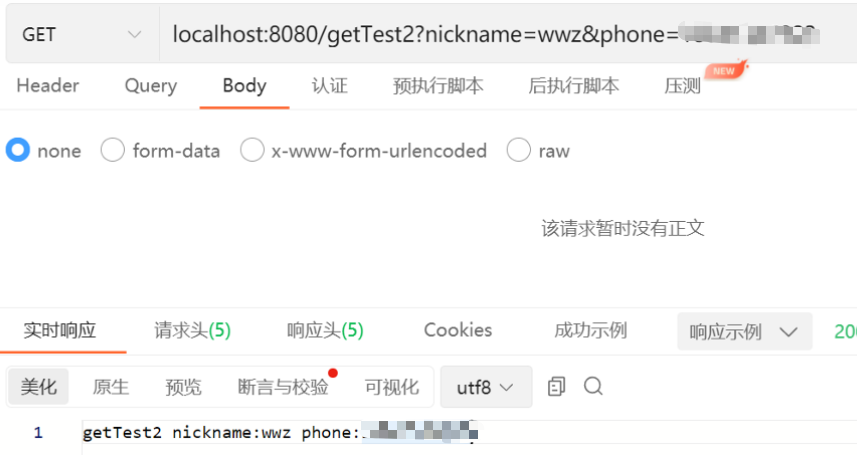

### 3.4.2 getTest3测试

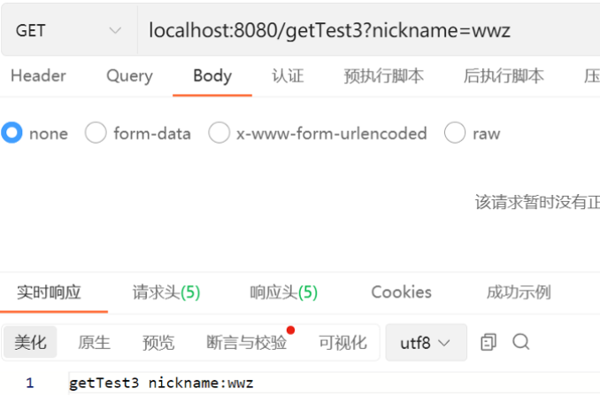

### 3.4.3 postTest1测试

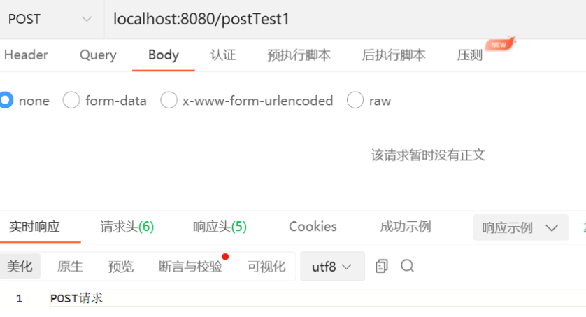

### 3.4.4 postTest2测试

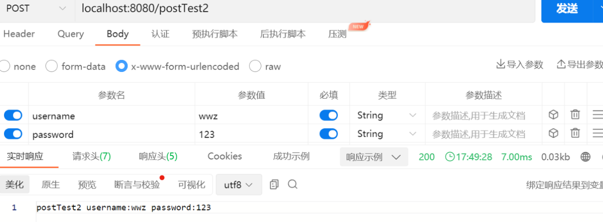

### 3.4.5 postTest3测试

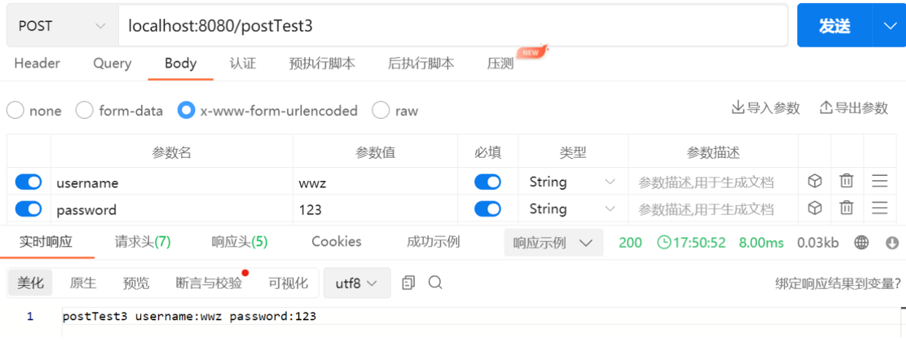

### 3.4.6 postTest4测试

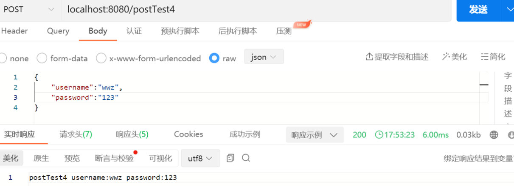

### 3.4.7 通配符测试

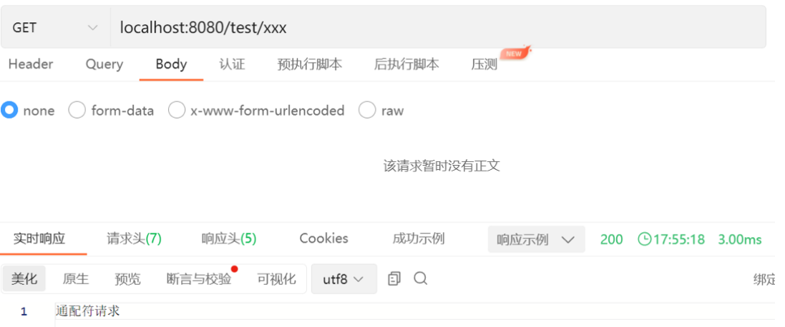


# 4. Web开发进阶
**本节内容**
- 第一节 静态资源访问
- 第二节 文件上传
- 第三节 拦截器
# 4.1. 静态资源访问
- 使用IDEA创建Spring Boot项目，会默认创建出`classpath:/static/`目录，静态资源(网站上的图片，CSS样式等)一般放在这个目录下即可。（前后端分离的项目，此目录是没有文件）
- 如果默认的静态资源过滤策略不能满足开发需求，也可以自定义静态资源过滤策略。在`application.properties`中直接定义过滤规则和静态资源位置：

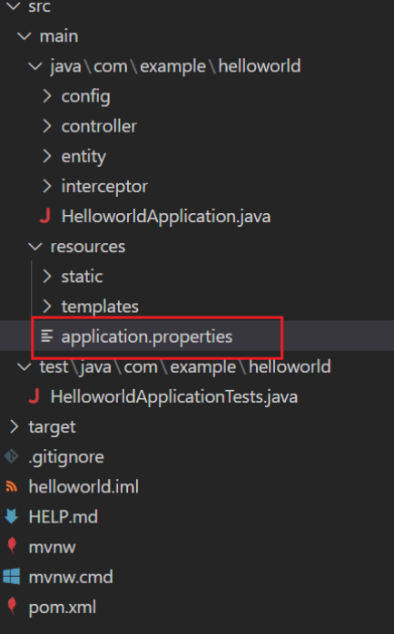

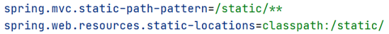

- 过滤规则为`/static/**`，静态资源位置为`classpath:/static/`

```java
# static目录下的文件默认做了全局路径的映射，就是说可以直接访问，不需要
http://localhost:8080/static/test.jpg 这样来访问
# 当没有配置虚拟访问路径时，可以直接在网页上输入 http://localhost:8080/static目录下静态资源的文件名 即可访问该文件
# 例如可以 直接输入 http://localhost:8080/test.jpg
# 设置静态资源的虚拟访问路径 默认为 /**
# 设置为/images/** 就意味着 访问静态文件时必须加上这个前缀了：
http://localhost:8080/images/test.jpg
spring.mvc.static-path-pattern=/images/**
# 如果不想使用默认创建的static目录，则需要使用以下代码 设置 静态资源的目录
# classpath就是类路径，具体是helloworld/target/classes 该目录下存储了经过编译后生成的字节码.class 文件和静态资源目录spring.web.resources.static-locations=classpath:/static/
```

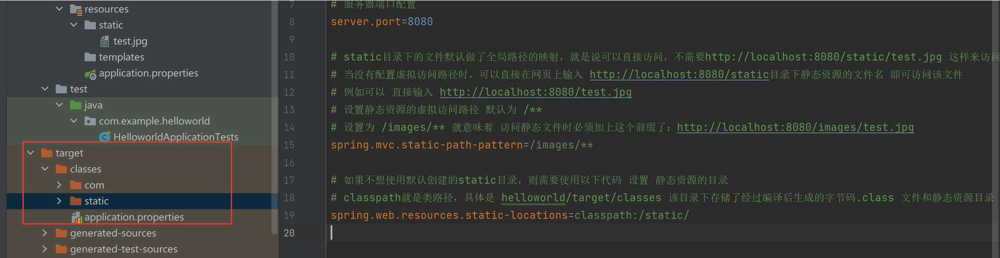

## 4.2 文件上传

- 当需要前端上传文件，例如excel文件和图片等时需要用到文件上传功能
- 表单的enctype 属性规定在发送到服务器之前应该如何对表单数据进行编码。
- 当表单的`enctype="application/x-www-form-urlencoded"`（默认）时，`form`表单中的数据格式为：`key=value&key=value`
- 当表单的`enctype="multipart/form-data"`时，其传输数据形式如下:


### 4.2.1 SpirngBoot实现文件上传功能：将用户上传的文件存储到Web服务器的本地
- HTML 表单用于收集用户的输入信息。HTML 表单表示文档中的一个区域，此区域包含交互控件，将用户收集到的信息发送到Web 服务器。表单数据以`<form>`开头例如：
```java
# 以下实例创建了一个表单，包含一个普通输入框和一个密码输入框：
<form action="">
Username: <input type="text" name="user"><br>
Password: <input type="password" name="password">
</form>
```
-  Spring Boot工程嵌入的`tomcat`限制了请求的文件大小，每个文件的配置最大为`1Mb`，单次请求的文件的总数不能大于`10Mb`。(一次HTTP请求可以传递很多文件)
-  要更改这个默认值需要在配置文件（如application.properties）中加入两个配置
```java
# 设置HTTP的单次POST请求附带上传的总文件大小
spring.servlet.multipart.max-request-size=10 MB
# 设置HTTP的单次POST请求附带上传的单个文件的大小
spring.servlet.multipart.max-file-size=10MB
```
-  当表单的`enctype="multipart/form-data"`时,可以使用`MultipartFile`获取上传的文件数据，再通过`transferTo`方法将其写入到磁盘中


### 4.2.2 文件上传功能的代码实现

- 新建FileUploadControlle.java文件

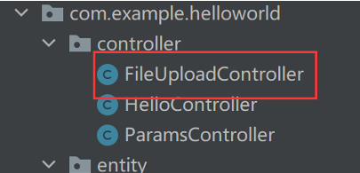

```java
//FileUploadControlle.java  
package com.example.helloworld.controller;

import org.springframework.web.bind.annotation.*;
import org.springframework.web.multipart.MultipartFile;

import javax.servlet.http.HttpServletRequest;
import java.io.File;
import java.io.IOException;

@RestController
public class FileUploadController {

    @PostMapping("/upload")
    public String up(String nickname, MultipartFile photo, HttpServletRequest request) throws IOException {
        System.out.println(nickname);
        // 获取图片的原始名称
        System.out.println(photo.getOriginalFilename());
        // 取文件类型
        System.out.println(photo.getContentType());
        // 获取Web服务器运行的目录
        // 用户上传的文件最终是要存储在Web服务器上的，Web服务器最终是运行在一个Linux系统上，只不过在调试的时候springboot
        // 直接给我们提供了一个模拟的Web服务器（Tomcat），所以为了存储文件，我们必须动态的获得Web服务器的地址
        // 获取服务器对应的路径可以添加HttpServletRequest 类对象，此类是Java EE提供的一个代表了前端请求的类
        // request.getServletContext() 获得请求的上下文对象，即为正在运行的Web服务器。getRealPath得到Web服务器运行的目录
        // 通过 "/upload/" 获得 upload 目录，即使该目录不存在，该目录也可以在saveFile函数中动态创建出来
        String path = request.getServletContext().getRealPath("/upload/");
        System.out.println(path);
        saveFile(photo,path);
        return "上传成功";
    }

    // 自定义的文件存储方法
    public void saveFile(MultipartFile photo,String path) throws IOException {
        // 判断存储的目录是否存在，如果不存在则创建
        File dir = new File(path);
        // 判断路径是否存在
        if(!dir.exists()){
            // 创建目录
            boolean mark = dir.mkdir();
            if(!mark){
                System.out.println("文件目录创建错误");
            }
        }
        // 创建最终存储的文件对象：目录路径+文件名称
        File file = new File(path+photo.getOriginalFilename());
        photo.transferTo(file);
    }
}
```
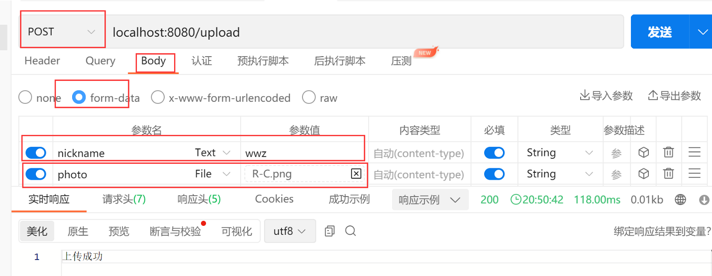

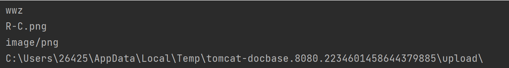

- 设置静态文件目录为刚刚设置的`\upload`，即可通过浏览器访问该文件
  静态资源配置方法详解: https://juejin.cn/post/7022823623844954142

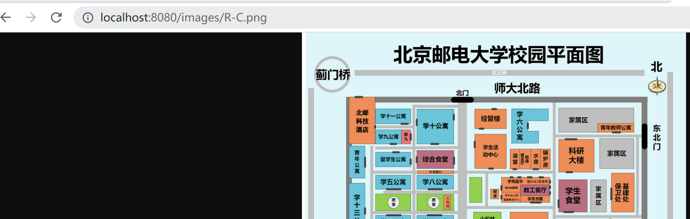

## 4.3 拦截器


- 拦截器在Web系统中非常常见，对于某些全局统一的操作(例如获取用户信息和获取用户订单的控制器都需要判断用户是否登录了)，我们可以把它提取到拦截器中实现。总结起来，拦截器大致有以下几种使用场景：
  - (1)权限检查：如登录检测，进入处理程序检测是否登录，如果没有，则直接返回登录页面。
  - (2)性能监控：有时系统在某段时间莫名其妙很慢，可以通过拦截器在进入处理程序之前记录开始时间，在处理完后记录结束时间，从而得到该请求的处理时间
  - (3)通用行为：读取cookie得到用户信息并将用户对象放入请求，从而方便后续流程使用，还有提取Locale、Theme信息等，只要是多个处理程序都需要的，即可使用拦截器实现。
- Spring Boot定义了`HandlerInterceptor`接口来实现自定义拦截器的功能
- `HandlerInterceptor`接口定义了`preHandle(用的最多)、postHandle、afterCompletion`三种方法，通过重写这三种方法实现请求前、请求后等操作

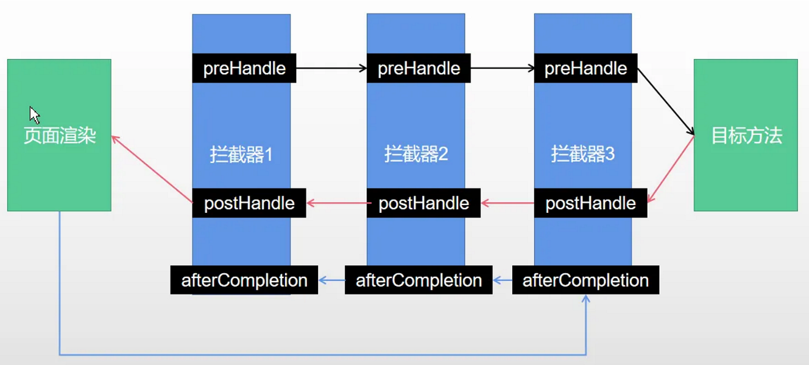


### 4.3.1 拦截器的定义
拦截器一般以Interceptor结尾，重写preHandle方法，该方法返回真则继续调用下一个preHandle方法

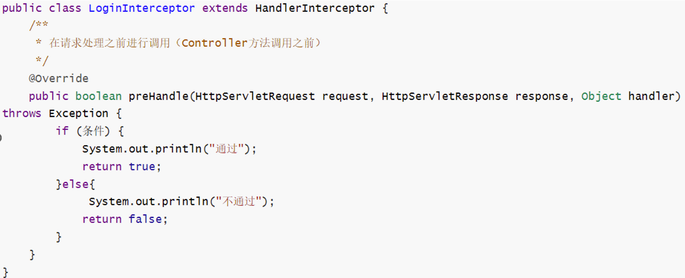

### 4.3.2 拦截器注册

- `addPathPatterns`方法定义拦截的地址
- `excludePathPatterns`定义排除某些地址不被拦截
- 添加的一个拦截器没有`addPathPattern`任何一个url则默认拦截所有请求
- 如果没有`excludePathPatterns`任何一个请求，则默认不放过任何一个请求。

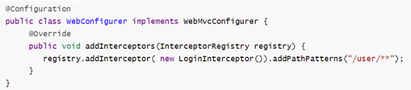

### 4.3.3 拦截器的实现
- 创建`Interceptor`包并添加`LoginInterceptor` 类, Interceptor包（文件夹）下存放所有的拦截器类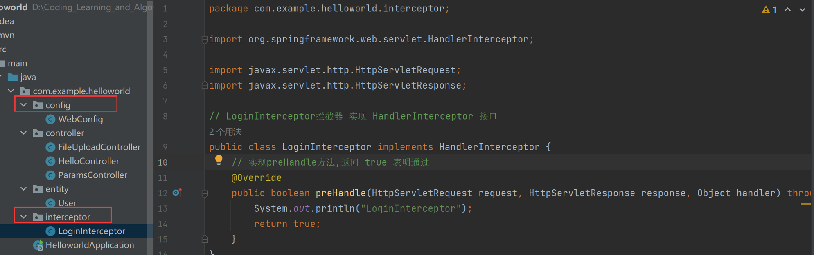
```java
package com.example.helloworld.interceptor;

import org.springframework.web.servlet.HandlerInterceptor;

import javax.servlet.http.HttpServletRequest;
import javax.servlet.http.HttpServletResponse;

// LoginInterceptor拦截器 实现 HandlerInterceptor 接口
public class LoginInterceptor implements HandlerInterceptor {
    // 实现preHandle方法,返回 true 表明通过
    @Override
    public boolean preHandle(HttpServletRequest request, HttpServletResponse response, Object handler) throws Exception {
        System.out.println("LoginInterceptor");
        return true;
    }
}
```
-  创建`config`包并添加`WebConfig`类, config下的类定义了springboot的所有配置,WebConfig对Web相关的设置进行了配置

```java
package com.example.helloworld.config;

import com.example.helloworld.interceptor.LoginInterceptor;
import org.springframework.context.annotation.Configuration;
import org.springframework.web.servlet.config.annotation.InterceptorRegistry;
import org.springframework.web.servlet.config.annotation.WebMvcConfigurer;

// @Configuration注解的类会被springboot自动读取
@Configuration
public class WebConfig implements WebMvcConfigurer {

    @Override
    public void addInterceptors(InterceptorRegistry registry) {
        //添加自定义创建的拦截器，设置拦截路径
        registry.addInterceptor(new LoginInterceptor()).addPathPatterns("/user/**");
    }
}
```
# 5. 构建RESTful服务
**本节内容**
- 第一节RESTful介绍
- 第二节 构建RESTful应用接口
- 第三节 使用Swagger生成Web API文档
## 5.1 RESTful介绍
###  5.1.1 简介
- RESTful是目前流行的互联网软件服务架构设计风格。
- REST（Representational State Transfer，表述性状态转移）一词是由Roy Thomas Fielding在 2000 年的博士论文中提出的，它定义了互联网软件服务的架构原则，如果一个架构符合REST原则，则称之为RESTful架构。
- REST并不是一个标准，它更像一组客户端和服务端交互时的架构理念和设计原则，基于这种架构理念和设计原则的Web API更加简洁，更有层次。
### 5.1.2 RESTful的特点
- 每一个URI代表一种资源
- 客户端使用GET、POST、PUT、DELETE四种表示操作方式的动词对服务端资源进行操作：GET用于获取资源，POST用于新建资源（也可以用于更新资源），PUT用于更新资源，DELETE用于删除资源。
- 通过操作资源的表现形式来实现服务端请求操作。
- 资源的表现形式是JSON或者HTML。（数据库里的数据查询出来，然后以JSON的形式返回给前端，并做渲染）
- 客户端与服务端之间的交互在请求之间是无状态的（所谓无状态是指不用记录历史的请求信息），从客户端到服务端的每个请求都包含必需的信息。


### 5.1.3 RESTful API

- 符合RESTful规范的Web API需要具备如下两个关键特性：
  - 安全性：安全的方法被期望不会产生任何副作用，当我们使用GET操作获取资源时，不会引起资源本身的改变，也不会引起服务器状态的改变。
  - 幂等性：幂等的方法保证了对同一个接口重复进行一个请求和一次请求的效果相同（并不是指响应总是相同的，而是指服务器上资源的状态从第一次请求后就不再改变了），在数学上幂等性是指N次变换和一次变换相同。

### 5.1.4 HTTP Method

- HTTP提供了`POST、GET、PUT、DELETE`等操作类型对某个Web资源进行`Create、Read、Update和Delete`操作。
- 一个HTTP请求除了利用URI标志目标资源之外，还需要通过HTTP Method指定针对该资源的操作类型，一些常见的HTTP方法及其在RESTful风格下的使用：

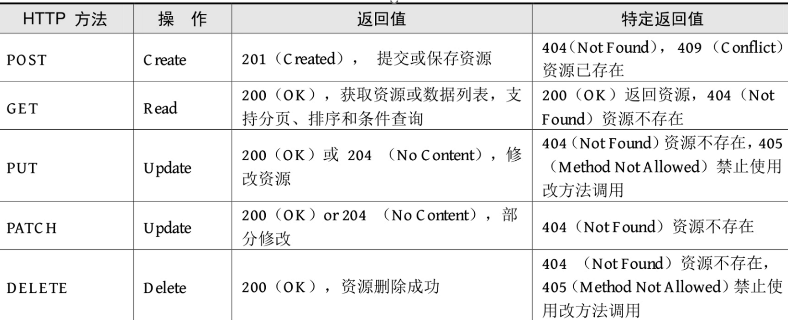


### 5.1.5 HTTP 状态码


- HTTP状态码就是服务向用户返回的状态码和提示信息，客户端的每一次请求，服务都必须给出回应，回应包括HTTP状态码和数据两部分。
- HTTP定义了 40 个标准状态码，可用于传达客户端请求的结果。状态码分为以下 5 个类别：
  - ○ 1xx：信息，通信传输协议级信息
  - ○ 2xx：成功，表示客户端的请求已成功接受
  - ○ 3xx：重定向，表示客户端必须执行一些其他操作才能完成其请求
  - ○ 4xx：客户端错误，此类错误状态码指向客户端，例如URL写错了就是 404
  - ○ 5xx：服务器错误，服务器负责这写错误状态码
- RESTful API中使用HTTP状态码来表示请求执行结果的状态，适用于REST API设计的代码以及对应的HTTP方法。

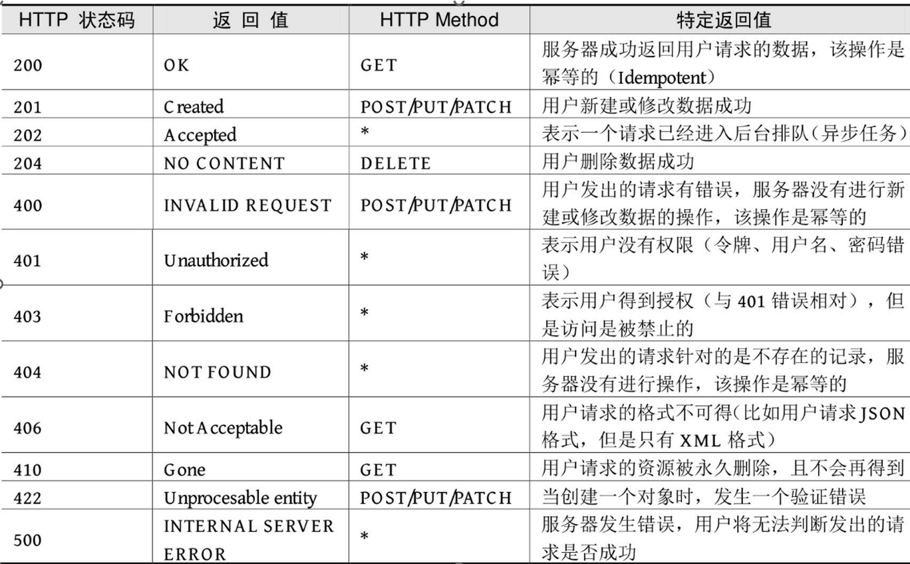


## 5.2 构建RESTful应用接口
### 5.2.1 Spring Boot实现RESTful API
- Spring Boot提供的`spring-boot-starter-web`组件完全支持开发RESTful API，提供了与REST操作方式（`GET、POST、PUT、DELETE`）对应的注解。
- `@GetMapping`：处理GET请求，获取资源。
- `@PostMapping`：处理POST请求，新增资源。
- `@PutMapping`：处理PUT请求，更新资源。
- `@DeleteMapping`：处理DELETE请求，删除资源。
- `@PatchMapping`：处理PATCH请求，用于部分更新资源。
- 在RESTful架构中，每个网址代表一种资源，所以URI中建议**不要包含动词，只包含名词**即可 ，而且所用的名词往往与数据库的表格名对应。
- 传统设计方法实现删除用户：GET方法 `http://localhost/del?id=10`
- RESTful设计方法实现删除用户：DELETE方法 `http://localhost/user/1`

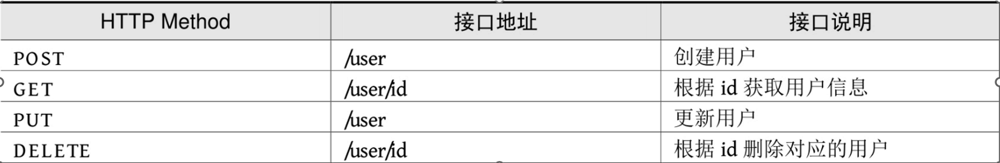

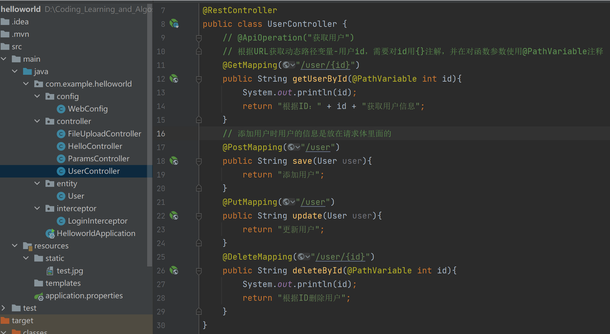

### 5.2.2 实现UserController类
```java
package com.example.helloworld.controller;
import com.example.helloworld.entity.User;
import org.springframework.web.bind.annotation.*;
import org.springframework.web.bind.annotation.RestController;

@RestController
public class UserController {
    // @ApiOperation("获取用户")
    // 根据URL获取动态路径变量-用户id，需要对id用{}注解，并在对函数参数使用@PathVariable注释
    @GetMapping("/user/{id}")
    public String getUserById(@PathVariable int id){
        System.out.println(id);
        return "根据ID：" + id + "获取用户信息";
    }
    // 添加用户时用户的信息是放在请求体里面的
    @PostMapping("/user")
    public String save(User user){
        return "添加用户";
    }
    @PutMapping("/user")
    public String update(User user){
        return "更新用户";
    }
    @DeleteMapping("/user/{id}")
    public String deleteById(@PathVariable int id){
        System.out.println(id);
        return "根据ID删除用户";
    }
}
```
## 5.3 使用Swagger生成Web API文档
### 5.3.1 什么是Swagger
- Swagger是一个规范和完整的框架，用于生成、描述、调用和可视化RESTful风格的Web服务，是非常流行的API表达工具。
- Swagger能够自动生成完善的RESTful API文档，同时并根据后台代码的修改同步更新，同时提供完整的测试页面来调试API。

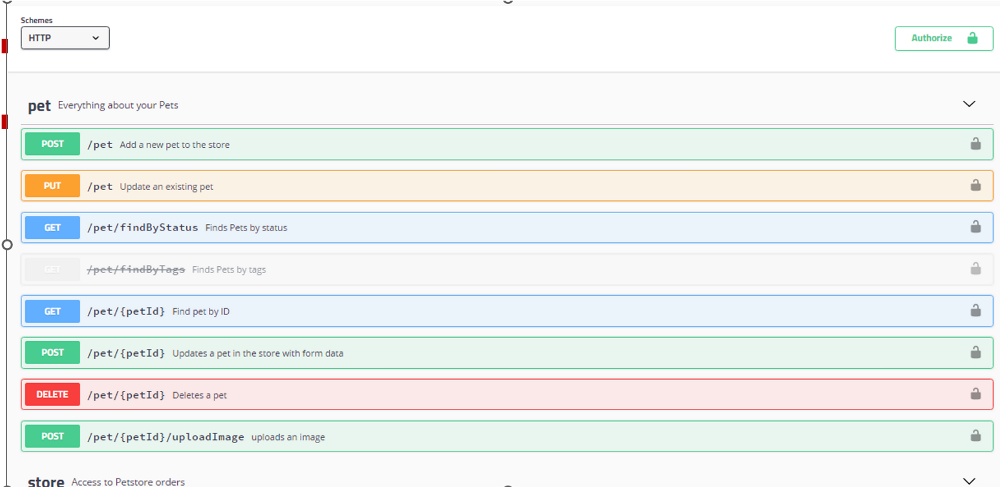

### 5.3.2 使用Swagger生成Web API文档

- 在Spring Boot项目中集成Swagger同样非常简单，只需在项目中引入 `springfox-swagger2` 和` springfox-swagger-ui` 依赖即可。

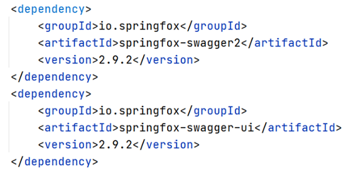

```java
<!-- 添加swagger2相关功能 -->
<dependency>
	<groupId>io.springfox</groupId>
	<artifactId>springfox-swagger2</artifactId>
	<version>2.9.2</version>
</dependency>
<!-- 添加swagger-ui相关功能 -->
<dependency>
    <groupId>io.springfox</groupId>
    <artifactId>springfox-swagger-ui</artifactId>
    <version>2.9.2</version>
</dependency>
```
### 5.3.3 配置Swagger

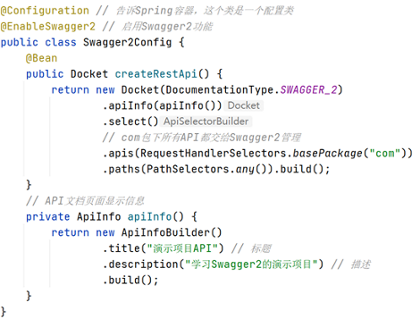

#### 5.3.3.1 在config目录下新建SwaggerConfig类
```java
package com.example.helloworld.config;
import org.springframework.context.annotation.Bean;
import org.springframework.context.annotation.Configuration;
import org.springframework.web.servlet.config.annotation.EnableWebMvc;
import org.springframework.web.servlet.config.annotation.ResourceHandlerRegistry;
import org.springframework.web.servlet.config.annotation.WebMvcConfigurer;
import springfox.documentation.builders.ApiInfoBuilder;
import springfox.documentation.builders.PathSelectors;
import springfox.documentation.builders.RequestHandlerSelectors;
import springfox.documentation.service.ApiInfo;
import springfox.documentation.service.Contact;
import springfox.documentation.spi.DocumentationType;
import springfox.documentation.spring.web.plugins.Docket;
import springfox.documentation.swagger2.annotations.EnableSwagger2;

@Configuration // 告诉Spring容器，这个类是一个配置类
@EnableSwagger2 // 启用Swagger2功能
@EnableWebMvc
public class SwaggerConfig implements WebMvcConfigurer{
    @Override
    public void addResourceHandlers(ResourceHandlerRegistry registry) {

        registry.addResourceHandler("/**").addResourceLocations(
                "classpath:/static/");
        registry.addResourceHandler("swagger-ui.html").addResourceLocations(
                "classpath:/META-INF/resources/");
        registry.addResourceHandler("/webjars/**").addResourceLocations(
                "classpath:/META-INF/resources/webjars/");
        WebMvcConfigurer.super.addResourceHandlers(registry);

    }
    /**
     * 配置Swagger2相关的bean
     */
    @Bean
    public Docket createRestApi() {
        return new Docket(DocumentationType.SWAGGER_2)
                .apiInfo(apiInfo())
                .select()
                .apis(RequestHandlerSelectors.basePackage("com"))// com包下所有API都交给Swagger2管理
                .paths(PathSelectors.any()).build();
    }

    /**
     * 此处主要是API文档页面显示信息
     */
    private ApiInfo apiInfo() {
        return new ApiInfoBuilder()
                .title("演示项目API") // 标题
                //创建人
                .contact(new Contact("王文正", "https://wangwzzb.gitee.io/",
                        "2642509545@qq.com"))
                .description("演示项目") // 描述
                .version("1.0") // 版本
                .build();
    }
}
```
### 5.3.4 注意事项


- `Spring Boot 2.6.X`后与Swagger有版本冲突问题，需要在`application.properties`中加入以下配置：
``` java
# 处理swagger版本兼容问题
spring.mvc.pathmatch.matching-strategy=ant_path_matcher
```
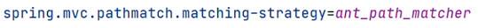

### 5.3.5 使用Swagger2进行接口调试

- 启动项目访问 `http://127.0.0.1:8080/swagger-ui.html`，即可打开自动生成的可视化测试页面

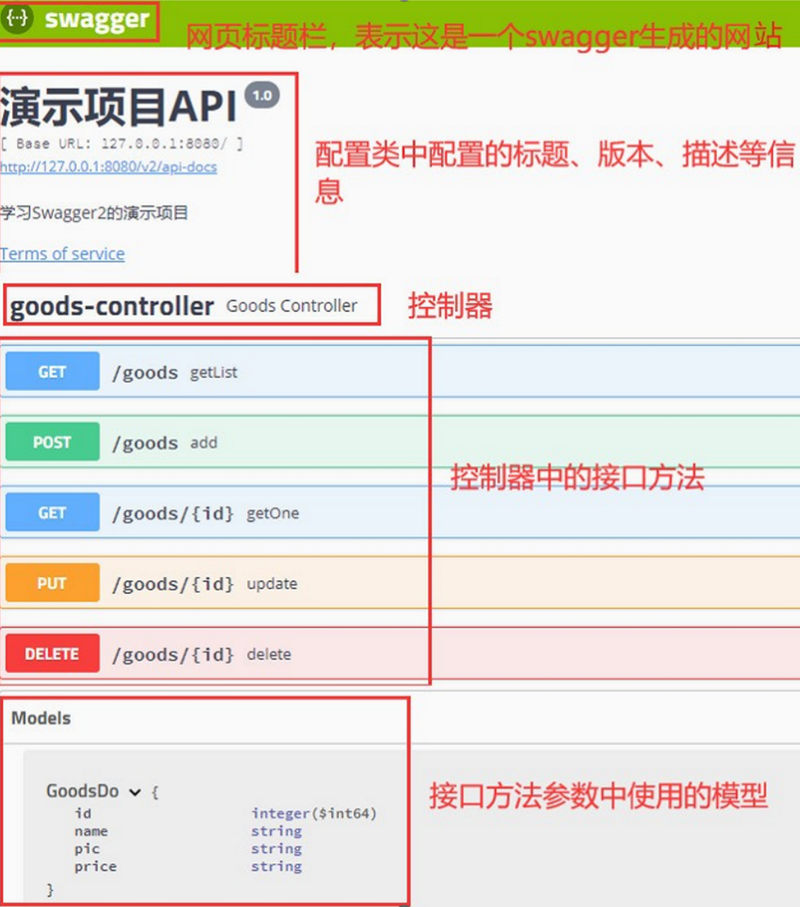

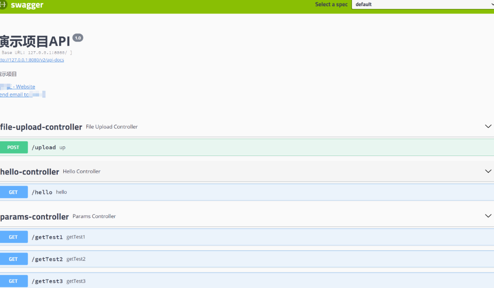

### 5.3.6 Swagger常用注解

- Swagger提供了一系列注解来描述接口信息，包括接口说明、请求方法、请求参数、返回信息等

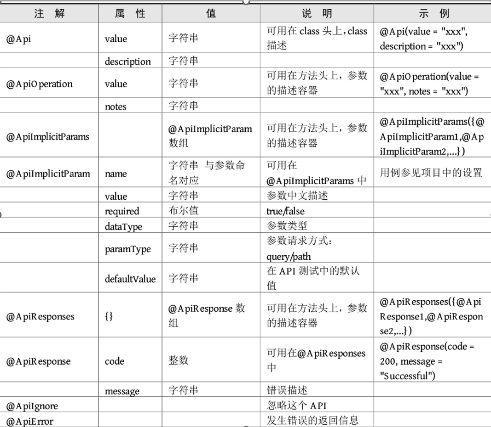

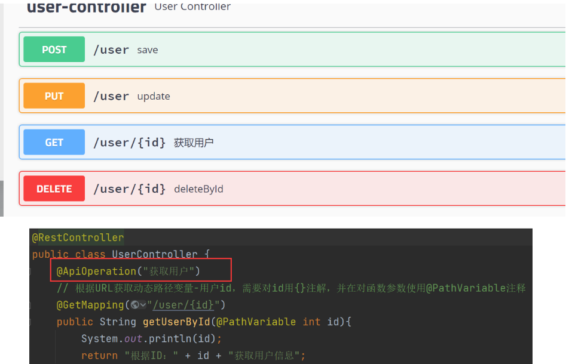

- Swagger 有着跟ApiPost一样的功能用于接口调试

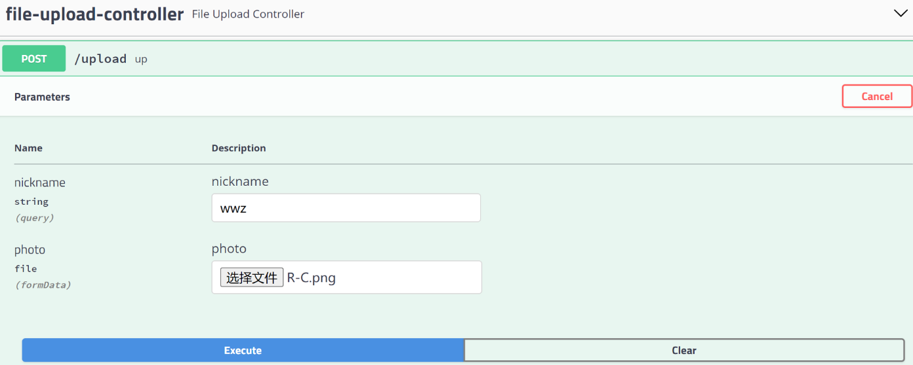

### 5.3.7 Springboot集成Swagger3

https://blog.csdn.net/hjjjjjjj_/article/details/120537261


# 6. MyBatisPlus 快速上手

**本节内容**
- 第一节ORM介绍
- 第二节MyBatis-Plus介绍
- 第三节MyBatis-Plus CRUD操作

本节构建的项目目录:

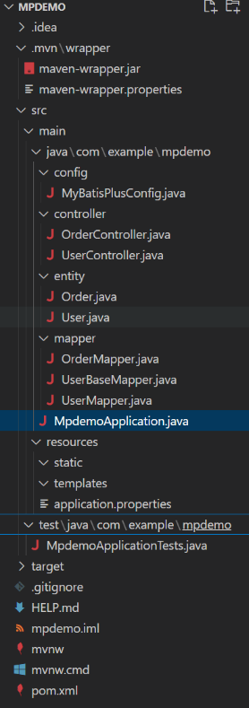

## 6.1 ORM介绍
- ORM（Object Relational Mapping，对象关系映射）是为了 **解决面向对象与关系数据库存在的互不匹配现象(Java对象存储到关系型数据库的表里面去或根据表数据重构出一个Java对象)** 的一种技术。
- ORM通过使用描述对象和数据库之间映射的元数据将程序中的对象自动持久化到关系数据库中。
- ORM框架的本质是简化编程中操作数据库的编码。
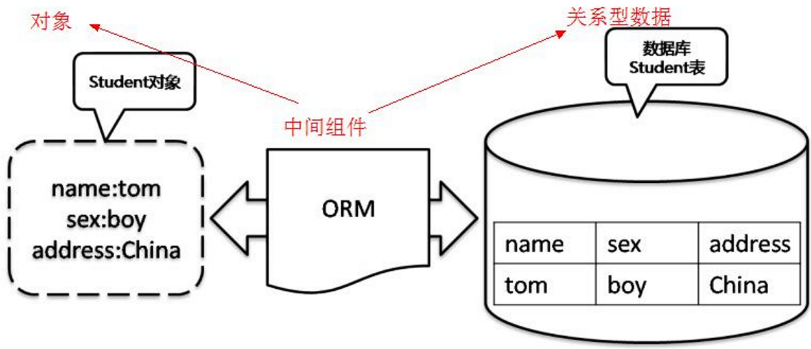
## 6.2 MyBatis-Plus介绍
- MyBatis是一款优秀的数据持久层ORM框架，被广泛地应用于应用系统。
- MyBatis能够非常灵活地实现动态SQL，可以使用XML或注解来配置和映射原生信息，能够轻松地将Java的POJO（Plain Ordinary Java Object，普通的Java对象）与数据库中的表和字段进行映射关联。
- MyBatis-Plus是一个MyBatis 的增强工具，在MyBatis 的基础上做了增强，简化了开发。


### 6.2.1 添加依赖

- MyBatisPlus 依赖MyBatis,安装MyBatisPlus依赖会自动安装MyBatis依赖
- 准备好一个MySql数据库，添加数据库驱动
- 通过数据库连接池技术可以一次性生成多个连接，提高效率
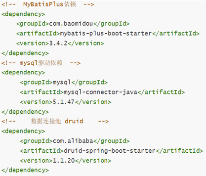
```java
<!-- 链接数据库 -->
<dependency>
    <groupId>com.baomidou</groupId>
    <artifactId>mybatis-plus-boot-starter</artifactId>
    <version>3.4.2</version>
</dependency>
<dependency>
    <groupId>mysql</groupId>
    <artifactId>mysql-connector-java</artifactId>
    <version>5.1.6</version>
</dependency>
<dependency>
    <groupId>com.alibaba</groupId>
    <artifactId>druid-spring-boot-starter</artifactId>
    <version>1.1.20</version>
</dependency>
```
### 6.2.2 全局配置
#### 6.2.2.1 在`application.properties`文件中配置数据库相关信息
- `driver-class-name`:指定数据库驱动
- `type`:使用阿里巴巴提供的一个数据库连接池技术
- `url`:数据库地址
- `username`:数据库账号
- `password`: 数据库密码
- `log-impl`: 指定日志输出格式


```java
spring.datasource.type=com.alibaba.druid.pool.DruidDataSource
spring.datasource.driver-class-name=com.mysql.jdbc.Driver
spring.datasource.url=jdbc:mysql://121.37.107.17:3306/mydb?
useSSL=false&useUnicode=true&characterEncoding=utf8
spring.datasource.username=root
spring.datasource.password=root
mybatis-plus.configuration.log-impl=org.apache.ibatis.logging.stdout.StdOutImpl
```
#### 6.2.2.2 添加@MapperScan注解

- MyBatis的数据库操作组件称为Mapper,数据库相关的操作最终都会放到Mapper包里面
- 需要通过`@MapperScan`注释告诉springboot Mapper包位置
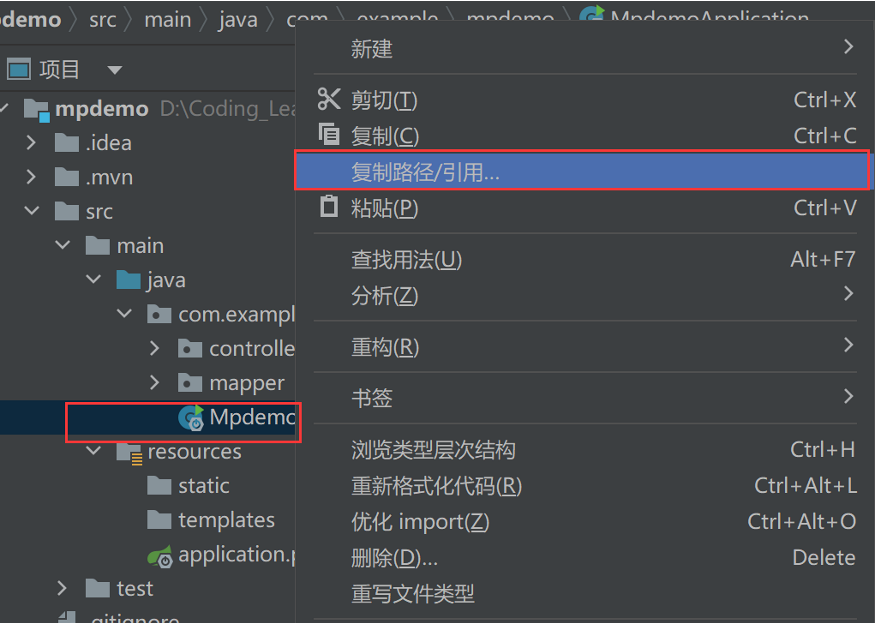
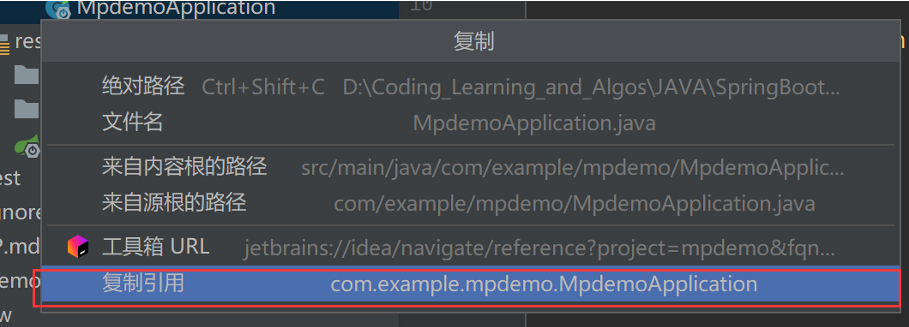
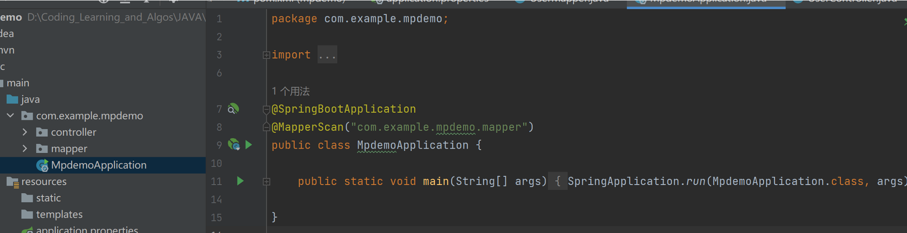

## 6.3 Mybatis 使用
### 6.3.1 Mybatis 注解
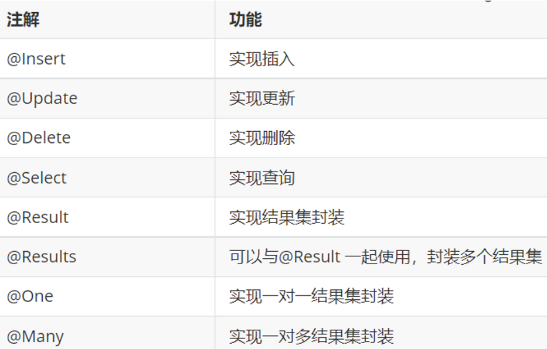
### 6.3.2 使用Mybatis进行CRUD操作
#### 6.3.2.1 前置操作

- （ 1 ）创建controller 包并创建UserController类
```java
@RestController
public class UserController {

    @GetMapping("/user")
    public String query(){
        return "查询用户";
    }
}
```

- （ 2 ）创建entity包并创建User类
>User类私有变量名称与数据的表头相符
>`Fn+Alt+Insert`快捷键为每个私有变量设置访问函数Getter和Setter
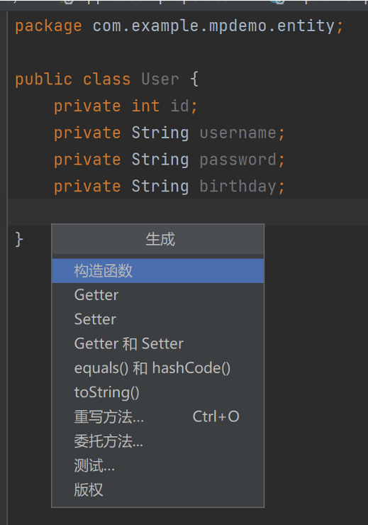
```java
public class User {
    private int id;
    private String username;
    private String password;
    private String birthday;

    public int getId() {
        return id;
    }

    public String getUsername() {
        return username;
    }

    public String getPassword() {
        return password;
    }

    public String getBirthday() {
        return birthday;
    }

    public void setId(int id) {
        this.id = id;
    }

    public void setUsername(String username) {
        this.username = username;
    }

    public void setPassword(String password) {
        this.password = password;
    }

    public void setBirthday(String birthday) {
        this.birthday = birthday;
    }
    
    @Override
    public String toString() {
        return "User{" +
                "id=" + id +
                ", username='" + username + '\'' +
                ", password='" + password + '\'' +
                ", birthday='" + birthday + '\'' +
                '}';
    }    
}
```
- （ 3 ）在CenOS7上安装mysql创建数据库mydb新增表user新增数据
```bash    
# 登录mysql
mysql -u root -p
#输入在日志中生成的临时密码
Enter password:
#创建数据库mydb
CREATE DATABASE mydb; 
#对一个数据库进行操作时首先应该切换到该数据库
USE mydb;        
# 创建表user
CREATE TABLE IF NOT EXISTS `user`(
   `id` bigint(20) NOT NULL AUTO_INCREMENT,
   `username` VARCHAR(100) NOT NULL,
   `password` VARCHAR(100) NOT NULL,
   `birthday` DATE NOT NULL,
   PRIMARY KEY ( `id` )
)ENGINE=InnoDB DEFAULT CHARSET=utf8;
# 增加数据
INSERT INTO user (username, password, birthday) VALUES ("Kevin","123456",'1999-10-11');
INSERT INTO user (username, password, birthday) VALUES ("Peter", "654321",'2000-01-10');
INSERT INTO user (username, password, birthday) VALUES ("wwz", "128321",'2002-04-16');
# 查询数据
select * from user;
```

#### 6.3.2.2 创建mapper包并定义UserMapper接口**

>对于Mybatis而言不需要实现只需要把方法的声明写上去，所有对数据库的操作都可以让mybatis完成（此部分还不涉及MybatisPlus功能） ，Mapper包下的类名称命名规范: mysql数据库表名+Mapper
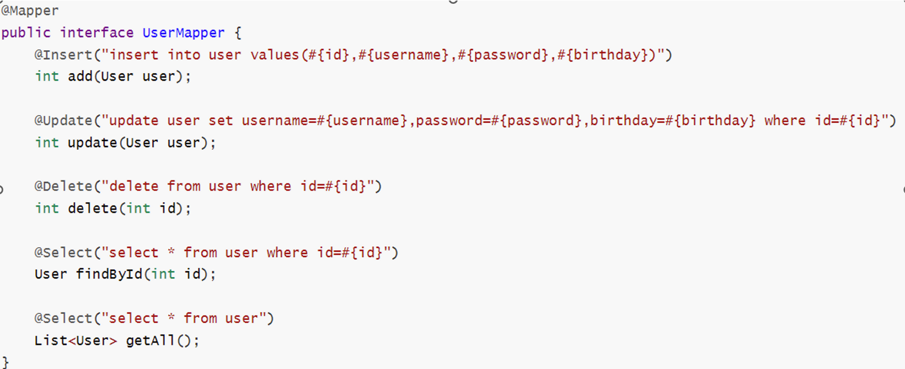
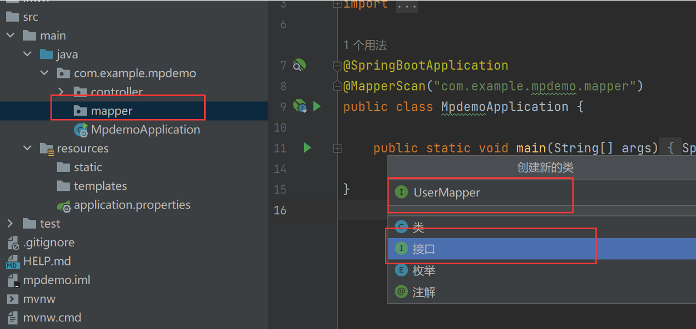
```java
package com.example.mpdemo.mapper;

import com.example.mpdemo.entity.User;
import org.apache.ibatis.annotations.*;

import java.util.List;

// @Mapper注解声明UserMapper是Mapper组件
// 用于操作用户表,MyBaits会根据Mapper注解，动态实现UserMapper接口（实现类），动态代理技术
// Spring会自动创建UserMapper接口实现类对应的实例
@Mapper
public interface UserMapper {
    // 查询所有用户
    // 通过@Select注解声明函数find用于查询数据，括号内填写SQL语句
    // select * from user 会在配置文件中的
    // spring.datasource.url=jdbc:mysql://121.37.107.17:3306/mydb?useSSL=false
    // 指明的数据库mydb中查找该表，并自动把数据生成User对象放到List中
    // Interface的方法默认 是public的
    @Select("select * from user")
    public List<User> getALL();
    // 基于 id 值查询用户
    @Select("select * from user where id=#{id}")
    User findById(int id);
    //-------------------------------------------------------------------
    // 插入用户（增加用户）
    // insert SQL语句，
    // 返回值表示插入了几条记录，返回值0表明插入失败了
    // 使用 insert into user values(#{id},#{username},#{password},#{birthday}) 语句时
    // values 后面必须把user表的列字段名称写全
    // 当用户没有传递 id字段时，如果sql表设置了id字段的自增类型，id就会自增
    @Insert("insert into user values(#{id},#{username},#{password},#{birthday})")
    int insert(User user);

    //--------------------------------------------------------------------
    //基于id值删除用户
    @Delete("delete from user where id=#{id}")
    int delete(int id);

    //--------------------------------------------------------------------
    //基于id值更新值
    @Update("update user set username=#{username},password=#{password},birthday=#{birthday} where id=#{id}")
    int update(User user);

}
```
####  6.3.2.3 修改UserController.java类
```java
package com.example.mpdemo.controller;

import com.example.mpdemo.entity.User;
import com.example.mpdemo.mapper.UserBaseMapper;
import com.example.mpdemo.mapper.UserMapper;
import org.springframework.beans.factory.annotation.Autowired;
import org.springframework.web.bind.annotation.*;

import java.util.List;

@RestController
public class UserController {

    // 当想要使用Mapper类时，只需要在Controller类中声明
    // 通过 @Autowired 注解，使得Spring自动实现一个userMapper对象并实例化
    //    @Autowired
    //    private UserMapper userMapper;
    @Autowired
    private UserBaseMapper userBaseMapper;
    // 查询所有用户
    @GetMapping("/user")
    public List<User> query(){
        // 前后端交互使JSON格式，返回List会自动转为JSON格式
        // return userMapper.getALL();
        return userBaseMapper.selectList(null);
    }
    // 根据用户id查询用户
    @GetMapping("/user/{id}")
    public User queryById(@PathVariable int id){
        // return userMapper.findById(id);
        return userBaseMapper.selectById(id);
    }
    // 添加用户
    @PostMapping("/user")
    public User save(User user){
        // return userMapper.insert(user)
        userBaseMapper.insert(user);
        return user;
    }

    //根据id更新用户
    @PutMapping("/user")
    public int update(User user){
        // return userMapper.update(user)
        //  userBaseMapper.update()默认更新所有用户
        return userBaseMapper.updateById(user);
    }

    //根据用户id删除用户
    @DeleteMapping("/user/{id}")
    public int deleteById(@PathVariable int id)
    {
        // return userMapper.delete(id)
        return userBaseMapper.deleteById(id);
    }
}
```
#### 6.3.2.4 运行程序在网页输入`http://localhost:8080/user`得到查询结果

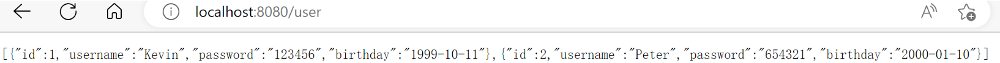

- IDEA输出查询记录：

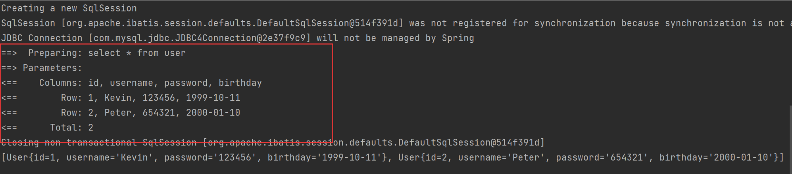

#### 6.3.2.5 使用apiPost测试接口

- （ 1 ）测试获取所用用户
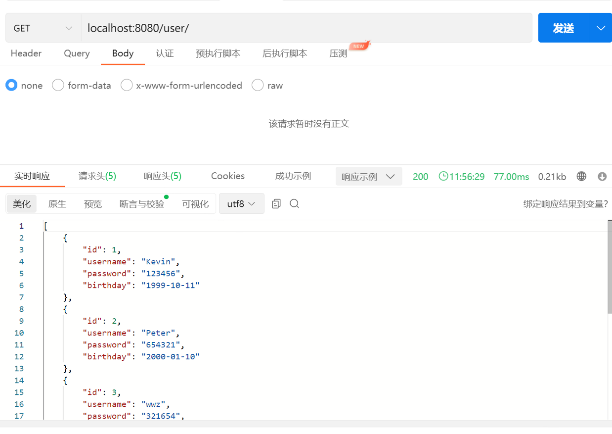
- （ 2 ）测试根据id获取用户数据
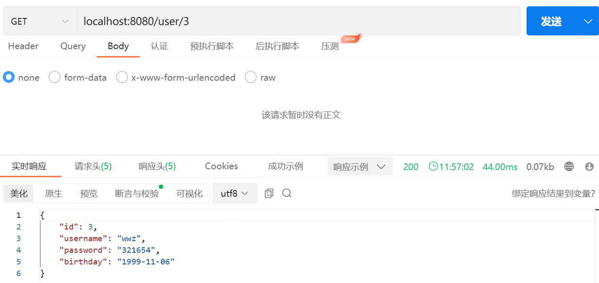
- （ 3 ）测试添加用户
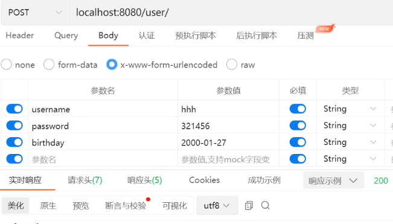、
- 数据库表项查看：
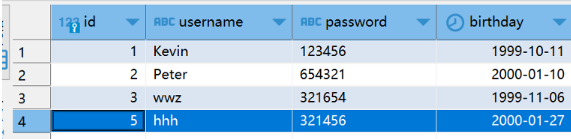
- （ 4 ）测试更新用户
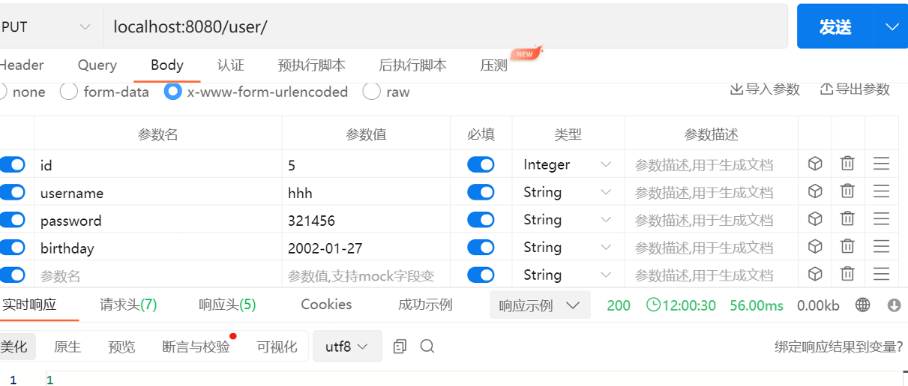
- 数据库表项查看：
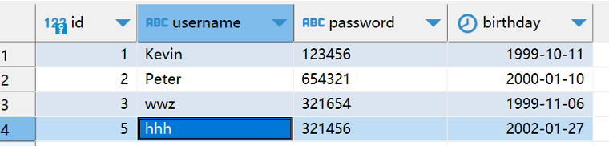
- （ 5 ）测试删除用户
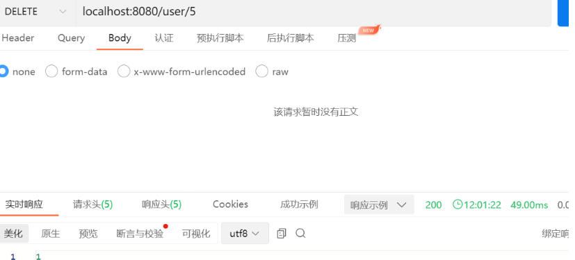
- 数据库表项查看：
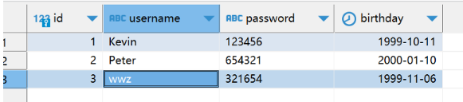


## 6.4 MybatisPlus使用

官方文档参考链接：https://baomidou.com/pages/223848/#tablename

### 6.4.1 编写`UserBaseMapper`继承`MybatisPlusBaseMapper`类

```java
package com.example.mpdemo.mapper;

import com.baomidou.mybatisplus.core.mapper.BaseMapper;
import com.example.mpdemo.entity.User;
import org.apache.ibatis.annotations.Mapper;

@Mapper
// 继承BaseMapper<User>，传入User类，MybatisPlus会自动根据User类找到user然后进行增删改查
// 类得名字必须和表的名字保持一致
public interface UserBaseMapper extends BaseMapper<User> {

}
```
- Mybatis早期名字为ibatis, BaseMapper类是mybatisplus包提供的
- BaseMapper类实现截图
- 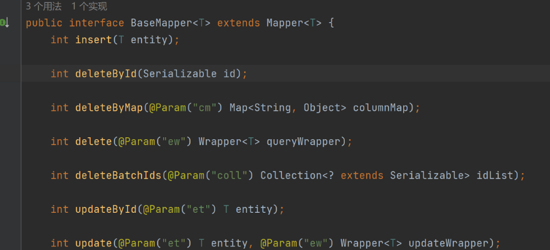

### 6.4.2 MybatisPlus注解
此注解用于实体类（例如User类），将该类的属性与数据库表之间的关系做注解
- `@TableName`，当表名与实体类名称不一致时，可以使用@TableName注解进行关联。
- `@TableField`，当表中字段名称与实体类属性不一致时，使用@TableField进行关联
- `@TableId`，用于标记表中的主键字段，标记了之后，例如当新增用户后，及时没有传递主键字段值，MybatisPlus会自动将主键字段值赋值给类实例(前提是使用`UserBaseMapper`,即继承了BaseMapper 的类)，MybatisPlus也提供了主键生成策略。

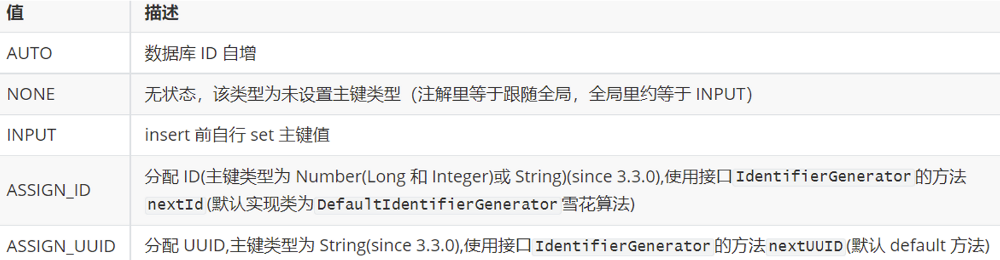

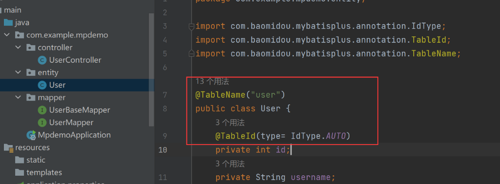


### 6.4.3 MybatisPlus条件构造器`QueryWrapper`的使用

https://baomidou.com/pages/10c804/#abstractwrapper
https://www.jianshu.com/p/1fe4bfa7db58
[CSDN MyBatis-Plus——超详细讲解条件构造器](https://blog.csdn.net/Huang_ZX_259/article/details/122524602#:~:text=MyBatis-Plus%E2%80%94%E2%80%94%E8%B6%85%E8%AF%A6%E7%BB%86%E8%AE%B2%E8%A7%A3%E6%9D%A1%E4%BB%B6%E6%9E%84%E9%80%A0%E5%99%A8%201%201%E3%80%81alleq%20%E6%8F%8F%E8%BF%B0%EF%BC%9A%20%E5%85%A8%E9%83%A8%E7%9B%B8%E7%AD%89%EF%BC%88%E6%88%96%E4%B8%AA%E5%88%ABisNull%29%20allEq%20%28Map%3CR%2C%20V%3E,8%E3%80%81notBetween%20%E6%8F%8F%E8%BF%B0%EF%BC%9A%20NOT%20BETWEEN%20%E5%80%BC1%20AND%20%E5%80%BC2%20)
https://www.cnblogs.com/nhdlb/p/14297236.html

```java
// UserController.java文件
//条件查询
@GetMapping("/user/find")
public List<User> findByUserName(String username){
   QueryWrapper<User> queryWrapper = new QueryWrapper<>();
   queryWrapper.eq("username",username);
   return userBaseMapper.selectList(queryWrapper);
}
```

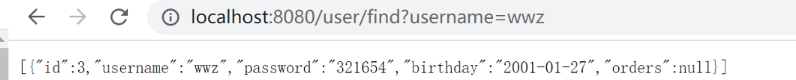

# 7. MyBatis多表查询及分页查询
**本节内容**
- 第一节 多表查询
- 第二节 分页查询

## 7.1 多表查询
- 表与表之间通过外键关联，例如在查询用户的时候想要查询该用户的订单记录
- MybatisPlus只是对单表的查询做了增强，多表查询还是Mybatis功能
- 实现复杂关系映射，可以使用`@Results`注解，`@Result`注解，`@One`注解，`@Many`注解组合完成复杂关系的配置。

### 7.1.1 准备工作
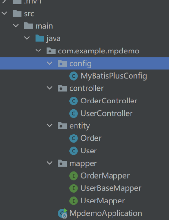

#### 7.1.1.1 修改数据库表名新增订单数据表
```bash
# 登录mysql
mysql -u root -p
#输入在日志中生成的临时密码
Enter password:
#对一个数据库进行操作时首先应该切换到该数据库
USE mydb;
#查看当前数据库所有表  
SHOW TABLES;
#修改表名为 t_user
rename table user to t_user;
# 创建表t_order
CREATE TABLE IF NOT EXISTS `t_order`(
   `id` bigint(20) NOT NULL AUTO_INCREMENT COMMENT '订单序列号',
   `order_time` DATE NOT NULL COMMENT '生成时间',
   `total_price` FLOAT(9,3) NOT NULL COMMENT '总价',
   `uid` bigint(20)  NOT NULL COMMENT '用户编号(外键)',
   PRIMARY KEY ( `id` )
)ENGINE=InnoDB DEFAULT CHARSET=utf8;
INSERT INTO t_order (order_time, total_price, uid) VALUES ("2023-02-01",3000.152,3);
INSERT INTO t_order (order_time, total_price, uid) VALUES ("2023-01-31",1000.312,3);
INSERT INTO t_order (order_time, total_price, uid) VALUES ("2023-01-21",100000.282,1);
```

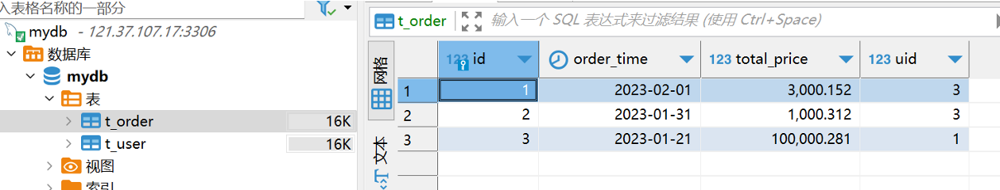

#### 7.1.1.2 在Entity包中新增Order 类
```java
// Order类
package com.example.mpdemo.entity;

import com.baomidou.mybatisplus.annotation.TableField;
import com.baomidou.mybatisplus.annotation.TableName;

// Order类对应数据库中的t_order表
@TableName("t_order")
public class Order {
    private int id;
    private String orderTime;
    private double total;

    // 订单与订单所属用户一对一关系
    // 订单 t_order 表中并不存在User列，因此需要使用@TableField(exist = false) 进行注释
    @TableField(exist = false)
    private User user;

    public int getId() {
        return id;
    }

    public void setId(int id) {
        this.id = id;
    }

    public String getOrderTime() {
        return orderTime;
    }

    public void setOrderTime(String orderTime) {
        this.orderTime = orderTime;
    }

    public double getTotal() {
        return total;
    }

    public void setTotal(double total) {
        this.total = total;
    }

    public User getUser() {
        return user;
    }

    public void setUser(User user) {
        this.user = user;
    }

    @Override
    public String toString() {
        return "Orders{" +
                "id=" + id +
                ", orderTime='" + orderTime + '\'' +
                ", total=" + total +
                ", user=" + user +
                '}';
    }
}
```
#### 7.1.1.3 在`UserBaseMapper`中新增查询用户及其所有订单函数
```java
package com.example.mpdemo.mapper;

import com.baomidou.mybatisplus.core.mapper.BaseMapper;
import com.example.mpdemo.entity.User;
import org.apache.ibatis.annotations.*;

import java.util.List;

@Mapper
// 继承BaseMapper<User>，传入User类，MybatisPlus会自动根据User类找到user然后进行增删改查
// 类得名字必须和表的名字保持一致
public interface UserBaseMapper extends BaseMapper<User> {
    //--------------------------------------------------------------------
    //  查询用户及其所有的订单
    // 一对多关系，一个用户有多个订单
    @Select("select * from t_user")
    // Results 是做结果集的映射的，就是说从数据中查询到的数据怎么给对象或对象成员属性赋值
    // Results 里可以定义多个Result
    @Results(
            {
                    // Result 给每个字段进行赋值
                    // column指明数据库表的列字段名称，property指明将要赋值的类成员属性名称
                    // 即使property与column一致，也必须写
                    @Result(column = "id",property = "id"),
                    @Result(column = "username",property = "username"),
                    @Result(column = "password",property = "password"),
                    @Result(column = "birthday",property = "birthday"),
                    // 为user的orders属性赋值
                    // 使用t_user 表中的列字段id，映射到类属性orders，orders的类型是List
                    // 有了id字段就可以使用OrderMapper类的根据用户id查询字段的函数selectByUid完成查询
                    // Mybatis 用户调用另一个Mapper类方法，@Many查询多个对象，查询结果赋值给orders属性
                    @Result(column = "id",property = "orders",javaType = List.class,
                            many=@Many(select = "com.example.mpdemo.mapper.OrderMapper.selectByUid")
                    )
            }
    )
    List<User> selectAllUserAndOrders();
}
```
#### 7.1.1.4  新增OrderMapper类
```java
package com.example.mpdemo.mapper;

import com.baomidou.mybatisplus.core.mapper.BaseMapper;
import com.example.mpdemo.entity.Order;
import com.example.mpdemo.entity.User;
import org.apache.ibatis.annotations.*;

import java.util.List;

@Mapper
public interface OrderMapper extends BaseMapper<Order> {

    @Select("select * from t_order where uid = #{uid}")
    List<Order> selectByUid(int uid);

    //  查询所有的订单，同时查询订单的用户
    // 一对一关系
    @Select("select * from t_order")
    @Results({
            @Result(column = "id",property = "id"),
            @Result(column = "order_time",property = "orderTime"),
            @Result(column = "total",property = "total"),
            @Result(column = "uid",property = "user",javaType = User.class,
                    one=@One(select = "com.example.mpdemo.mapper.UserBaseMapper.selectById")
            )
    })
    List<Order> selectAllOrdersAndUser();
}
```
#### 7.1.1.5 UserController新增查询所有用户及其订单函数

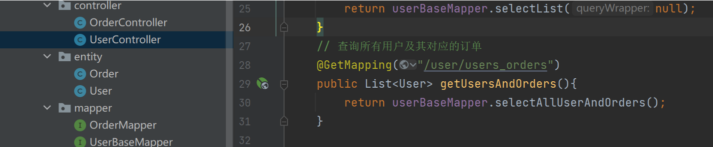

#### 7.1.1.6 新增OrderController类测试查询订单及其对应的用户id
```java
package com.example.mpdemo.controller;

import com.example.mpdemo.entity.Order;
import com.example.mpdemo.mapper.OrderMapper;
import org.springframework.beans.factory.annotation.Autowired;
import org.springframework.web.bind.annotation.GetMapping;
import org.springframework.web.bind.annotation.RequestMapping;
import org.springframework.web.bind.annotation.RestController;

import java.util.List;

@RestController
public class OrderController {

    @Autowired
    private OrderMapper orderMapper;

    @GetMapping("/order/findAll")
    public List<Order> findAll(){

        return orderMapper.selectAllOrdersAndUser();
    }

}
```

### 7.1.2 测试结果

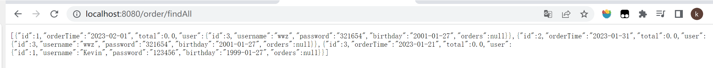

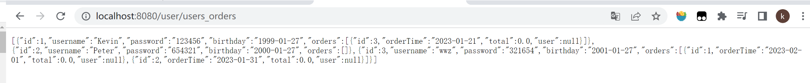


## 7.2.分页查询
- 编写配置文件
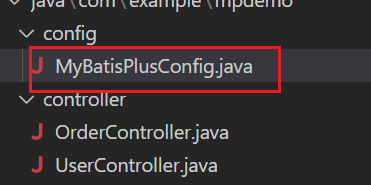
```java
package com.example.mpdemo.config;

import com.baomidou.mybatisplus.annotation.DbType;
import com.baomidou.mybatisplus.extension.plugins.MybatisPlusInterceptor;
import com.baomidou.mybatisplus.extension.plugins.inner.PaginationInnerInterceptor;
import org.springframework.context.annotation.Bean;
import org.springframework.context.annotation.Configuration;

@Configuration
public class MyBatisPlusConfig {
    // @Bean Spring组件
    @Bean
    public MybatisPlusInterceptor paginationInterceptor() {
        // 实例化一个MybatisPlus拦截器，当进行Mysql查询时都会被该拦截器处理
        MybatisPlusInterceptor interceptor = new MybatisPlusInterceptor();
        // 定义一个分页拦截器，必须要指定数据库的类型
        PaginationInnerInterceptor paginationInterceptor = new PaginationInnerInterceptor(DbType.MYSQL);
        // 添加注册拦截器
        interceptor.addInnerInterceptor(paginationInterceptor);
        return interceptor;

    }
}
```
-  测试代码在`UserController.java`中添加：

```java
    // 分页查询：数据的记录较多，查询数据时限制条目数
    // 例如：SQL语句 select * from xx limit 0,10 从第0条开始查询十条记录
    @GetMapping("/user/findByPage")
    public IPage<User> findByPage(){
        //设置起始值(第几条开始取)及每页条目数
        Page<User> page = new Page<>(0, 2);
        // iPage封装了结果集，iPage记录了每页显示了几条，一共分多少页，现在是第几页
        IPage iPage = userBaseMapper.selectPage(page,null);
        return iPage;
    }
```
-  测试结果
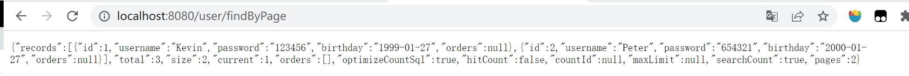
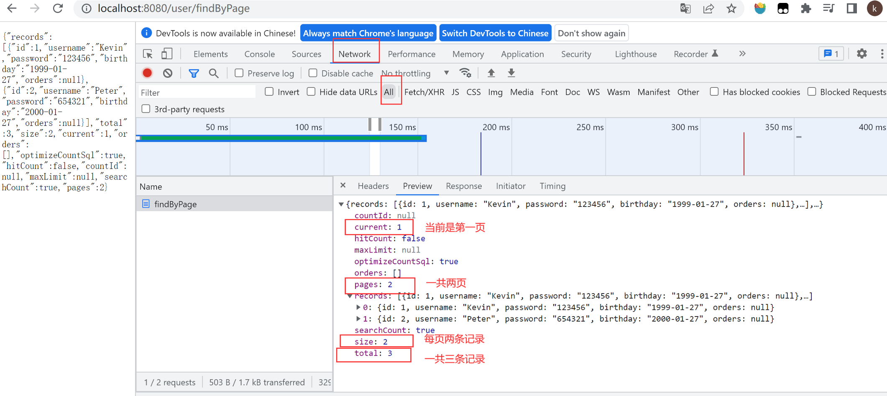

# 8. Vue框架快速上手
**本节内容**
- 1.前端环境准备
- 2.Vue框架介绍c
- 3.Vue快速入门
- 4.Vue基本语法
>怎么获取到后端数据并在前端进行渲染?
>参考官方Vue链接：https://v2.cn.vuejs.org/v2/guide/installation.html
>Vue分Vue2和Vue3两者不兼容.

## 8.1 前端环境准备
- 编码工具：VSCode
- 依赖管理：NPM
- 项目构建：VueCli

## 8.2 Vue框架介绍
### 8.2.1 介绍
- Vue (读音/vjuː/，类似于view) 是一套用于构建用户界面的渐进式框架。
- Vue.js提供了MVVM（一种设计模式）数据绑定和一个可组合的组件系统，具有简单、灵活的API。
- 其目标是通过尽可能简单的API实现响应式的数据绑定和可组合的视图组件。

### 8.2.2 MVVM模式
- MVVM是Model-View-ViewModel的缩写，它是一种基于前端开发的架构模式，其核心是提供对View和ViewModel的双向数据绑定。（脱胎于MVC模式：Model----Controller------View,但是C可能比较臃肿，MVVM模式将控制器变成了ViewModel，它可以完成数据监听（监听Model变化，并自动更新）和数据绑定（页面的变化也可以影响model），有了MVVM只需要关心数据逻辑，数据变化后的渲染由Vue框架自动完成）
- Vue提供了MVVM风格的双向数据绑定，核心是MVVM中的VM，也就是ViewModel，ViewModel负责连接View和Model，
保证视图和数据的一致性。
- Vue屏蔽了对HTMLDOM的直接操作，且不需要使用jQuery框架完成数据绑定和数据变换的更新


## 8.3 Vue快速入门

- **导入vue.js 的script 脚本文件**


- **在页面中声明一个将要被vue 所控制的DOM 区域（VUE视图、其实也就是HTML的标签或元素），既MVVM中的View**
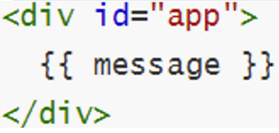

- **创建vm 实例对象（vue 实例对象即ViewModel对象）**


### 8.3.1 实践操作
- （ 1 ）创建一个文件夹（demo）用于存储编辑的html目录，将目录拖拽到VScode中
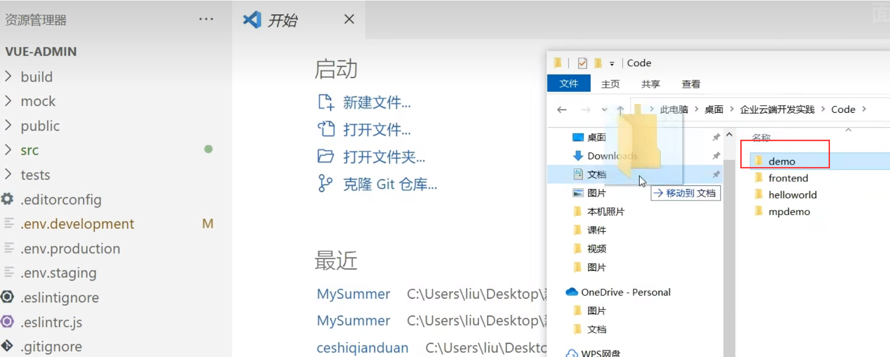

- （ 2 ）新建一个demo.html文件，输入!快速生成html模板
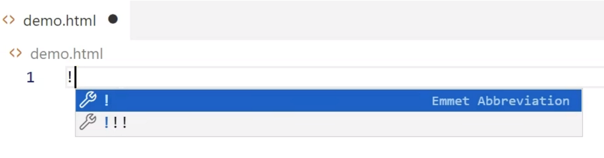

```html
<!DOCTYPE html>
<html lang="en">
<head>
    <meta charset="UTF-8">
    <meta http-equiv="X-UA-Compatible" content="IE=edge">
    <meta name="viewport" content="width=device-width, initial-scale=1.0">
    <title>Document</title>
    <!-- 通过在线链接暗转Vue，引入Vue源码依赖，学习基础语法通过在线安装的方式后面会使用npm安装 -->
    <script src="https://unpkg.com/vue@3"></script>
</head>
<body>
    <!-- 声明View视图/HTML标签 -->
    <div id="app">
        {{message}}
    </div>
    <script>
    // 创建Model
    const hello = {
        // Model模型存储了要控制的数据变量
        data: function(){
            return {
                message: 'Hello Vue!'
            }
        }
    };
    // 根据Model，创建ViewModel对象
    const app = Vue.createApp(hello);
    // 使用HTML元素id标签，指定当前Vue实例（app ViewModel对象）要管理的标签对象
    // 指定以后当message发生变化后HTML页面会自动更新并渲染
    app.mount('#app');
    // 以上代码可简写为：
    // Vue.createApp({
    //     data() {
    //         return {
    //             message: 'Hello Vue!'
    //         }
    //     }
    // }).mount('#app')
    </script>
</body>
</html>
```
- （ 3 ）在VScode中安装Open in Browser插件

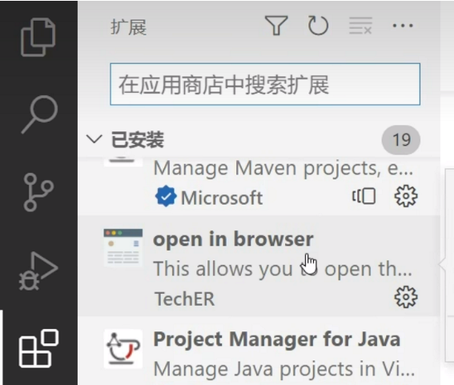

- （ 4 ）在demo.html页面邮件选择Open in Browser

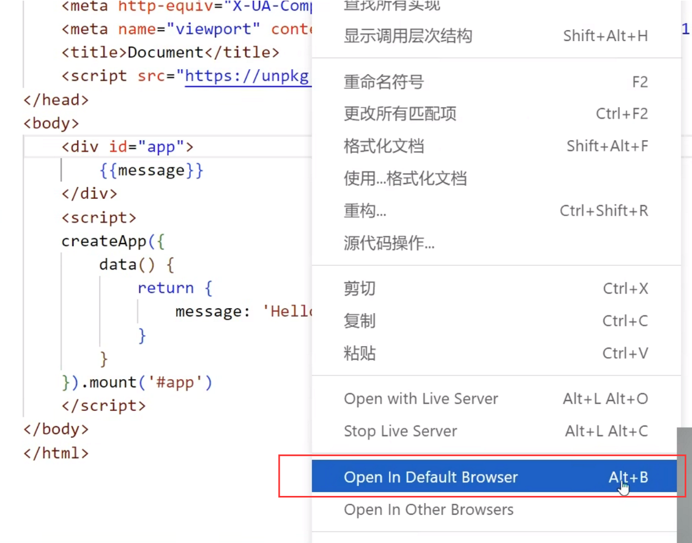


- （ 5 ）前端代码报错可以在浏览器Console界面查看

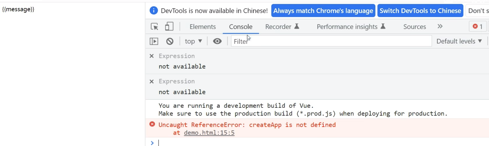

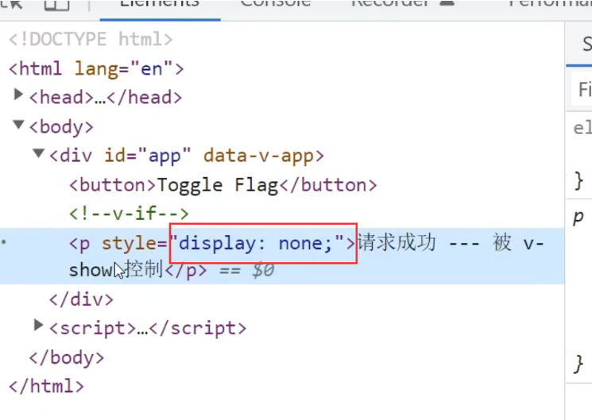

## 8.4 Vue基本语法
### 8.4.1  基本用法
```html
<!DOCTYPE html>
<html lang="en">
  <head>
    <meta charset="UTF-8" />
    <meta name="viewport" content="width=device-width, initial-scale=1.0" />
    <title>Document</title>
    <!-- 1. 导入 vue 的脚本文件 -->
    <script src="https://unpkg.com/vue@next"></script>
  </head>
  <body>

    <!-- 2. 声明要被 vue 所控制的 DOM 区域 -->
    <div id="app">
      {{message}}
    </div>

    <!-- 3. 创建 vue 的实例对象 -->
    <script>
    const hello = {
        // 指定数据源，既MVVM中的Model
        data: function() {
            return {
                message: 'Hello Vue!'
            }
        }
    }
    const app = Vue.createApp(hello)
    app.mount('#app')
    </script>
  </body>
</html>
```
### 8.4.2 内容渲染绑定指令
```html
<!DOCTYPE html>
<!-- 控制HTML标签内容的变化 -->
<html lang="en">
<head>
  <meta charset="UTF-8">
  <meta name="viewport" content="width=device-width, initial-scale=1.0">
  <title>Document</title>
  <script src="https://unpkg.com/vue@next"></script>
</head>
<body>
  <div id="app">
    <!-- {{内容名（意思是需要vue做映射链接的东西）}}是Vue的模板语法，链接到data里对应的数据，可以直接渲染 -->
    <p>姓名：{{username}}</p>
    <p>性别：{{gender}}</p>
    <!-- desc的值是一段HTML标签代码，但是{{}}不会直接使用HTML代码渲染，只会原封不动打印变量的值 -->
    <p>{{desc}}</p>
    <!-- 添加v-html="desc"（v-html="内容名（数据名）"），属性后就让浏览器执行HTML代码 -->
    <p v-html="desc"></p>
  </div>
  

  <script>
    const vm = {
      data: function(){ 
        // 返回JS对象
        return {
          username: 'zhangsan',
          gender: '男',
          desc: '<a href="http://www.baidu.com">百度</a>'
        }
      }
    }
    const app = Vue.createApp(vm)
    app.mount('#app')
  </script>
</body>
</html>
```
### 8.4.3 属性绑定指令
```html
<!DOCTYPE html>
<!-- 控制HTML标签属性的变换 -->
<html lang="en">
  <head>
    <meta charset="UTF-8" />
    <meta name="viewport" content="width=device-width, initial-scale=1.0" />
    <title>Document</title>
    <script src="https://unpkg.com/vue@next"></script>
  </head>
  <body>
    <div id="app">
      <!-- 使用 v-bind:属性名="属性值" 绑定属性 -->
      <!-- v-bind可以省略 -->
      <a v-bind:href="link">百度</a>
      <input type="text" :placeholder="inputValue">
      <!-- style绑定了一个对象 -->
      
    </div>

    <script>
      const vm = {
          data: function(){
            return {
              link:"http://www.baidu.com",
              // 文本框的占位符内容
              inputValue: '请输入内容',
              // 图片的 src 地址
              imgSrc: './images/demo.png',
              w:'500px'
          }
        }
      }
      const app = Vue.createApp(vm)
      app.mount('#app')
    </script>
  </body>
</html>
```
### 8.4.4 使用JavaScript表达式

```html
<!DOCTYPE html>
<!-- 在Vue{{}}中直接使用JS表达式 -->
<html lang="en">
  <head>
    <meta charset="UTF-8" />
    <meta name="viewport" content="width=device-width, initial-scale=1.0" />
    <title>Document</title>
    <script src="https://unpkg.com/vue@next"></script>
  </head>
  <body>
    <!-- vue 实例要控制的 DOM 区域 -->
    <div id="app">
      <!-- {{只能放置JavaScript表达式或变量不能放置循环语句等}} -->
      <p>{{number + 1}}</p>
      <p>{{ok ? 'True' : 'False'}}</p>
      <!-- 字符串分割为字符形程字符数组->数组倒置->数组重新融合为一个字符串 -->
      <p>{{message.split('').reverse().join('')}}</p>
      <p :id="'list-' + id">xxx</p>
      <!-- 绑定一个user对象 -->
      <p>{{user.name}}</p>
    </div>

    <script>
      const vm = {
        data: function(){
          return {
            number: 9,
            ok: false,
            message: 'ABC',
            id: 3,
            user: {
              name: 'zs',
            }
          }
        }
      }
      const app = Vue.createApp(vm)
      app.mount('#app')
    </script>
  </body>
</html>
```
### 8.4.5 事件绑定指令
```html
<!DOCTYPE html>
<html lang="en">
  <head>
    <meta charset="UTF-8" />
    <meta name="viewport" content="width=device-width, initial-scale=1.0" />
    <title>Document</title>
    <script src="https://unpkg.com/vue@next"></script>
  </head>
  <body>
    <div id="app">
      <h3>count 的值为：{{count}}</h3>
      <!-- JS里关于单击事件的监听使用的是onclick -->
      <!-- Vue重新封装了监听事件，使用或简写为 @click -->
      <!-- v-on:click="函数名" -->
      <button v-on:click="addCount">+1</button>
      <!-- @:click="JS表达式" -->
      <!-- 在HTML 属性的表达式中可以直接使用定义的内容名，count一旦变化 上面<h3>的内容值会自动发生变换，这就是Vue的关键特性之一 -->
      <button @click="count+=1">+1</button>
    </div>

    <script>
      const vm = {
        // 数据放到data后
        data: function(){
          return {
            count: 0,
          }
        },
        // 自定义方法放到method后
        methods: {
          // 旧版的JS定义函数使用 函数名: function(){函数体} 方式定义
          // 新版JS可以使用 函数名(){函数体} 方式定义函数
          // 点击按钮，让 count 自增 +1
          // 在方法里必须使用this.内容名（数据名） 访问数据，this指代vm对象
          addCount() {
            this.count += 1
          },
        },
      }
      const app = Vue.createApp(vm)
      app.mount('#app')
    </script>
  </body>
</html>
```
### 8.4.6 条件渲染指令
```html
<!DOCTYPE html>
<!-- 根据一个条件控制一个HTML元素能否显示 -->
<html lang="en">
  <head>
    <meta charset="UTF-8" />
    <meta name="viewport" content="width=device-width, initial-scale=1.0" />
    <title>Document</title>
    
    <script src="https://unpkg.com/vue@next"></script>

  </head>
  <body>
    <div id="app">
      <button @click="flag = !flag">Toggle Flag</button>
      <!-- Vue指令(HTML标签) v-if需要传递的值是一个Bool数据，当布尔值为真时显示改HTML标签内容 -->
      <!-- v-if="false" 时，网页渲染出的HTML源码中该标签就压根不会被创建 -->
      <p v-if="flag">请求成功 --- 被 v-if 控制</p>
      <!-- v-show="false" 时标签会被创建，但会被CSS属性隐藏-->
      <!-- 如果标签需要频繁的被切换应该使用v-show -->
      <p v-show="flag">请求成功 --- 被 v-show 控制</p>
    </div>


    <script>
      const vm = {
        data: function(){
          return {
            flag: false,
          }
        }
      }
      const app = Vue.createApp(vm)
      app.mount('#app')
    </script>
  </body>
</html>
```
### 8.4.7 v-else和v-else-if指令
```html
<!DOCTYPE html>
<!-- 基于标签实现条件判断 -->
<html lang="en">
  <head>
    <meta charset="UTF-8" />
    <meta name="viewport" content="width=device-width, initial-scale=1.0" />
    <title>Document</title>
    <script src="https://unpkg.com/vue@next"></script>

  </head>
  <body>
    <div id="app">
      <p v-if="num > 0.5">随机数 ＞ 0.5</p>
      <p v-else>随机数 ≤ 0.5</p>
      <hr />
      <p v-if="type === 'A'">优秀</p>
      <p v-else-if="type === 'B'">良好</p>
      <p v-else-if="type === 'C'">一般</p>
      <p v-else>差</p>

      <div v-show="a"> 
        测试
      </div>
      <button @click="!a">点击</button>
    </div>

    <script>
      const vm = {
        data: function(){
          return {
            // 生成 1 以内的随机数
            num: Math.random(),
            // 类型
            type: 'A',
            a : false 
          }
        },
        methods:{

          f:function(){
            this.a = !this.a
          }

        }
      }
      const app = Vue.createApp(vm)
      app.mount('#app')
    </script>
  </body>
</html>
```

### 8.4.8 列表渲染指令v-for

```html
<!DOCTYPE html>
<!-- 根据后端返回的数据数量，自动创建对应数量的HTML标签 -->
<html lang="en">
  <head>
    <meta charset="UTF-8" />
    <meta name="viewport" content="width=device-width, initial-scale=1.0" />
    <title>Document</title>
    <script src="https://unpkg.com/vue@next"></script>

  </head>
  <body>
    <div id="app">
      <ul>
        <!-- (user) in userList 得到的仅是数组元素 -->
        <li v-for="(user, i) in userList">索引是：{{i}}，姓名是：{{user.name}}</li>
      </ul>
    </div>

    <script>
      const vm = {
        data: function(){
          return {
            userList: [
              { id: 1, name: 'zhangsan' },
              { id: 2, name: 'lisi' },
              { id: 3, name: 'wangwu' },
            ],
          }
        },
      }
      const app = Vue.createApp(vm)
      app.mount('#app')
    </script>
  </body>
</html>
```
### 8.4.9 v-for中的key

```html
<!DOCTYPE html>
<html lang="en">

<head>
  <meta charset="UTF-8">
  <meta name="viewport" content="width=device-width, initial-scale=1.0">
  <title>Document</title>
  <script src="https://unpkg.com/vue@next"></script>

</head>

<body>
  <div id="app">

    <!-- 添加用户的区域 -->
    <div>
      <!-- v-model 指令定义双向绑定的内容名（即页面发生了变化，例如本例中的text组件的内容发生了变换 name变量也会相应改变；且name发生改变后text组件内容也会变换，例如本例中每在List添加一个name后就把this.name=" " 相应的页面text组件也会发生变换） -->
      <!-- :value = "name" 是一种单向绑定，页面发生了变化name变量的值会发生变换，但是name发生了变化页面则不会发生变换 -->
      
      <input type="text" v-model="name">
      <button @click="addNewUser">添加</button>
    </div>

    <!-- 用户列表区域 -->
    <ul>
      <!-- Vue组件化开发要求使用v-for时给每个列表元素赋值一个唯一的key -->
      <!-- vue 倾向于重用标签，如果不给每个vue标签指定唯一的id 那么对于本例而言当给zhangsan打勾（checkbox组件）之后，这个被打勾的checkbox组件会一直保持在列表的第一个位置，因为它没有绑定到唯一的user -->
      <!-- key一般是从数据库中得到，可以保证唯一性 -->
      <li v-for="(user, index) in userlist" :key="user.id">
        <input type="checkbox" />
        姓名：{{user.name}}
      </li>
    </ul>
  </div>

  <script>
    const vm = {
      data: function(){
        return {
          // 用户列表
          userlist: [
            { id: 1, name: 'zhangsan' },
            { id: 2, name: 'lisi' }
          ],
          // 输入的用户名
          name: '',
          // 下一个可用的 id 值
          nextId: 3
        }
      },
      methods: {
        // 点击了添加按钮
        addNewUser() {
          // unshift 在列表起始位加入对象
          this.userlist.unshift({ id: this.nextId, name: this.name })
          this.name = ''
          this.nextId++
        }
      }
    }
    const app = Vue.createApp(vm)
    app.mount('#app')
  </script>
</body>

</html>
```
-  显示效果
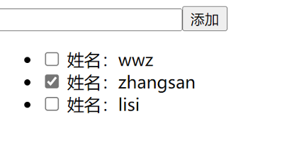


# 9. Vue组件化开发
**本节内容**
- 第一节NPM使用
- 第二节Vue CLI使用
- 第三节 组件化开发
## 9.1 NPM使用
### 9.1.1 NPM简介
- NPM（Node Package Manager）是一个NodeJS包管理和分发工具(类似Java的Maven)。
- NPM以其优秀的依赖管理机制和庞大的用户群体，目前已经发展成为整个JS领域的依赖管理工具
- NPM最常见的用法就是用于安装和更新依赖。要使用NPM，首先要安装Node工具。

### 9.1.2 NodeJS 安装

- Node.js 是一个基于Chrome V8 引擎 的JavaScript 运行时环境。
- Node中包含了NPM包管理工具。
- 下载地址：https://nodejs.org/zh-cn/
- nodeJS安装教程：
  - [Nodejs安装教程](https://blog.csdn.net/qq_48485223/article/details/122709354)
  - [windows安装npm教程--nodejs ](https://www.cnblogs.com/jianguo221/p/11487532.html)
  - [node版本与npm版本对应关系（版本错误建议重新安装）](https://nodejs.org/zh-cn/download/releases/)
  - [node所有版本安装网址](https://nodejs.org/en/download/releases/)
  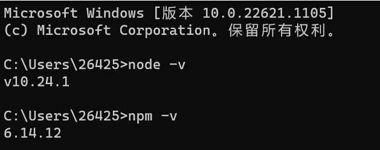
- [安装nvm工具进行NodeJs版本管理](https://juejin.cn/post/6985421942681534495)
  - ○ nvm下载后找不到的话可以重起CMD试试
  - ○ [2023 - windows10 安装nvm 管理nodejs ，并设置全局模块安装路径的配置](https://juejin.cn/post/7196652592373497915)
  - ○ [无法找到node的解决办法](https://blog.csdn.net/qq_37024887/article/details/109604360)


### 9.1.3 NPM的使用

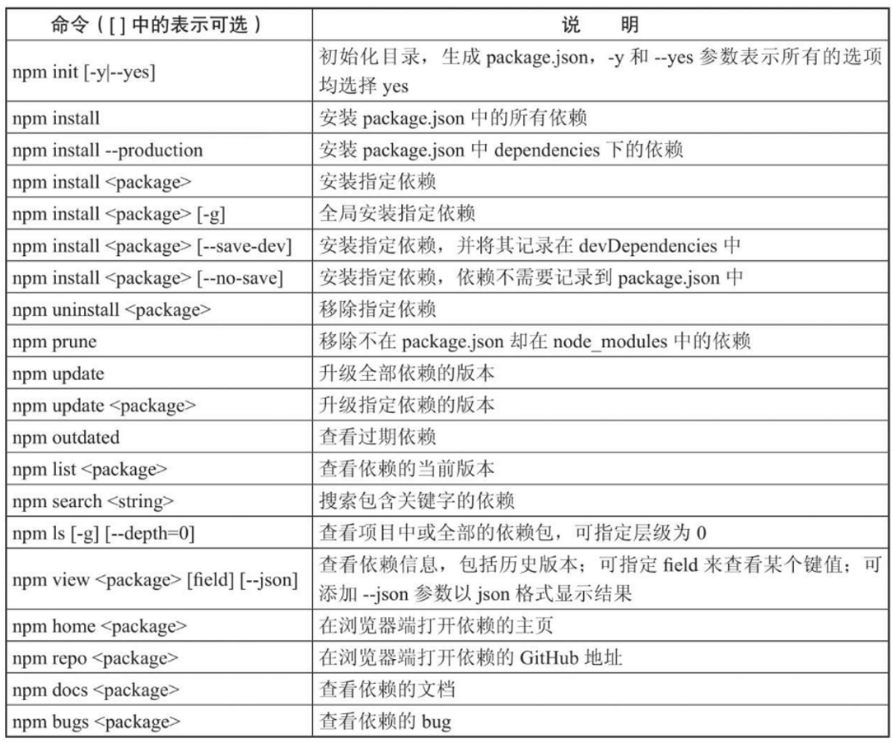

## 9.2 Vue CLI使用
### 9.2.1  Vue/Vue CLi安装与基本使用

- 不再使用一个个html文件编辑的方式开发项目了，而使用工程化的方式
- [Vue-Cli版本切换教程](https://juejin.cn/post/6898585774368030727)
- Vue CLI是Vue官方提供的构建工具，通常称为脚手架。
- 用于快速搭建一个带有热重载（在代码修改后不必刷新页面即可呈现修改后的效果）及构建生产版本等功能的单页面应用。
- Vue CLI基于webpack 构建，也可以通过项目内的配置文件进行配置。
- 安装（安装vue-cli会自动安装vue）：`npm install -g @vue/cli`
- [解决‘vue‘不是内部或外部命令，也不是可运行的程序或批处理文件的方法](https://blog.csdn.net/m0_48276047/article/details/113926266)
- 使用CLI 创建项目：
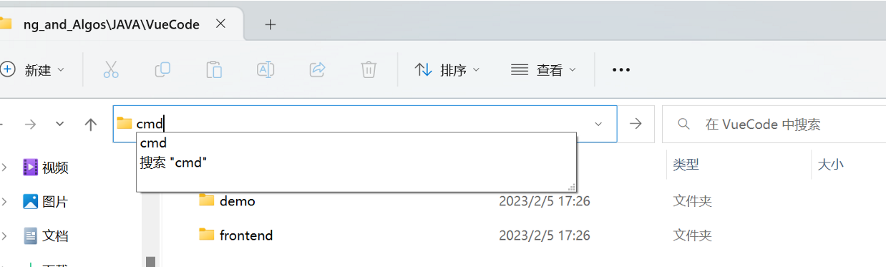
  - ○ 输入:`npm ctreate vue_hello`

  - ○ 取消勾选Linter(它是eslint需要的一个组件)
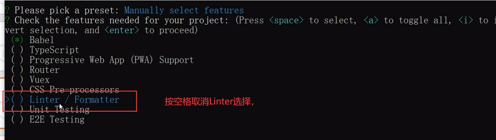
  - ○ 选择最新的 3
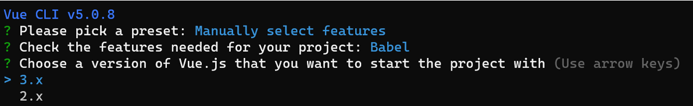
  - ○ 选择将配置记录到package.json文件中
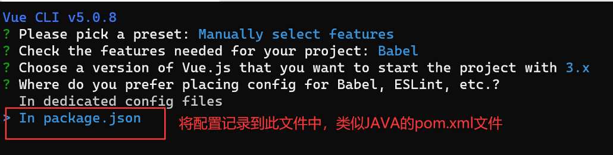
  - ○ 是否将刚才的配置保存为一个快照（用于快速创建之后的项目）
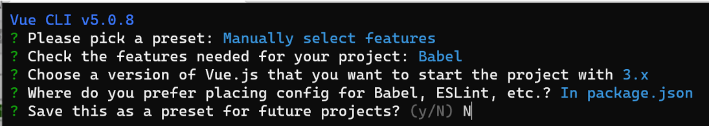\
  - ○ 创建成功，在VSCode中打开创建的项目
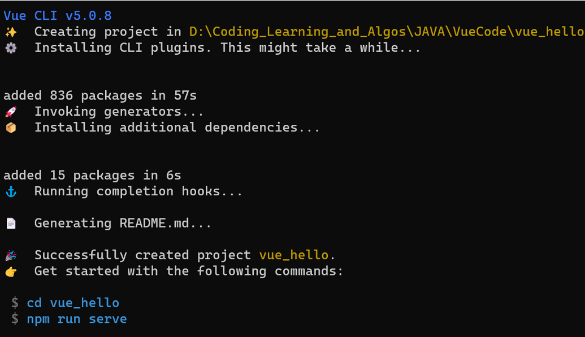
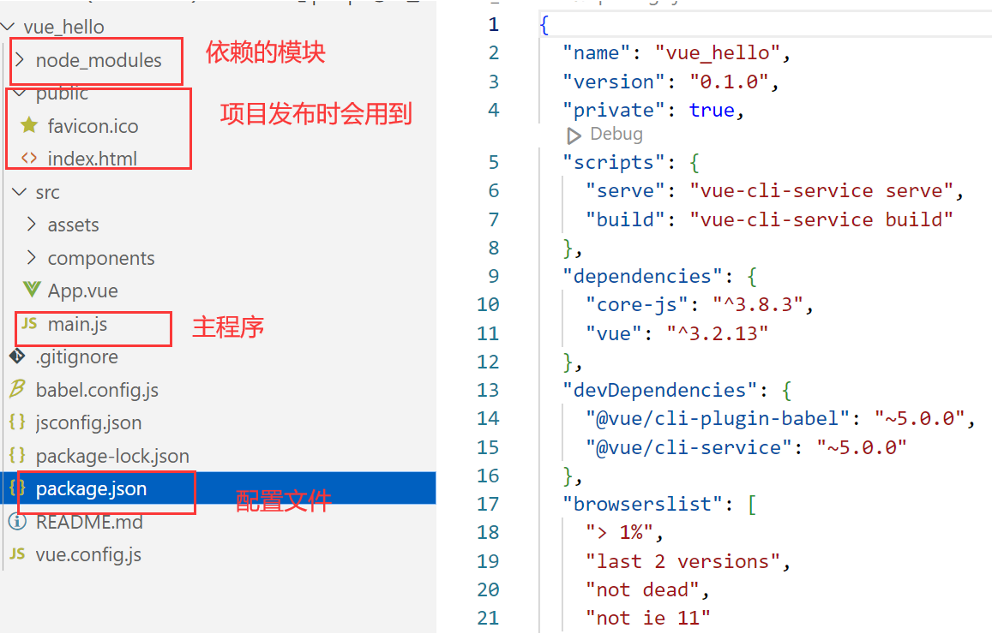
  - ○ 启动程序实例vue_hello
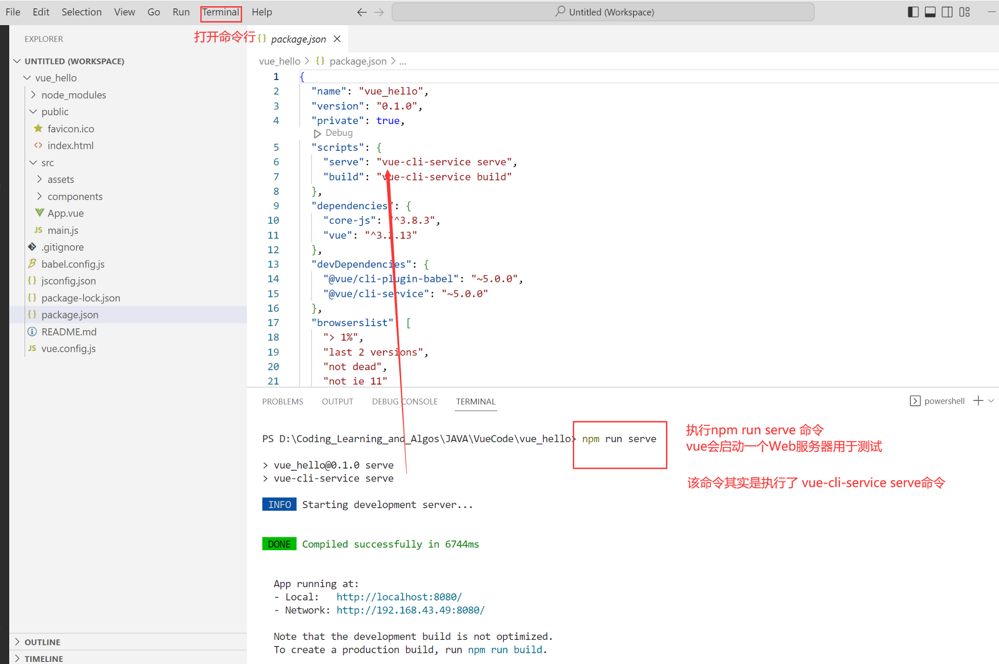
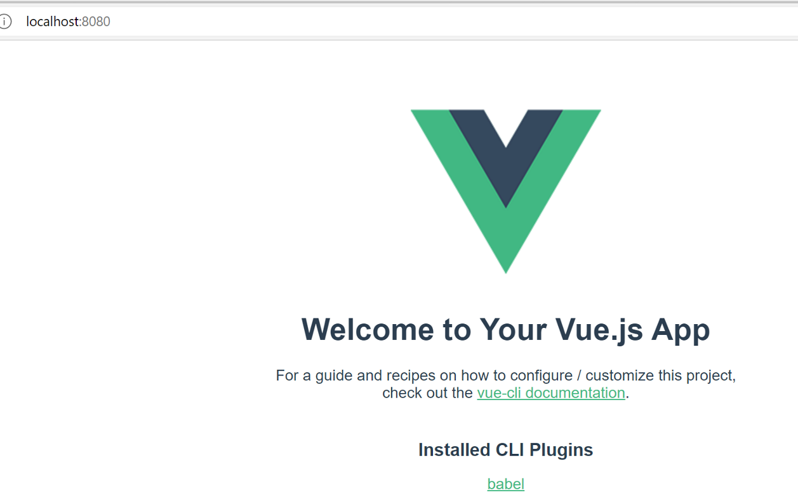


### 9.2.2Vue项目结构

- Vue项目结构:
  - `node_modules`文件夹:vue 项目的文件依赖存放在这个文件夹
  - `public`文件夹:存放页面图标和不支持JavaScript 情况时的页面。
  - `package.json`：存放项目的依赖配置（比如vuex，element-UI）。
  - `babel.config.js:babel` 转码器的配置文件。
  - `vue.config.js:vue`的配置文件。
  - `yarn.lock`:用来构建依赖关系树。
  - `.gitignore`:git 忽略文件
  - `src`:存放vue 项目的源代码。其文件夹下的各个文件（文件夹）分别为：
  - `assets`：资源文件，比如存放css，图片等资源。
  - `component`：组件文件夹，用来存放vue 的公共组件（注册于全局，在整个项目中通过关键词便可直接输出）。
  - `router`:用来存放index.js，这个js 用来配置路由
  - `tool`：用来存放工具类js，将js 代码封装好放入这个文件夹可以全局调用（比如常见的api.js，http.js是对http 方法和api 方法的封装）。
  - `views`：用来放主体页面，虽然和组件文件夹都是vue 文件，但views 下的vue 文件是可以用来充当路由view 的。
  - `main.js`:是项目的入口文件，作用是初始化vue 实例，并引入所需要的插件。
  - `app.vue`:是项目的主组件，所有页面都是在该组件下进行切换的。

## 9.3 Vue组件化开发
- 组件（Component）是Vue.js最强大的功能之一。组件可以扩展HTML元素，封装可重用的代码。
- Vue的组件系统允许我们使用小型、独立和通常可复用的组件构建大型应用。


### 9.3.1 组件的构成
- Vue 中规定组件的后缀名是.vue
- 每个.vue 组件都由 3 部分构成，分别是
  - ○ template，组件的模板结构，可以包含HTML标签及其他的组件
  - ○ script，组件的JavaScript 代码,即组件的行为
  - ○ style，组件的样式

### 9.3.2 组件化开发实践
- VScode 安装Vetur工具
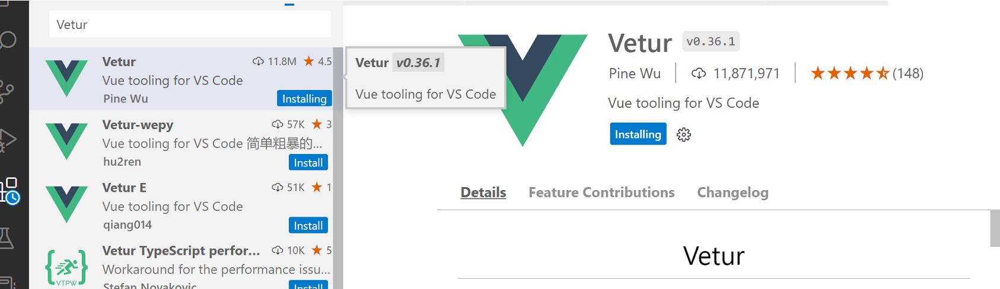
-  `main.js`解读
```javascript
// 从vue模块导入createApp方法
import { createApp } from 'vue'
// 从本级目录的App.vue导入App类
// .vue是Vue提供的组件
import App from './App.vue'

// #app标签在 ./public/index.html文件中
// 最终App组件的内容会被渲染到index.html的app组件中
createApp(App).mount('#app')
```

- `App.vue`解读:App.vue是一个根组件所有组件都会直接或间接被放到App组件中
```html
<template>
  <!-- img组件 alt属性规定图像的替代文本 -->
  <!-- 下面这个img组件其实定义的就是Vue的logo -->
  
  <!-- HelloWorld标签是Vue自定义的标签，组件化开发的功能支持用户自定义标签 -->
  <!-- HelloWorld 组件定义在./components下 -->
  <HelloWorld msg="Welcome to Your Vue.js App"/>
  <HelloWorld msg="Welcome to Your Vue.js App Again!"/>
</template>

<script>
// import导入HelloWorld组件
import HelloWorld from './components/HelloWorld.vue'

// export 导出：一个模块就是一个独立的文件。该文件内部的所有变量，外部无法获取。如果你希望外部能够读取模块内部的某个变量，就必须使用export关键字输出该变量。
// 了解 export、export default、import的作用和区别 https://zhuanlan.zhihu.com/p/389813789
export default {
  name: 'App',
  // 在componets中注册导入的组件，然后再<template></template>中就可以使用了
  components: {
    HelloWorld
  }
}
</script>

<style>
#app {
  font-family: Avenir, Helvetica, Arial, sans-serif;
  -webkit-font-smoothing: antialiased;
  -moz-osx-font-smoothing: grayscale;
  text-align: center;
  color: #2c3e50;
  margin-top: 60px;
}
</style>
```

# 10. 第三方组件element-ui
**本节内容**
- 第一节 组件间的传值
- 第二节element-ui介绍
- 第三节 组件的使用
- 第四节 图标的使用

## 10.1 组件间的传值
- 组件可以由内部的Data提供数据，也可以由父组件通过prop的方式传值。
- 兄弟组件之间可以通过Vuex等统一数据源提供数据共享。

## 10.2 element-ui介绍
- Element是国内饿了么公司提供的一套开源前端框架，简洁优雅，提供了Vue、React、Angular等多个版本。
- element-ui适配vue3的版本还在快速迭代中还不成熟
- 文档地址：https://element.eleme.cn/#/zh-CN/
- 安装(-S表示将安装的包版本记录在package.json文件中)：npm i element-ui-s
- 在main.js文件中引入Element：
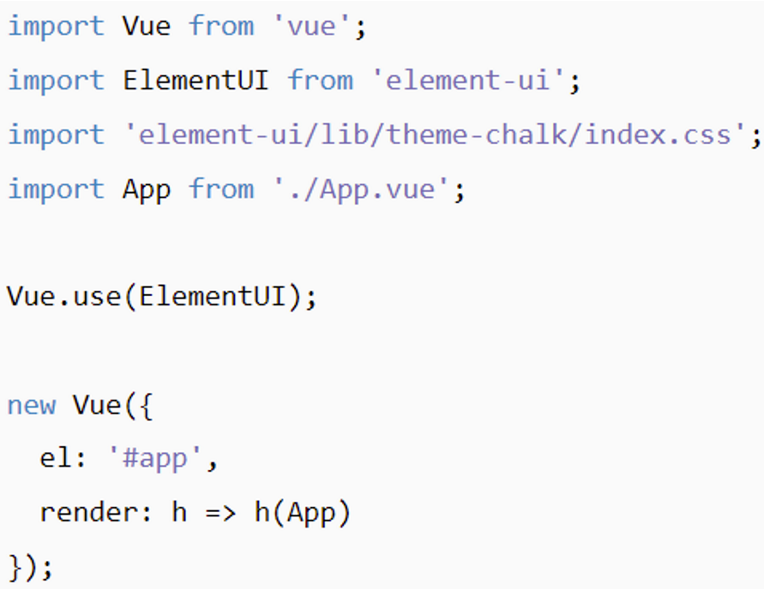
```javascript
import Vue from 'vue'
import App from './App.vue'
// 从node_modules导入ElementUI
import ElementUI from 'element-ui'
// 导入ElementUI组件所用到的样式
import 'element-ui/lib/theme-chalk/index.css'
// 导入第三方样式库
import 'font-awesome/css/font-awesome.min.css'

// 之前在App.vue中的export default { components:{组件名}}对组件进行局部注册
// 第三方的组件要在多个地方用，因此仍使用局部注册的方式会很麻烦，可以使用Vue.use(ElementUI);尽心全局注册
Vue.use(ElementUI);

Vue.config.productionTip = false

new Vue({
  render: h => h(App),
}).$mount('#app')
```
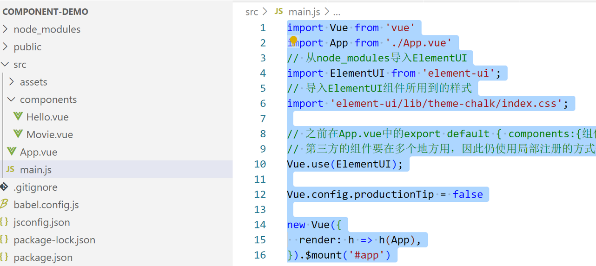

## 10.3 第三方图标库

- 由于Element UI提供的字体图符较少，一般会采用其他图表库，如著名的Font Awesome
- Font Awesome提供了 675 个可缩放的矢量图标，可以使用CSS所提供的所有特性对它们进行更改，包括大小、颜色、阴影或者其他任何支持的效果。
- 文档地址：http://fontawesome.dashgame.com/
https://www.runoob.com/font-awesome/fontawesome-tutorial.html
- 安装：`npm install font-awesome -S`
- 使用：
  - ○ `main.js`导入css样式`import 'font-awesome/css/font-awesome.min.css`
  - ○ 在需要使用图标的地方插入`<iclass="fa 图标名字"></i>图标名字`
  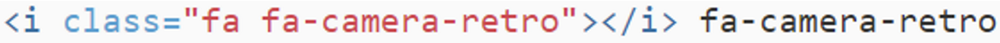
  


## 10.4 实践 1 ：演示组件传值

### 10.4.1 使用vue-cli创建一个新的项目`component-demo`
- 选择vue2,因为element-ui成熟的版本是适配的vue2
- vue2和vue3在main.js的语法内容上有差异

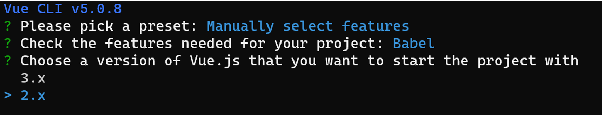

### 10.4.2 编写一个自定义组件`Movie.vue`

- vue script 导出代码块快捷键

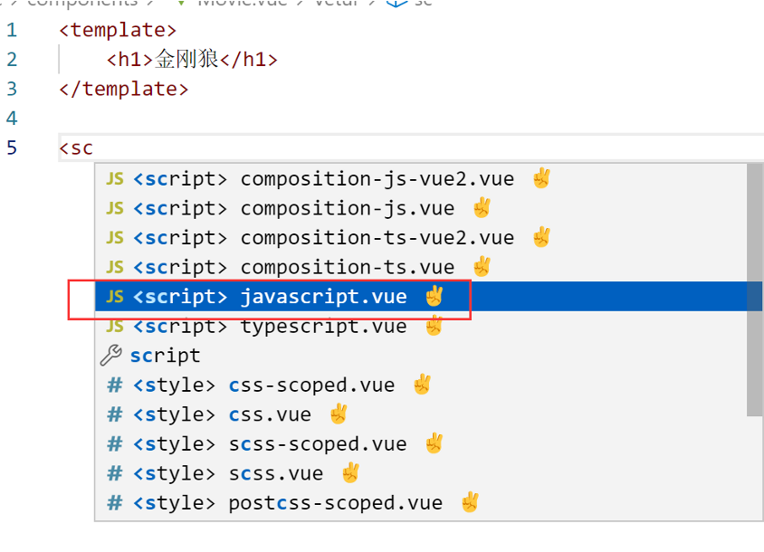

```Javascript
<template>
    <!-- vue2.x的template中必须有唯一的一个根标签<div></div> -->
    <div>
        <h1>{{title}}</h1>
        <span>{{ rating }}</span>
        <button @click="Collect">点击收藏</button>
    </div>

</template>

<script>
export default {
    // 给组件起名,在App.vue中可以通过Movie.name调用查看该属性
    name:"Movie",
    // props:["属性名"] 自定义属性，定义完成后就可以在App.vue中通过 <Movie 属性名="属性值"></Moive>来设置变量
    // 组件间的传值: 由父组件通过prop的方式传值
    props:[
        "title",
        "rating"
    ],
    data:function(){
        return {
            // 组件间的传值: 由内部的Data提供数据
            // title:"金刚狼"
        }
    },
    methods:{
        Collect(){
            alert("收藏成功！")
        }
    }
}
</script>
```
### 10.4.3 编写Hello.vue组件
```html
<template>
    <h3>hello</h3>
</template>>
```
### 10.4.4 编写App.vue组件
```html
<template>
  <div id="app">
    <Movie v-for="movie in movies" :key="movie.id" :title="movie.title" :rating="movie.rating"></Movie>
    <Hello></Hello>
    <!-- 上面的Hello 组件 和 Movie组件是兄弟组件，当他们之间想要共享数据该怎么办？ 通过vuex可以实现-->
  </div>
</template>

<script>
import Movie from './components/Movie.vue'
import Hello from './components/Hello.vue'

export default {
  name: 'App',
  data:function(){
    return{
      // 模拟返回数据库数据
      movies:[
        {id:1,title:"金刚狼",rating:8.7},
        {id:2,title:"流浪地球",rating:9.7},
        {id:3,title:"满江红",rating:8.9}
      ]
    }
  },
  components: {
    Movie,
    Hello
  }
}
</script>

<style>
#app {
  font-family: Avenir, Helvetica, Arial, sans-serif;
  -webkit-font-smoothing: antialiased;
  -moz-osx-font-smoothing: grayscale;
  text-align: center;
  color: #2c3e50;
  margin-top: 60px;
}
</style>
```
### 10.4.5 实验结果
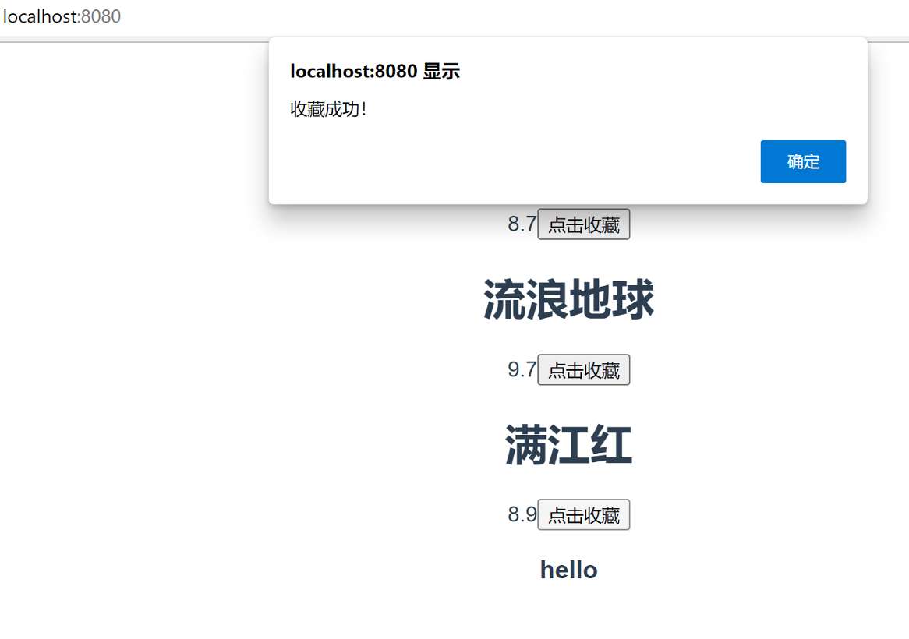
## 10.5 实践 2 ：使用npm install 命令下载vue项目所需的依赖包
>当vue的项目没有node_modules目录时，可以使用npm install 命令根据package.json命令下载所需依赖包
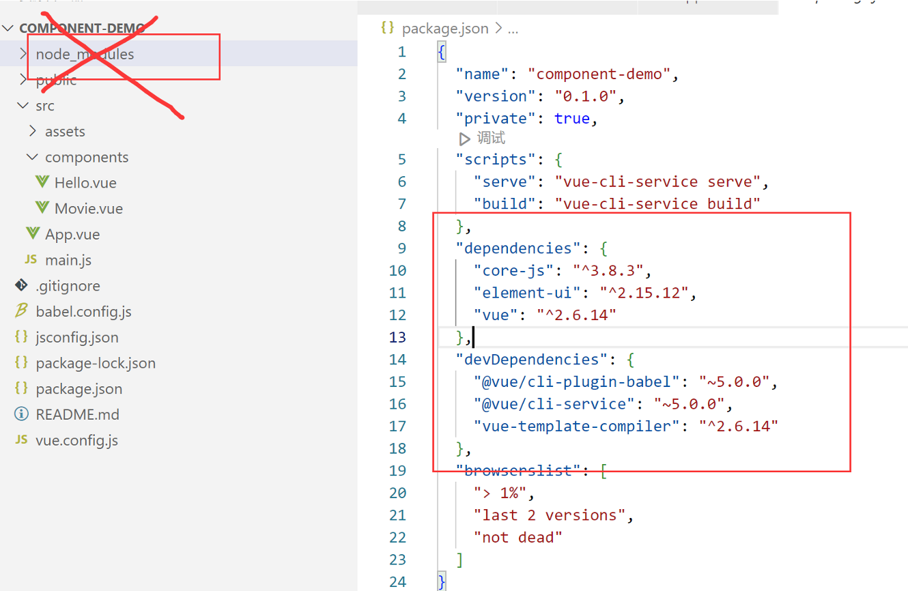
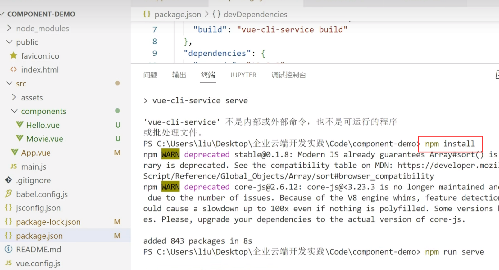

## 10. 6 实验3:使用element-ui组件
通过仔细阅读源码后使用element-ui组件
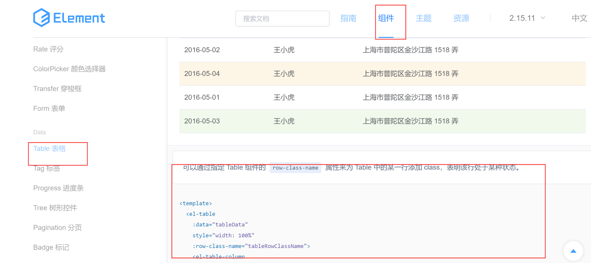


# 11. Axios网络请求
**本节内容**
- 第一节Axios的使用
- 第二节 与Vue整合
- 第三节 前后端联调时涉及到的跨域问题
## 11.1 Axios的使用
### 11.1.1 Axios简介
- 在实际项目开发中，前端页面所需要的数据往往需要从服务器端获取，这必然涉及与服务器的通信。（浏览器向服务端发送请求拿到数据，再通过vue进行数据绑定）
- 前端做数据请求的技术中原始的技术就是ajax，但是ajax用起来不方便
- Axios 是一个基于promise 网络请求库，作用于node.js 和浏览器中。
- Axios 在浏览器端使用XMLHttpRequests发送网络请求，并能自动完成JSON数据的转换 。
- 安装：`npm install axios`
- 地址：https://www.axios-http.cn/
- 在文件（可以是main.js 或要使用该包的组件）中导入：`import axios from 'axios'`

### 11.1.2 发送网络请求
- 发送GET请求(对应`Springboot GetMapping`)
  - ○ .then,.catch是promise相关的语法
  
  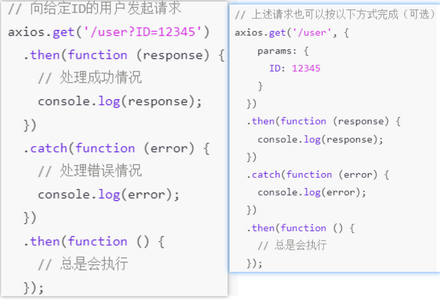
- 发送POST请求（axios会自动把请求体里的数据转为JSON格式传递给后端）

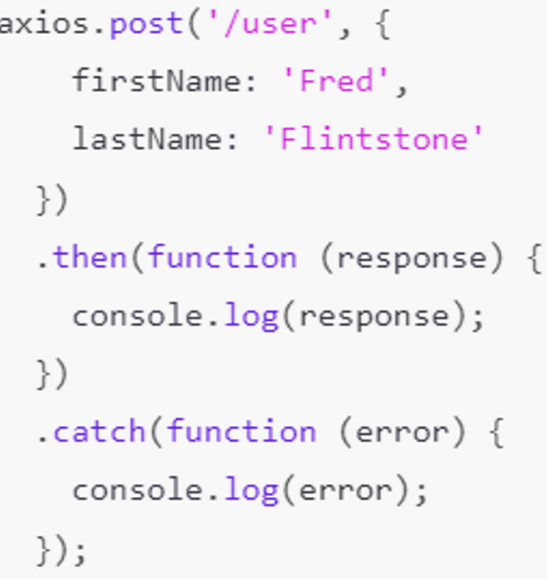

- 其他请求方式参考：https://axios-http.com/zh/docs/req_config

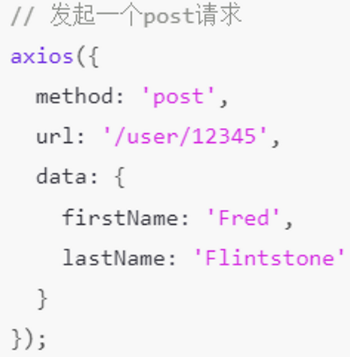

- RESTful编程风格
- get内是URL+配置项
- post内是URL+请求体+配置项

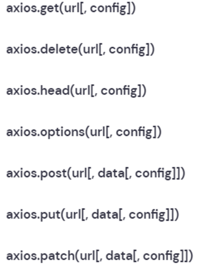


### 11.1.3 异步回调问题
- `async/await`：成对出现
- 1.2得到的数据都是以异步的形式得到的，具体来说就是发送请求然后在.then()中传递一个回调函数，然后得到Response，不必等到Response返回后才继 续执行程序
- 给发请求所在的方法前面加async，在发请求的函数前加await,这样就不需要.then()了，程序会等待拿到数据后，再继续执行
- 常用的还是1.2的方式


### 11.1.4 Axios网络请求定义位置
#### 11.1.4.1 Vue组件的生命周期
```Javascript
  // vue提供了组件生命周期函数，一个组件从创建-加载（挂载到页面）渲染-销毁（切换页面）都有对应的函数
  // 在vue官网搜索生命周期可以找到所有的生命周期函数
  created:function(){
    console.log("App组件被创建了")
  },
  // 组件渲染完毕（挂载完毕）
  mounted:function(){
    console.log("App组件被渲染完毕")
  },
```
#### 11.1.4.2 Axios网络请求一般作用在组件创建函数内
```Javascript
created:function(){
    console.log("App组件被创建了")
    // get请求和后端联动起来了 
    // 以mpdemo springboot后端项目为例 可以请求 /user/users_orders接口获得所有用户及其订单
    // 但是Vue自带的Web服务器占用了8080端口，
    // 因此可以修改mpdemo项目的端口为8080（application.properties文件）：server.port=8088
    axios.get("http://localhost:8088/user/users_orders").then(function(response){
      console.log(response)
    })
  },
```

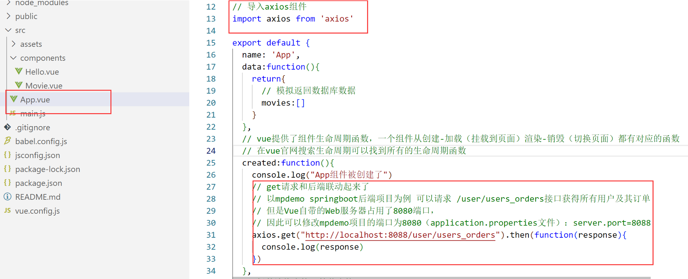

运行代码在浏览器启动检查功能
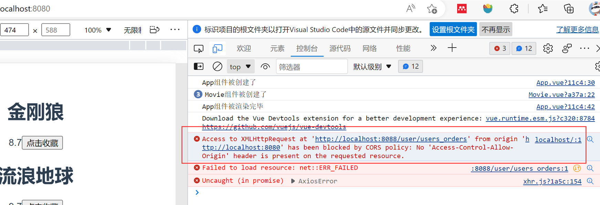

显示数据被CORS策略阻塞了，这就涉及到跨域的问题，另外我们发现报错是在App组件被渲染后面，这是因为此处get请求是一个异步的过程，等到所有的
代码都执行完了，网络请求都成功了才会执行。

#### 11.1.4.3 根据Spring Boot中配置CORS解决跨域问题后在前端显示得到的用户数据
```Javascript
<!--Hello.vue 文件-->
<template>
    <div>
        <el-table
        :data="tableData"
        style="width: 100%"
        :row-class-name="tableRowClassName">
        <el-table-column
        prop="id"
        label="编号"
        width="180">
        </el-table-column>
        <el-table-column
        prop="username"
        label="姓名"
        width="180">
        </el-table-column>
        <el-table-column
        prop="birthday"
        label="出生日期">
        </el-table-column>
        </el-table>
        <el-date-picker
        v-model="value1"
        type="date"
        placeholder="选择日期">
        </el-date-picker>
        <i class="fa fa-car"></i>
    </div>
</template>

<style>
.el-table .warning-row {
    background: oldlace;
}

.el-table .success-row {
    background: #f0f9eb;
}
</style>

<script>
// 导入axios组件
import axios from 'axios'

export default {
    methods: {
    tableRowClassName({row, rowIndex}) {
        if (rowIndex === 1) {
        return 'warning-row';
        } else if (rowIndex === 3) {
        return 'success-row';
        }
        return '';
    }
    },
    created:function(){
        // axios.get("http://localhost:8088/user/users_orders").then(function(response){
        //     // 将后端的数据赋值给tableData
        //     // 回调函数的作用域发生了变化，直接使用this.tableData = response.data赋值数据会显示
        //     // tableData未定义，其实就是浏览器不知道this是谁
        //     this.tableData = response.data
        // })
        axios.get("http://localhost:8088/user/users_orders").then((response)=>{
            // => 使得此函数体的作用域继承自父组件
            this.tableData = response.data
        })
    },
    data() {
    return {
        tableData: [],
        value1: ''
    }
    }
}
</script>
```

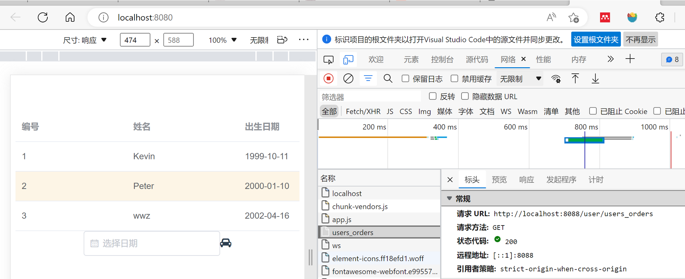

## 11.2 与Vue整合

- 在实际项目开发中，几乎每个组件中都会用到axios 发起数据请求。此时会遇到如下两个问题：
  - ○ 每个组件中都需要导入axios
  - ○ 每次发请求都需要填写完整的请求路径
- 可以通过全局配置的方式解决上述问题：

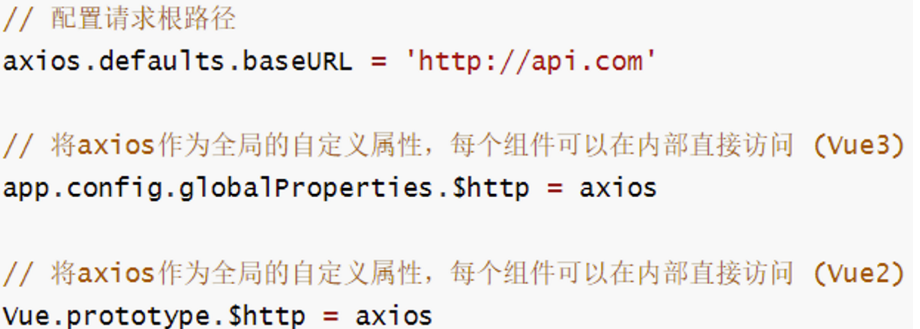

- 在`main.js`中添加

```Javascript
importaxios from 'axios'
axios.defaults.baseURL= "http://localhost:808^8 "
// 下面的代码为Vue添加一个叫$http的属性，该属性的值是axios
Vue.prototype.$http= axios
```
- 然后就可以在Vue项目的任何一个组件中使用了：
  - ○ 旧的使用方式：`axios.get("http://localhost:8088/user/users_orders").then((response)=>{this.tableData = response.data})`○ 新的使用方式（不需要再写完整的URL了）：`this.$http.get("/user/users_orders").then((response)=>{this.tableData = response.data})`

## 11.3 跨域
- 为了保证浏览器的安全，不同源的客户端脚本在 **没有明确授权** 的情况下，不能读写对方资源，称为同源策略，同源策略是浏览器安全的基石
- 同源策略（Sameoriginpolicy）是一种约定，它是浏览器最核心也最基本的安全功能
- 所谓同源（即指在同一个域）就是两个页面具有相同的协议（protocol），主机（host）和端口号（port）
- 当一个请求url的协议、域名、端口三者之间任意一个与当前页面url不同即为跨域，此时无法读取非同源网页的Cookie，无法向非同源地址发送AJAX 请求
- 例如本例中前端运行在 8080 端口而后端运行在 8088 端口，他们就不同源
### 11.3.1 跨域问题解决
- `CORS（Cross-Origin Resource Sharing）`是由W3C制定的一种跨域资源共享技术标准，其目的就是为了解决前端的跨域请求。
- CORS可以在不破坏即有规则的情况下，通过后端服务器实现CORS接口，从而实现跨域通信。
- CORS将请求分为两类：简单请求和非简单请求，分别对跨域通信提供了支持

#### 11.3.1.1 简单请求
满足以下条件的请求即为简单请求：
- 请求方法：`GET、POST、HEAD`
- 除了以下的请求头字段之外，没有自定义的请求头：`Accept、Accept-Language、Content-Language、Last-Event-ID、Content-Type`
- Content-Type的值只有以下三种：`text/plain、multipart/form-data、application/x-www-form-urlencoded`

#### 11.3.1.2 简单请求的服务器处理
- 对于简单请求，CORS的策略是请求时在请求头中增加一个Origin字段，

- 服务器收到请求后，根据该字段判断是否允许该请求访问，如果允许，则在HTTP头信息中添加Access-Control-Allow-Origin字段。

#### 11.3.1.3 非简单请求
- 对于非简单请求的跨源请求，浏览器会在真实请求发出前增加一次OPTION请求，称为预检请求（preflight request）
- 预检请求将真实请求的信息，包括请求方法、自定义头字段、源信息添加到HTTP头信息字段中，询问服务器是否允许这样的操作。
- 例如一个GET请求：

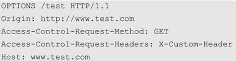

- `Access-Control-Request-Method`表示请求使用的HTTP方法，`Access-Control-Request-Headers`包含请求的自定义头字段
- 服务器收到请求时，需要分别对`Origin、Access-Control-Request-Method、Access-Control-Request-Headers`进行验证，验证通过后，会在返回HTTP头信息中添加：

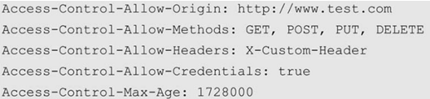

- `Access-Control-Allow-Methods、Access-Control-Allow-Headers`：真实请求允许的方法、允许使用的字段:
  - ○ `Access-Control-Allow-Credentials`: 是否允许用户发送、处理cookie
  - ○ `Access-Control-Max-Age`: 预检请求的有效期，单位为秒，有效期内不会重复发送预检请求。
- 当预检请求通过后，浏览器才会发送真实请求到服务器。这样就实现了跨域资源的请求访问。

### 11.3.2 Spring Boot中配置CORS
#### 11.3.2.1方法 1 ： 新增跨域配置类继续全局配置

在传统的Java EE开发中，可以通过过滤器统一配置，而Spring Boot中对此则提供了更加简洁的解决方案:

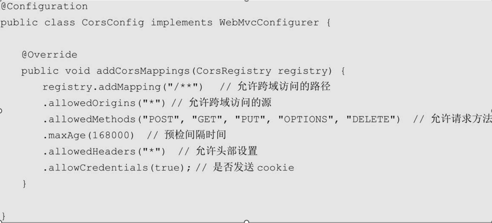

#### 11.3.2.2 方法 2 ：为独立控制器添加@CrossOrigin注解

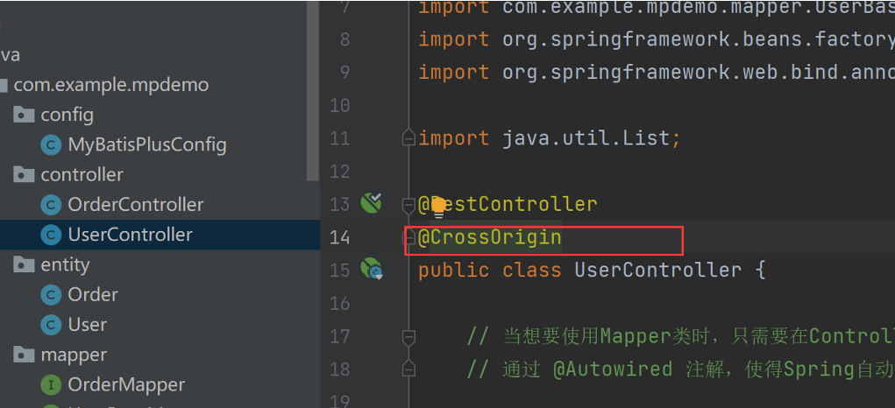

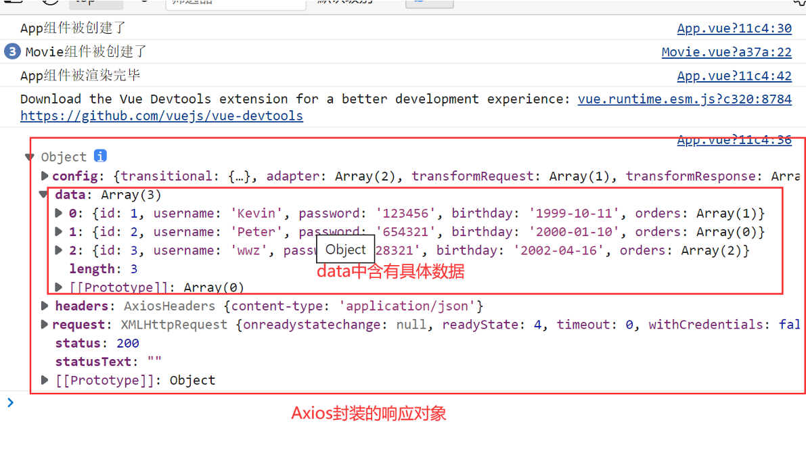

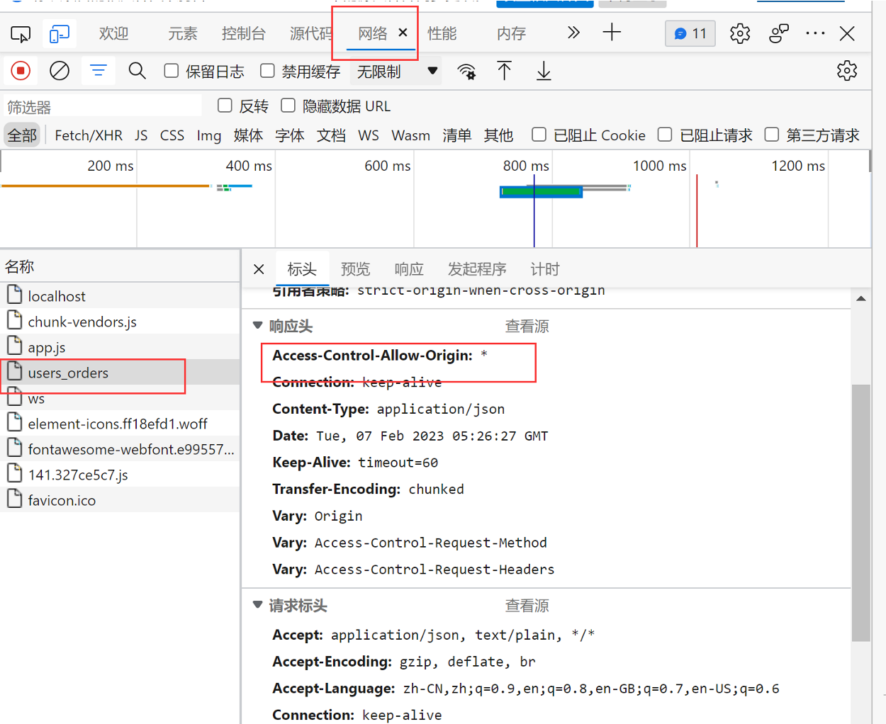


# 12. 前端路由VueRouter
**本节内容**
-  第一节VueRouter安装与使用
-  第二节 参数传递
-  第三节 子路由
-  第四节 导航守卫

## 12.1 SPA与前端路由

>路由是根据不同的url地址来显示不同的页面或内容的功能，这个概念很早是由后端提出的，既浏览器向不同的地址发送请求，后端返回相应的内容。SPA 指的是一个web 网站只有唯一的一个HTML 页面，所有组件的展示与切换都在这唯一的一个页面内完成。此时，不同组件之间的切换需要通过前端路由来实现。前端路由通常是通过监听URL hash属性值的变化，切换页面，hash 属性是一个 可读可写的字符串 ，该字符串是URL 的锚部分（从# 号开始的部分）。

**前端路由的工作方式**: 前端路由，指的是Hash 地址与组件之间的对应关系。
- 用户点击了页面上的路由链接
- 导致了URL 地址栏中的Hash 值发生了变化
- 前端路由监听了到Hash 地址的变化
- 前端路由把当前Hash 地址对应的组件渲染都浏览器中

## 12.2 VueRouter基本使用
- vue-router 是vue.js 官方给出的路由解决方案, 它只能结合vue 项目进行使用,能够轻松的管理SPA （单页应用程序）项目中组件的切换。例如网易云音乐的页面，每点一个连接就会切换一个组件显示

- Vue适合做单页面项目，所有网页内容都是通过一个html来切换，此html通过不同的路由控制不同组件的显示（该控制需要vue-router）
- Vue的单页面应用是基于路由和组件的，路由用于设定访问路径，并将路径和组件映射起来(访问不同的路径显示不同的组件)
- vue-router 目前有3.x 的版本和4.x 的版本，vue-router 3.x 只能结合vue2 进行使用，vue-router 4.x 只能结合vue3 进行使用
- 安装：`npm install vue-router@4`或`npm install vue-router@3`
- Vue-router官网：https://router.vuejs.org/zh/introduction.html

## 12.2.1 vue-router的基本使用步骤

- 在项目中安装vue-router
- 定义路由组件
- 声明路由链接和占位符
- 创建路由模块
- 导入并挂载路由模块

### 12.2.2 vue-router 安装

- 安装vue-router3.x
```
npm install vue-router@3
```
- 安装vue-router 4 .x
```
npm install vue-router@ 4
```
### 12.2.3 创建路由组件
>在项目中定义Discover.vue、Friends.vue、My.vue 三个组件，将来要使用vue-router 来控制它们的展示与切换：

- **Discover.vue：**
```Javascript
<template>
	<div>
		<h1>发现音乐</h1>
	</div>
</template>
```
- **Friends.vue：**
```Javascript
<template>
    <div>
        <h1>关注</h1>
    </div>
</template>
```
- **My.vue：**
```Javascript
<template>
	<div>
		<h1>我的音乐</h1>
	</div>
</template>
```

### 12.2.4 声明路由链接和占位标签

>可以使用`<router-link>`标签来声明路由链接，并使用` <router-view>`标签来声明路由占位符（作用是当某个路由链接被点击后，该路由链接的组件就会在占位符的位置被渲染出来）。示例代码如下：

- **App.vue：**

```Javascript
		<!-- to="跳转的目的名称"， 所有的跳转都会以锚点的形式进行跳转，也就是类似 http://localhost:8080/#/discover # 号就是锚点，#号后接目的名称-->
		<!-- 注意此时还没有对目的名称和组件的关系进行绑定-->
		<router-link to="/discover">发现音乐</router-link>
		<router-link to="/my">我的音乐</router-link>
		<router-link to="/friends">关注</router-link>
		<!-- 声明路由占位标签 -->
		<router-view></router-view>
	</div>
</template>
```
### 12.2.5 创建路由模块
在项目中创建router文件夹，在该文件夹下新建index.js 路由模块，加入以下代码：
```Javascript
import VueRouter from 'vue-router'
import VueRouter from 'vue-router'
import Vue from 'vue'
import Discover from '@/components/Discover.vue'
import Friends from '@/components/Friends.vue'
import My from '@/components/My.vue'
//将VueRouter设置为Vue的插件
Vue.use(VueRouter)
// 创建一个路由对象
const router = new VueRouter({
// 指定hash属性与组件的对应关系
routes: [
	//path 对应 <router-link to="/discover"> 中to的内容，component对应导入的组件名称
	{ path: '/discover', component: Discover },
	{ path: '/friends', component: Friends },
	{ path: '/my', component: My },
]
})
// 导出router对象，该对象还需要在main.js中加载一下
export default router
```
### 12.2.5 挂载路由模块
在main.js中导入并挂载router
```Javascript
import Vue from 'vue'
import Vue from 'vue'
import App from './App.vue'
// 导入定义的router import router from './router/index.js',下面的导入部分省略了index.js是
//  因为所有index.js可以省略
import router from './router'
Vue.config.productionTip = false
new Vue({
	render: h => h(App),
	// 挂载router
	// 名称:值一致时可以只写名称
	router:router
}).$mount('#app')
```
## 12.3 vue-router进阶
### 12.3.1 路由重定向
>路由重定向指的是：用户在访问地址A 的时候，强制用户跳转到地址C ，从而展示特定的组件页面。

- 通过路由规则的redirect 属性，指定一个新的路由地址，可以很方便地设置路由的重定向：
```Javascript
const router = new VueRouter({
const router = new VueRouter({
// 指定hash属性与组件的对应关系
routes: [
	// 当用户访问 / 时，跳转到 /discover
	{ path: '/', redirect: '/discover'},
	{ path: '/discover', component: Discover },
	{ path: '/friends', component: Friends },
	{ path: '/my', component: My },
]
})
```
### 12.3.2 嵌套路由
>在`Discover.vue` 组件中，声明toplist和playlist的子路由链接以及子路由占位符。示例代码如下：
```Javascript
<template>
<div>
	<h1>发现音乐</h1>
	<!-- 子路由链接 -->
	<router-link to="/discover/toplist">推荐</router-link><br>
	<router-link to="/discover/playlist">歌单</router-link><br>
	<hr>
	<router-view></router-view>
</div>
</template>
```
- **TopList.vue：**
```Javascript
<template>
    <div>
        <h1>推荐</h1>
    </div>
</template>
```
- **PlayList.vue：**

```Javascript
<template>
	<div>
		<h1>歌单</h1>
	</div>
</template>
```

>在`src/router/index.js`路由模块中，导入需要的组件，并使用children 属性声明子路由规则：

```Javascript
import VueRouter from 'vue-router'
import Vue from 'vue'
import Discover from '@/components/Discover.vue'
import Friends from '@/components/Friends.vue'
import My from '@/components/My.vue'
import TopList from '@/components/TopList.vue'
import PlayList from '@/components/PlayList.vue'
// 导入组件的另一种形式 import PlayList from '../components/PlayList.vue'
//将VueRouter设置为Vue的插件
Vue.use(VueRouter)
const router = new VueRouter({
// 指定hash属性与组件的对应关系
routes: [
    {   path: '/', redirect: '/discover'},
    {   path: '/discover', 
        component: Discover,
        // 通过children属性，嵌套声明子路由
        children: [
            {path:"toplist",component:TopList},
            {path:"playlist",component:PlayList}
        ]
    },
    { path: '/friends', component: Friends },
    { path: '/my', component: My },
]
})
export default router
```
### 12.3.3 动态路由

思考：有如下 3 个路由链接(每一个商品都有一个商品详情，但是不可能给每一个商品都创建一个唯一的组件)：

```Javascript
<router-link to="/product/1">商品 1 </router-link>
<router-link to="/product/2">商品 2 </router-link>
<router-link to="/product/3">商品 3 </router-link>
```

```Javascript
constrouter = new VueRouter({
// 指定hash属性与组件的对应关系
routes: [
{ path: '/product/1', component: Product},
{ path: '/product/2', component: Product},
{ path: '/product/3', component: Product},
]
})
```
上述方式复用性非常差。动态路由指的是：把Hash 地址中可变的部分定义为参数项，从而提高路由规则的复用性。在vuerouter 中使用英文的冒号（:）来定义路由的参数项。示例代码如下（上面定义的三个绑定关系可以用下面的一条来取代）：
```Javascript
{ path: '/product/:id',component:Product }
```
通过动态路由匹配的方式渲染出来的组件中，可以使用$route.params对象访问到动态匹配的参数值， **比如在商品详情组件的内部，根据id值，请求不同的商品数据。**
```Javascript
<template>
<template>
	<h1>Product组件</h1>
	<!-- 获取动态的id值 -->
	<p>{{$route.params.id}}</p>
</template>

<script>
export default {
// 组件的名称
name: 'Product'
} 
</script>
```
为了简化路由参数的获取形式，vue-router 允许在路由规则中开启props 传参(不需要再通过Router对象去获取了)。示例代码如下：

```Javascript
{ path: '/product/:id',component: Product, props: true }
```
```Javascript
<template>
<h1>Product组件</h1>
<!-- 获取动态的id值 -->
<p>{{id}}</p>
</template>

<script>
	export default {
	// 组件的名称
	name: 'Product',
	props : [id]
	} 
</script>
```
### 12.3.4 编程式导航

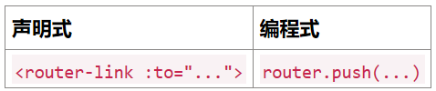

除了使用` <router-link>`创建 a 标签来定义导航链接，我们还可以借助router 的实例方法，通过编写代码来实现。
想要导航到不同的URL，则使用 router.push方法。这个方法会向 history 栈添加一个新的记录，所以，当用户点击浏览器后退按钮时，则回到之前的URL。
当你点击` <router-link>`时，这个方法会在内部调用，所以说，点击`<router-link :to="...">`等同于调用`router.push(...)` 。

```Javascript
<template>
<button @click="gotoProduct(2)">跳转到商品2</button>
</template>
<script>
export default {
	methods:{
		gotoProduct: function(id){
			this.$router.push('/movie/${id}')
		}
	}
}
 </script>
```
### 12.3.5 导航守卫

导航守卫可以控制路由的访问权限（例如没有登录就想跳转到订单页面是肯定不行的）。示意图如下：
全局导航守卫会拦截每个路由规则，从而对每个路由进行访问权限的控制。
你可以使用router.beforeEach 注册一个全局前置守卫：

```Javascript
router.beforeEach((to, from, next) => {
// 用户想要去主页，但是他没有登录就跳转到登录页面去
	if (to.path === '/main' && !isAuthenticated) {
		next('/login')
	} 
	else {
		next()
	}
})
```
- vue-router提供的导航守卫主要用来拦截导航，让它完成跳转或取消。
- to：Route：即将要进入的目标路由。
- from：Route：当前导航正要离开的路由（从哪里来）。
- next：在守卫方法中如果声明了next形参，则必须调用next() 函数，否则不允许用户访问任何一个路由（控制让不让跳转）
  - ○ 直接放行：next()
  - ○ 强制其停留在当前页面：next(false)
  - ○ 强制其跳转到登录页面：next('/login')

## 12.5 实践
### 12.5.1 新建vue2 router-demo项目并安装vue-router3(匹配vue 2 )

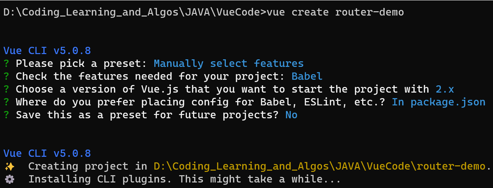
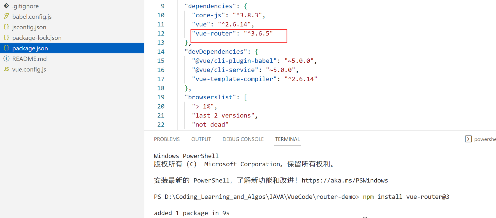


# 13.状态管理VueX

**本节内容**
- 第一节Vuex介绍
- 第二节Vuex安装与使用

## 13.1 简单状态管理
>经常被忽略的是，Vue 应用中响应式data 对象的实际来源——当访问数据对象时，一个组件实例只是简单的代理访问。所以，如果你有一处需要被多个实例间共享的状态，你可以使用一个 reactive方法让对象作为响应式对象。

```Javascript
const { createApp, reactive } = Vue
const sourceOfTruth = reactive({
	message: 'Hello'
})
const appA = createApp({
	data() {
	return sourceOfTruth
}
}).mount('#app-a')
const appB = createApp({
	data() {
	return sourceOfTruth
}
}).mount('#app-b')

```
```Javascript
<div id="app-a">App A: {{ message }}</div>
<div id="app-b">App B: {{ message }}</div>
```
现在当sourceOfTruth 发生变更，appA 和appB 都将自动地更新它们的视图。虽然现在我们有了一个真实数据来源，但调试将是一场噩梦。应用的任何部分都可以随时更改任何数据，而不会留下变更过的记录。

```Javascript
const appB = createApp({
	data() {
	return sourceOfTruth
},
mounted() {
	sourceOfTruth.message = 'Goodbye' // both apps will render 'Goodbye' message
	now
}
}).mount('#app-b')
```
为了解决这个问题，可以采用一个简单的` store` 模式：

```Javascript
conststore = {
const store = {
	debug: true,
	state: reactive({
		message: 'Hello!'
	}),
	setMessageAction(newValue) {
		if (this.debug) {
		console.log('setMessageAction triggered with', newValue)
		} 
		this.state.message = newValue
	},
	clearMessageAction() {
	if (this.debug) {
		console.log('clearMessageAction triggered')
	}
		this.state.message = ''
	}
}
```
需要注意，所有store 中state 的变更，都放置在store 自身的action 中去管理。这种集中式状态管理能够被更容易地理解哪种类型的变更将会发生，以及它们是如何被触发。当错误出现时，现在也会有一个log 记录bug 之前发生了什么。
此外，每个实例/组件仍然可以拥有和管理自己的私有状态：

```Javascript
<div id="app-a">{{sharedState.message}}</div>
<div id="app-b">{{sharedState.message}}</div>
```
```Javascript
const appA = createApp({
	data() {
		return {
		privateState: {},
		sharedState: store.state
	}
	},
	mounted() {
		store.setMessageAction('Goodbye!')
	}
}).mount('#app-a')
const appB = createApp({
	data() {
		return {
		privateState: {},
		sharedState: store.state
		}
	}
}).mount('#app-b')
```

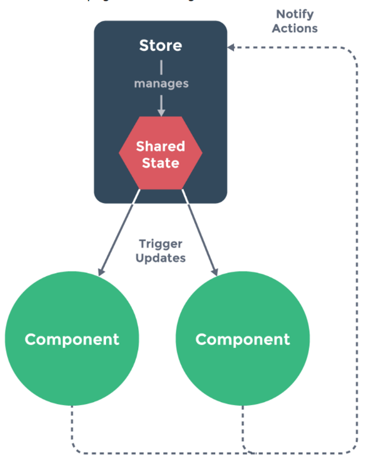

随着我们进一步扩展约定，即组件不允许直接变更属于store 实例的state，而应执行action 来分发(dispatch) 事件通知store 去改变，最终达成了 Flux架构。这样约定的好处是，能够记录所有store 中发生的state 变更，同时实现能做到记录变更、保存状态快照、历史回滚/时光旅行的先进的调试工具。

## 13.2 Vuex介绍

由于状态零散地分布在许多组件和组件之间的交互中，大型应用复杂度也经常逐渐增长。为了解决这个问题，Vue 提供 Vuex：我们有受到Elm 启发的状态管理库。

Vuex 是一个专为Vue.js 应用程序开发的状态管理模式+ 库。它采用集中式存储管理应用的所有组件的状态，并以相应的规则保证状态以一种可预测的方式发生变化。

- 对于组件化开发来说，大型应用的状态往往跨越多个组件。在多层嵌套的父子组件之间传递状态已经十分麻烦，而Vue更是没有为兄
弟组件提供直接共享数据的办法。
- 基于这个问题，许多框架提供了解决方案——使用全局的状态管理器，将所有分散的共享数据交由状态管理器保管，Vue也不例
外。（所有的数据都从单一的数据源获取）
- Vuex 是一个专为Vue.js 应用程序开发的状态管理库，采用集中式存储管理应用的所有组件的状态。
- 简单的说，Vuex用于管理分散在Vue各个组件中的数据。
- vuex3 对应vue2, vuex4对应vue3
- 安装：`npm install vuex@next`

### 13.2.1 示例
让我们从一个简单的Vue 计数应用开始：
```Javascript
const Counter = {
// 状态
data () {
	return {
		count: 0
	}
},
// 视图
template: `
<div>{{ count }}</div>
`,
// 操作
methods: {
	increment () {
		this.count++
	}
	}
} 
createApp(Counter).mount('#app')
```
这个状态自管理应用包含以下几个部分：
- **状态** ，驱动应用的数据源；
- **视图** ，以声明方式将 **状态** 映射到视图；
- **操作** ，响应在视图上的用户输入导致的状态变化。

以下是一个表示“单向数据流”理念的简单示意：

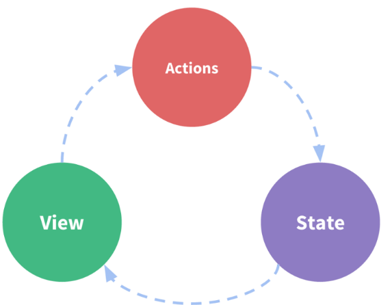

但是，当我们的应用遇到 **多个组件共享状态** 时，单向数据流的简洁性很容易被破坏：
- 多个视图依赖于同一状态。
- 来自不同视图的行为需要变更同一状态。

对于问题一，传参的方法对于多层嵌套的组件将会非常繁琐， **并且对于兄弟组件间的状态传递无能为力。**

对于问题二，我们经常会采用父子组件直接引用或者通过事件来变更和同步状态的多份拷贝。以上的这些模式非常脆弱，通常会导致无法维护的代码。

因此，我们为什么不把组件的共享状态抽取出来，以 **一个全局单例模式管理** 呢？在这种模式下，我们的组件树构成了一个巨大的“视图”，不管在树的哪个位置，任何组件都能获取状态或者触发行为！

通过定义和隔离状态管理中的各种概念并通过强制规则维持视图和状态间的独立性，我们的代码将会变得更结构化且易维护。

这就是Vuex 背后的基本思想，借鉴了 Flux、Redux和 The Elm Architecture。与其他模式不同的是，Vuex 是专门为Vue.js 设计的状态管理库，以利用Vue.js 的细粒度数据响应机制来进行高效的状态更新。

### 13.2.2什么情况下应该使用Vuex？

Vuex 可以帮助我们管理共享状态，并附带了更多的概念和框架。这需要对短期和长期效益进行权衡。如果您不打算开发大型单页应用，使用Vuex 可能是繁琐冗余的。确实是如此——如果您的应用够简单，您最好不要使用Vuex。一个简单的 store模式就足够您所需了。但是，如果您需要构建一个中大型单页应用，您很可能会考虑如何更好地在组件外部管理状态，Vuex 将会成为自然而然的选择。引用Redux的作者Dan Abramov 的话说就是：

> Flux 架构就像眼镜：您自会知道什么时候需要它。

### 13.2.3 安装
```bash
npm install vuex@3
```
## 13.3 最简单的Store

每一个Vuex 应用的核心就是store（仓库）。“store”基本上就是一个容器，它包含着你的应用中大部分的 **状态(state)** 。Vuex 和单纯的全局对象有以下两点不同：
- 1.Vuex 的状态存储是响应式的。当Vue 组件从store 中读取状态的时候，若store 中的状态发生变化，那么相应的组件也会相应地得
到高效更新。
- 2.你不能直接改变store 中的状态。改变store 中的状态的唯一途径就是显式地提交(commit)mutation。这样使得我们可以方便地跟踪
每一个状态的变化，从而让我们能够实现一些工具帮助我们更好地了解我们的应用。
安装Vuex 之后，让我们来创建一个store。创建过程直截了当——仅需要提供一个初始state 对象和一些mutation：

```Javascript
import Vue from 'vue'
import Vuex from 'vuex'
Vue.use(Vuex)
const store = new Vuex.Store({
	state: {
		count: 0
	},
	mutations: {
		increment (state) {
		state.count++
		}
	}
})
```
现在，你可以通过 `store.state` 来获取状态对象，并通过` store.commit`方法触发状态变更：

```Javascript
store.commit('increment')
console.log(store.state.count) // -> 1
```
为了在Vue 组件中访问 `this.$store property`，你需要为Vue 实例提供创建好的store。Vuex 提供了一个从根组件向所有子组件，以`store` 选项的方式“注入”该store 的机制：

```Javascript
new Vue({
	el: '#app',
	store: store,
})
```
在Vue 组件中， 可以通过 `this.$store`访问store实例。现在我们可以从组件的方法提交一个变更：

```Javascript
methods: {
	increment() {
		this.$store.commit('increment')
		console.log(this.$store.state.count)
	}
}
```
再次强调，我们通过提交mutation 的方式，而非直接改变store.state.count ，是因为我们想要更明确地追踪到状态的变化。这个简单的约定能够让你的意图更加明显，这样你在阅读代码的时候能更容易地解读应用内部的状态改变。此外，这样也让我们有机会去实现一些能记录每次状态改变，保存状态快照的调试工具。有了它，我们甚至可以实现如时间穿梭般的调试体验。

由于store 中的状态是响应式的，在组件中调用store 中的状态简单到仅需要在计算属性中返回即可。触发变化也仅仅是在组件的methods 中提交mutation。

## 13.4. State

Vuex 使用 **单一状态树** ——是的，用一个对象就包含了全部的应用层级状态。至此它便作为一个“唯一数据源(SSOT)”而存在。这也意味着，每个应用将仅仅包含一个store 实例。单一状态树让我们能够直接地定位任一特定的状态片段，在调试的过程中也能轻易地取得整个当前应用状态的快照。
单状态树和模块化并不冲突——在后面的章节里我们会讨论如何将状态和状态变更事件分布到各个子模块中。


### 13.4.1 在Vue 组件中获得Vuex 状态
那么我们如何在Vue 组件中展示状态呢？由于Vuex 的状态存储是响应式的，从store 实例中读取状态最简单的方法就是在计算属性中返回某个状态：
```Javascript
const Counter = {
	template: `<div>{{ count }}</div>`,
	computed: {
		count () {
			return this.$store.state.count
		}
	}
}
```
每当` store.state.count`变化的时候, 都会重新求取计算属性，并且触发更新相关联的DOM。
然而，这种模式导致组件依赖全局状态单例。在模块化的构建系统中，在每个需要使用state 的组件中需要频繁地导入，并且在测试组件时需要模拟状态。
Vuex 通过Vue 的插件系统将store 实例从根组件中“注入”到所有的子组件里。且子组件能通过`this.$store`访问到。让我们更新下Counter 的实现：

```Javascript
const Counter = {
	template: `<div>{{ count }}</div>`,
	computed: {
		count () {
			return this.$store.state.count
		}
	}
}
```
### 13.4.2 mapState 辅助函数

当一个组件需要获取多个状态的时候，将这些状态都声明为计算属性会有些重复和冗余。为了解决这个问题，我们可以使用mapState 辅助函数帮助我们生成计算属性，让你少按几次键：

```Javascript
// 在单独构建的版本中辅助函数为 Vuex.mapState
import { mapState } from 'vuex'
export default {
	// ...
	computed: mapState({
	// 箭头函数可使代码更简练
	count: state => state.count,
	// 传字符串参数 'count' 等同于 `state => state.count`
	countAlias: 'count',
	// 为了能够使用 `this` 获取局部状态，必须使用常规函数
	countPlusLocalState (state) {
		return state.count + this.localCount
	}
})
}
```
当映射的计算属性的名称与state 的子节点名称相同时，我们也可以给mapState 传一个字符串数组。

```Javascript
computed: mapState([
// 映射 this.count 为 store.state.count
'count'
])
```
### 13.4.3 对象展开运算符
mapState 函数返回的是一个对象。我们如何将它与局部计算属性混合使用呢？通常，我们需要使用一个工具函数将多个对象合并为一个，以使我们可以将最终对象传给computed 属性。但是自从有了对象展开运算符，我们可以极大地简化写法：

```Javascript
computed: {
	localComputed () { /* ... */ },
	// 使用对象展开运算符将此对象混入到外部对象中
	...mapState({
	// ...
	})
}
```
### 13.4.4 组件仍然保有局部状态

使用Vuex 并不意味着你需要将所有的状态放入Vuex。虽然将所有的状态放到Vuex 会使状态变化更显式和易调试，但也会使代码变得冗长和不直观。如果有些状态严格属于单个组件，最好还是作为组件的局部状态。你应该根据你的应用开发需要进行权衡和确定。

## 13.5 Getter

有时候我们需要从store 中的state 中派生出一些状态，例如对列表进行过滤并计数：
```Javascript
computed: {
doneTodosCount () {
return this.$store.state.todos.filter(todo => todo.done).length
}
}
```
如果有多个组件需要用到此属性，我们要么复制这个函数，或者抽取到一个共享函数然后在多处导入它——无论哪种方式都不是很理想。
Vuex 允许我们在store 中定义“getter”（可以认为是store 的计算属性）。
Getter 接受state 作为其第一个参数：

```Javascript
conststore = createStore({
state: {
todos: [
{ id: 1 , text: '...', done: true },
{ id: 2 , text: '...', done: false }
]
},
getters: {
doneTodos: (state) => {
return state.todos.filter(todo => todo.done)
}
}
})
```
### 13.5.1 通过属性访问
Getter 会暴露为 `store.getters`对象，你可以以属性的形式访问这些值：
```Javascript
store.getters.doneTodos // -> [{ id: 1 , text: '...', done: true}]
```
Getter 也可以接受其他getter 作为第二个参数：

```Javascript
getters: {
	// ...
	doneTodosCount (state, getters) {
	return getters.doneTodos.length
	}
}
```

```Javascript
store.getters.doneTodosCount // -> 1
```
我们可以很容易地在任何组件中使用它：
```Javascript
computed: {
	doneTodosCount () {
		return this.$store.getters.doneTodosCount
	}
}
```
### 13.5.2 通过方法访问
你也可以通过让getter 返回一个函数，来实现给getter 传参。在你对store 里的数组进行查询时非常有用。
```Javascript
    // ...
    getTodoById: (state) => (id) => {
    return state.todos.find(todo => todo.id === id)
    }
}
```
```Javascript
store.getters.getTodoById(2) // -> { id: 2, text: '...', done: false }
```
### 13.5.3 mapGetters 辅助函数
- mapGetters 辅助函数仅仅是将store 中的getter 映射到局部计算属性：
```Javascript
import { mapGetters } from 'vuex'
export default {
	// ...
	computed: {
		// 使用对象展开运算符将 getter 混入 computed 对象中
		...mapGetters([
		'doneTodosCount',
		'anotherGetter',
		// ...
		])
	}
}
```
- 如果你想将一个getter 属性另取一个名字，使用对象形式：
```Javascript
...mapGetters({
// 把 `this.doneCount` 映射为 `this.$store.getters.doneTodosCount`
doneCount: 'doneTodosCount'
})
```
## 13.6 Mutation

更改Vuex 的store 中的状态的唯一方法是提交mutation。Vuex 中的mutation 非常类似于事件：每个mutation 都有一个字符串的 **事件类型(type)和一个回调函数(handler)** 。这个回调函数就是我们实际进行状态更改的地方，并且它会接受state 作为第一个参数：
```Javascript
const store = createStore({
state: {
count: 1
},
mutations: {
increment (state) {
// 变更状态
state.count++
}
}
})
```
你不能直接调用一个mutation 处理函数。这个选项更像是事件注册：“当触发一个类型为increment的mutation 时，调用此函数。”要唤醒一个mutation 处理函数，你需要以相应的type 调用 **store.commit** 方法：

```Javascript
store.commit('increment')
```
### 13.6.1 提交载荷（Payload）
你可以向store.commit 传入额外的参数，即mutation 的 **载荷（payload）** ：
```Javascript
// ...
mutations: {
increment (state, n) {
state.count += n
}
}
```
```Javascript
store.commit('increment', 10)
```
在大多数情况下，载荷应该是一个对象，这样可以包含多个字段并且记录的mutation 会更易读：

```Javascript
// ...
mutations: {
increment (state, payload) {
state.count += payload.amount
}
}
store.commit('increment', {
amount: 10
})
```
### 13.6.2 对象风格的提交方式

- 提交mutation 的另一种方式是直接使用包含type 属性的对象：
```Javascript
store.commit({
type: 'increment',
amount: 10
})
```
- 当使用对象风格的提交方式，整个对象都作为载荷传给mutation 函数，因此处理函数保持不变：
```Javascript
mutations: {
increment (state, payload) {
state.count += payload.amount
}
}
```
### 13.6.3 使用常量替代Mutation 事件类型
使用常量替代mutation 事件类型在各种Flux 实现中是很常见的模式。这样可以使linter 之类的工具发挥作用，同时把这些常量放在单独的文件中可以让你的代码合作者对整个app 包含的mutation 一目了然：

```Javascript
// mutation-types.js
export const SOME_MUTATION= 'SOME_MUTATION'
```
```Javascript
// store.js
import { createStore } from 'vuex'
import { SOME_MUTATION } from './mutation-types'
const store = createStore({
state: { ... },
mutations: {
// 我们可以使用 ES2015 风格的计算属性命名功能来使用一个常量作为函数名
[SOME_MUTATION] (state) {
// 修改 state
}
}
})
```
用不用常量取决于你——在需要多人协作的大型项目中，这会很有帮助。但如果你不喜欢，你完全可以不这样做。

### 13.6.4 Mutation 必须是同步函数
一条重要的原则就是要记住 **mutation 必须是同步函数** 。为什么？请参考下面的例子：
```Javascript
mutations: {
someMutation (state) {
api.callAsyncMethod(() => {
state.count++
})
}
}
```
现在想象，我们正在debug 一个app 并且观察devtool 中的mutation 日志。每一条mutation 被记录，devtools 都需要捕捉到前一状态和后一状态的快照。然而，在上面的例子中mutation 中的异步函数中的回调让这不可能完成：因为当mutation 触发的时候，回调函数还没有被调用，devtools 不知道什么时候回调函数实际上被调用——实质上任何在回调函数中进行的状态的改变都是不可追踪的。

### 13.6.5 在组件中提交Mutation
你可以在组件中使用 `this.$store.commit('xxx')` 提交mutation，或者使用 `mapMutations` 辅助函数将组件中的methods 映射为`store.commit` 调用（需要在根节点注入`store`）。

```Javascript
mport { mapMutations } from 'vuex'
export default {
	// ...
	methods: {
	...mapMutations([
	'increment', // 将 `this.increment()` 映射为
	`this.$store.commit('increment')`
	
	// `mapMutations` 也支持载荷：
	'incrementBy' // 将 `this.incrementBy(amount)` 映射为
	`this.$store.commit('incrementBy', amount)`
	]),
	
	...mapMutations({
	add: 'increment' // 将 `this.add()` 映射为 `this.$store.commit('increment')`
	})
	}
}
```
在mutation 中混合异步调用会导致你的程序很难调试。例如，当你调用了两个包含异步回调的mutation 来改变状态，你怎么知道什么时候回调和哪个先回调呢？这就是为什么我们要区分这两个概念。在Vuex 中， **mutation 都是同步事务** ：

```Javascript
store.commit('increment')
// 任何由"increment" 导致的状态变更都应该在此刻完成。
```
为了处理异步操作，让我们来看一看Action。

## 13.7 Action

Action 类似于mutation，不同在于：
- Action 提交的是mutation，而不是直接变更状态。
- Action 可以包含任意异步操作。
让我们来注册一个简单的action：

```Javascript
const store = createStore({
        state: {
        count: 0
        },
        mutations: {
        increment (state) {
        state.count++
        }
        },
        actions: {
        increment (context) {
        context.commit('increment')
        }
        }
})
```
Action 函数接受一个与store 实例具有相同方法和属性的context 对象，因此你可以调用`context.commit` 提交一个mutation，或者通过`context.state` 和` context.getters`来获取state和getters。当我们在之后介绍到 Modules时，你就知道context 对象为什么不是store实例本身了。实践中，我们会经常用到ES2015 的参数解构来简化代码（特别是我们需要调用commit 很多次的时候）：

```Javascript
actions: {
increment ({ commit }) {
commit('increment')
}
}
```
### 13.7.1 分发Action

Action 通过 `store.dispatch`方法触发：
```Javascript
store.dispatch('increment')
```
乍一眼看上去感觉多此一举，我们直接分发mutation 岂不更方便？实际上并非如此，还记得 **mutation 必须同步** 执行这个限制么？Action就不受约束！我们可以在action 内部执行异步操作：

```Javascript
actions: {
incrementAsync ({ commit }) {
setTimeout(() => {
commit('increment')
}, 1000 )
}
}
```
Actions 支持同样的载荷方式和对象方式进行分发：

```Javascript
// 以载荷形式分发
store.dispatch('incrementAsync', {
amount: 10
})
// 以对象形式分发
store.dispatch({
type: 'incrementAsync',
amount: 10
})
```
来看一个更加实际的购物车示例，涉及到 **调用异步API 和分发多重mutation** ：

```Javascript
actions: {
checkout ({ commit, state }, products) {
	// 把当前购物车的物品备份起来
	const savedCartItems = [...state.cart.added]
	// 发出结账请求，然后乐观地清空购物车
	commit(types.CHECKOUT_REQUEST)
	// 购物 API 接受一个成功回调和一个失败回调
	shop.buyProducts(
	products,
	// 成功操作
	() => commit(types.CHECKOUT_SUCCESS),
	// 失败操作
	() => commit(types.CHECKOUT_FAILURE, savedCartItems)
	)
	}
}
```
注意我们正在进行一系列的异步操作，并且通过提交mutation 来记录action 产生的副作用（即状态变更）。


### 13.7.2 在组件中分发Action

你在组件中使用 `this.$store.dispatch('xxx')`分发action，或者使用 mapActions辅助函数将组件的methods 映射为`store.dispatch` 调用（需要先在根节点注入store ）：

```Javascript
import { mapActions } from 'vuex'
export default {
	// ...
	methods: {
	...mapActions([
	'increment', // 将 `this.increment()` 映射为
	`this.$store.dispatch('increment')`
	// `mapActions` 也支持载荷：
	'incrementBy' // 将 `this.incrementBy(amount)` 映射为
	`this.$store.dispatch('incrementBy', amount)`
	]),
	...mapActions({
	add: 'increment' // 将 `this.add()` 映射为
	`this.$store.dispatch('increment')`
	})
	}
}
```
### 13.7.3 组合Action

Action 通常是异步的，那么如何知道action 什么时候结束呢？更重要的是，我们如何才能组合多个action，以处理更加复杂的异步流程？
首先，你需要明白 `store.dispatch` 可以处理被触发的action 的处理函数返回的Promise，并且`store.dispatch`仍旧返回Promise：

```Javascript
actions: {
    actionA ({ commit }) {
        return new Promise((resolve, reject) => {
            setTimeout(() => {
            commit('someMutation')
            resolve()
            }, 1000)
        })
    }
}
```
现在你可以：

```Javascript
store.dispatch('actionA').then(() => {
// ...
})
```
在另外一个action 中也可以：

```Javascript
// 假设 getData() 和 getOtherData() 返回的是 Promise
actions: {
	async actionA ({ commit }) {
		commit('gotData', await getData())
	},
	async actionB ({ dispatch, commit }) {
		await dispatch('actionA') // 等待 actionA 完成
		commit('gotOtherData', await getOtherData())
	}
}
```
最后，如果我们利用`async / await`，我们可以如下组合action：
```Javascript
// 假设 getData() 和 getOtherData() 返回的是 Promise
actions: {
	async actionA ({ commit }) {
		commit('gotData', await getData())
	},
	async actionB ({ dispatch, commit }) {
		await dispatch('actionA') // 等待 actionA 完成
		commit('gotOtherData', await getOtherData())
	}
}
```
一个 `store.dispatch`在不同模块中可以触发多个action 函数。在这种情况下，只有当所有触发函数完成后，返回的Promise 才会执行

## 13.8 Module

由于使用单一状态树，应用的所有状态会集中到一个比较大的对象。当应用变得非常复杂时，store 对象就有可能变得相当臃肿。
为了解决以上问题，Vuex 允许我们将store 分割成 **模块（module）** 。每个模块拥有自己的state、mutation、action、getter、甚至是嵌套子模块——从上至下进行同样方式的分割：
```Javascript
const moduleA = {
    state: () => ({ ... }),
    mutations: { ... },
    actions: { ... },
    getters: { ... }
}
 const moduleB = {
    state: () => ({ ... }),
    mutations: { ... },
    actions: { ... }
} 
const store = createStore({
    modules: {
    a: moduleA,
    b: moduleB
    }
})
store.state.a // -> moduleA 的状态
store.state.b // -> moduleB 的状态
```
### 13.8.1 模块的局部状态
- 对于模块内部的mutation 和getter，接收的第一个参数是 **模块的局部状态对象。**
```Javascript
const moduleA = {
state: () => ({
	count: 0
}),
mutations: {
	increment (state) {
		// 这里的 `state` 对象是模块的局部状态
		state.count++
	}
},
getters: {
	doubleCount (state) {
		return state.count * 2
		}
	}
}
```
- 同样，对于模块内部的action，局部状态通过 `context.state` 暴露出来，根节点状态则为`context.rootState` ：

```Javascript
const moduleA = {
    // ...
    actions: {
        incrementIfOddOnRootSum ({ state, commit, rootState }) {
            if ((state.count + rootState.count) % 2 === 1) {
            commit('increment')
            }
        }
    }
}
```
- 对于模块内部的getter，根节点状态会作为第三个参数暴露出来：

```Javascript
const moduleA = {
	// ...
	getters: {
		sumWithRootCount (state, getters, rootState) {
			return state.count + rootState.count
		}
	}
}
```
### 13.8.2 模块动态注册

在store 创建 之后，你可以使用 `store.registerModule`方法注册模块

```Javascript
import{ createStore } from 'vuex'
conststore = createStore({ /* 选项*/})
// 注册模块`myModule`
store.registerModule('myModule', {
// ...
})
// 注册嵌套模块`nested/myModule`
store.registerModule(['nested', 'myModule'], {
// ...
})
```
之后就可以通过 `store.state.myModule`和` store.state.nested.myModule`访问模块的状态。

## 13.9 状态管理
- 每一个Vuex应用的核心都是一个store(一个全局对象)，与普通的全局对象不同的是，基于Vue数据与视图绑定的特点，当store中的状态发生变化时，与之绑定的视图也会被重新渲染。
- store中的状态不允许被直接修改，改变store中的状态的唯一途径就是显式地提交（commit）mutation，这可以让我们方便地跟踪每一个状态的变化（方便于维护，知道是哪个组件修改了数据）。
- 在大型复杂应用中，如果无法有效地跟踪到状态的变化，将会对理解和维护代码带来极大的困扰。
- Vuex中有 5 个重要的概念：State、Getter、Mutation、Action、Module。
- 解释下图: State 通过vue数据视图绑定将数据渲染到Vue组件上-> Vue组件 如果发起了异步请求，就将请求发送到Action部分->Action将从后端得到的数据提交到`Mutations->Mutations`再修改State数据；如果没有异步的操作请求，可以直接让Vue组件commit(提交)Mutations更改State。

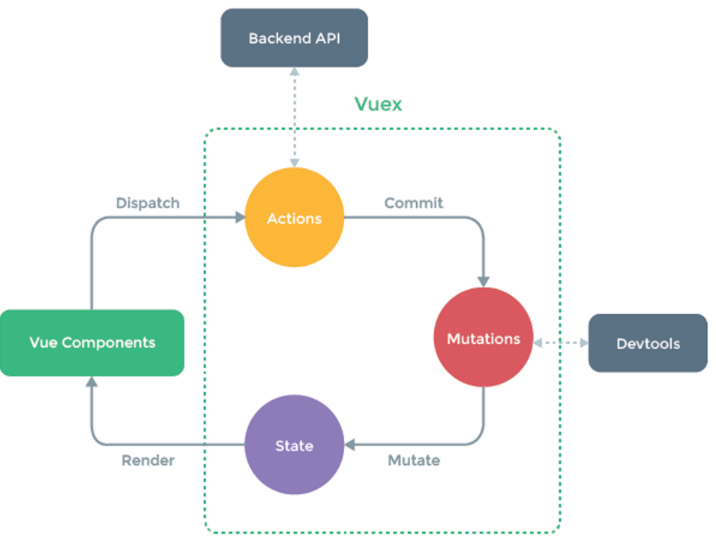


### 13.9.1 State（一下内容基于vue3即基于vuex4）
>State用于维护所有应用层的状态，并确保应用只有唯一的数据源 (把组件中需要共享的数据设置到state中)

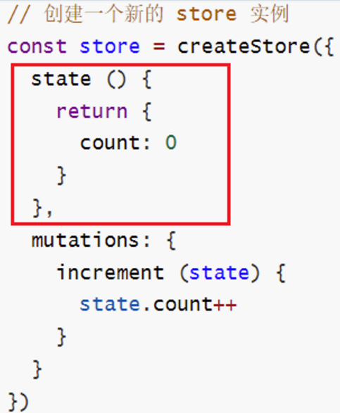


- 在组件中，可以直接使用`this.$store.state.count`访问数据，也可以先用mapState辅助函数将其映射下来

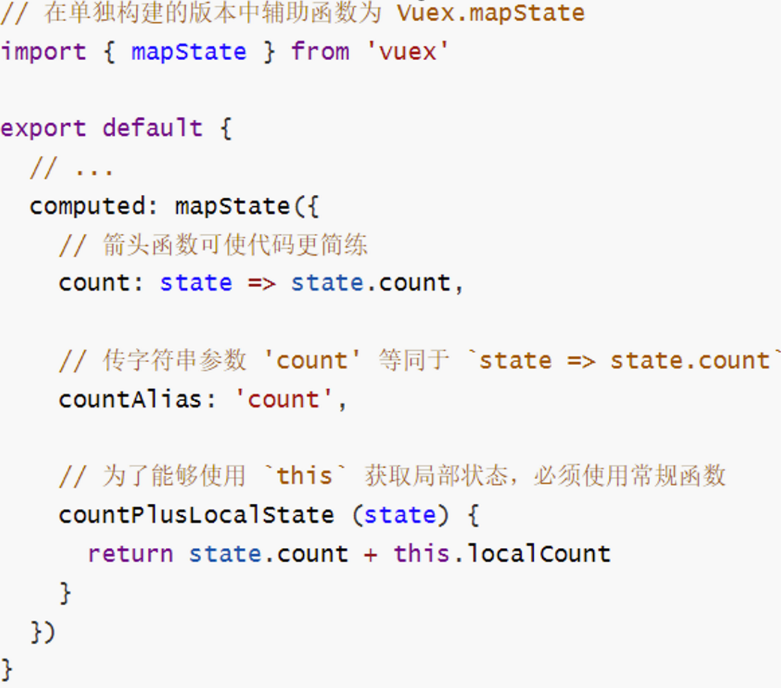


### 13.9.2 Getter

- Getter维护由State派生的一些状态，这些状态随着State状态的变化而变化
- 所谓派生的状态举例: 如下图所示todos数组中记录了列表完成的情况（状态），现在我想要从这个记录中得到已经完成的数组yua元
素，就可以使用Getter
- state.todos是一个数组，filter函数是JS关于数组的一个过滤函数

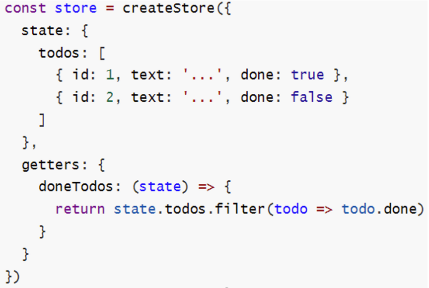

- 在组件中，可以直接使用`this.$store.getters.doneTodos`，也可以先用mapGetters辅助函数将其映射下来，代码如下：

**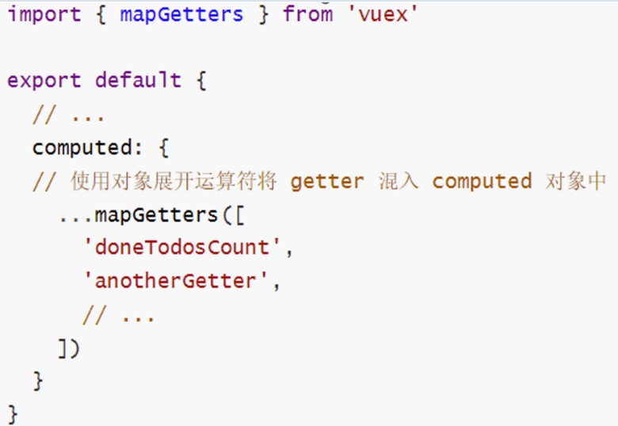**


### 13.9.3 Mutation
- Mutation提供修改State状态的方法。

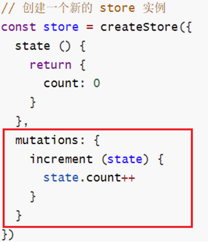

- 在组件中，可以直接使用store.commit来提交mutation

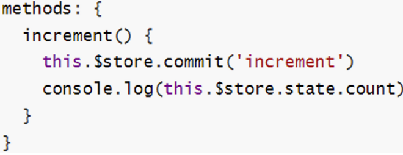

- 也可以先用mapMutation辅助函数将其映射下来

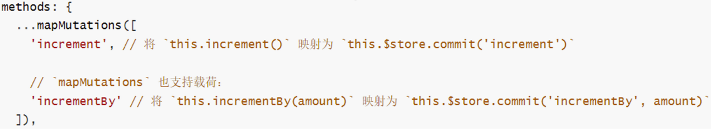

### 13.9.4 Action
- Action类似Mutation，不同在于: Action不能直接修改状态，只能通过提交mutation来修改，Action可以包含异步操作
- 这么做的目的是在下面的代码actions中记录状态的变化

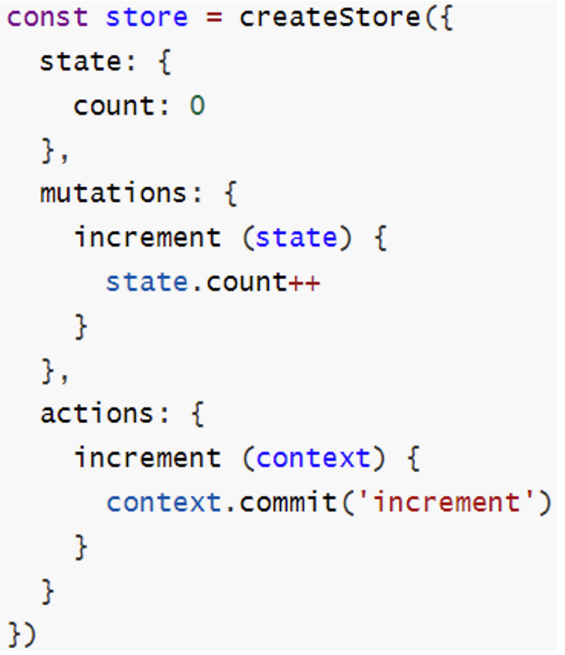

- 在组件中，可以直接使用`this.$store.dispatch('xxx')`分发action，或者使用mapActions辅助函数先将其映射下来

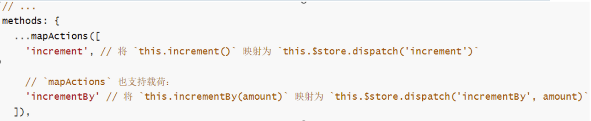

### 13.9.5 Module

- 由于使用单一状态树，当项目的状态非常多时，store对象就会变得十分臃肿。因此，Vuex允许我们将store分割成模块（Module）
- 每个模块拥有独立的State、Getter、Mutation和Action，模块之中还可以嵌套模块，每一级都有着相同的结构。

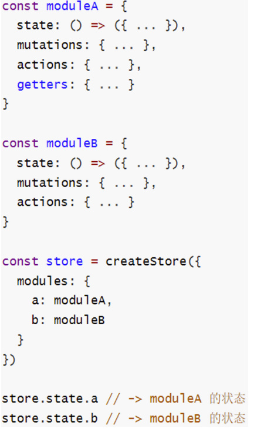

### 13.9.6 总结
- 作为一个状态管理器，首先要有保管状态的容器——State；
- 为了满足衍生数据和数据链的需求，从而有了Getter；
- 为了可以“显式地”修改状态，所以需要Mutation；
- 为了可以“异步地”修改状态（满足AJAX等异步数据交互），所以需要Action；
- 最后，如果应用有成百上千个状态，放在一起会显得十分庞杂，所以分模块管理（Module）也是必不可少的；
- Vuex并不是Vue应用开发的必选项，在使用时，应先考虑项目的规模和特点，有选择地进行取舍，对于小型应用来说，完全没有必要引入状态管理，因为这会带来更多的开发成本；


## 13.10 实践

### 13.10.1 新建vue2 vuex-demo项目并安装vuex3(匹配vue 2 )

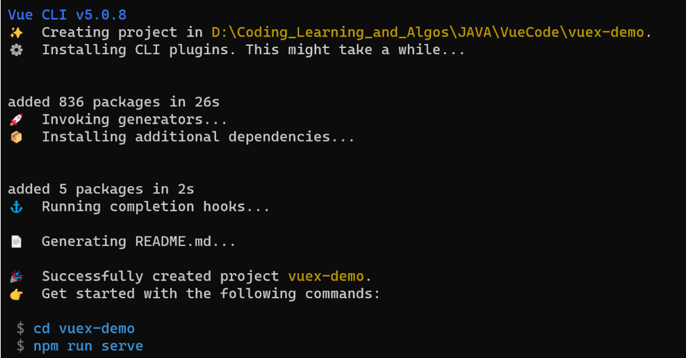

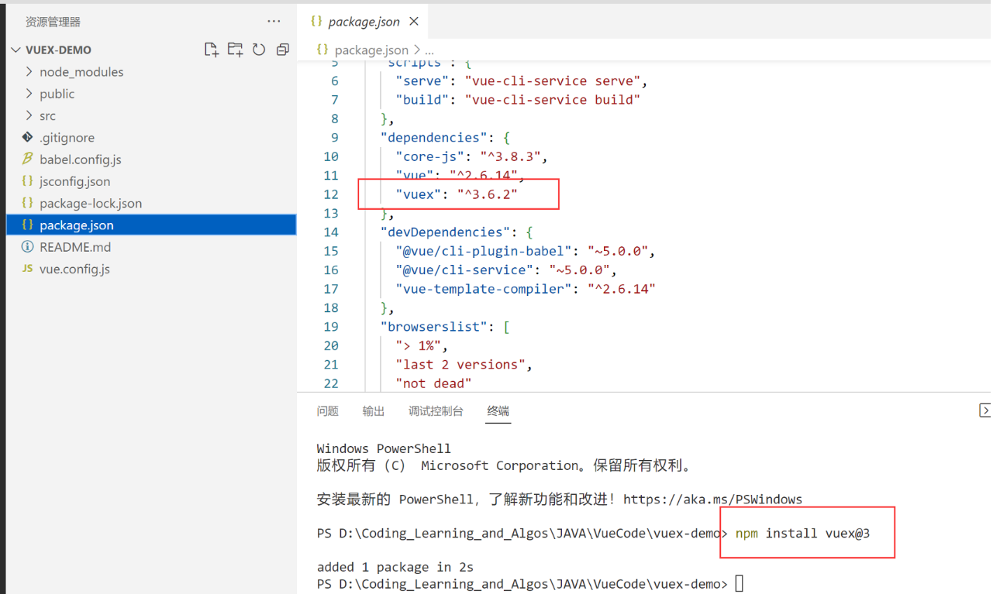

### 13.10.2 新建store目录（vuex数据存储的地方）

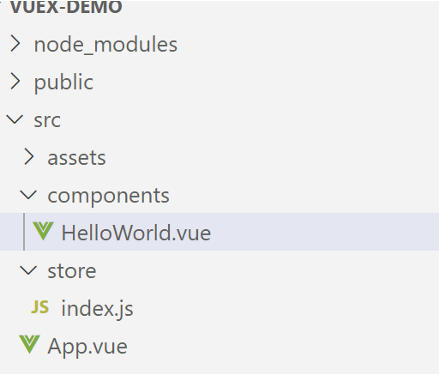


# 14. 前端数据模拟MockJS
**本节内容**
- 第一节mockjs介绍
- 第二节mockjs基本使用
- 第三节 数据生成规则

## 14.1 Mockjs基本使用

### 14.1.1 什么是mockjs

Mock.js 是一款前端开发中拦截Ajax请求再生成随机数据响应的工具.可以用来模拟服务器响应. 优点是非常简单方便, 无侵入性, 基本覆盖常用的接口数据类型.
- 前后端分离
- 开发无侵入（不需要修改既有代码，就可以拦截Ajax 请求，返回模拟的响应数据。）
- 数据类型丰富（支持生成随机的文本、数字、布尔值、日期、邮箱、链接、图片、颜色等。）
- 增加单元测试的真实性（通过随机数据，模拟各种场景。）
- 用法简单、符合直觉的接口。
- 方便扩展（支持支持扩展更多数据类型，支持自定义函数和正则。）
- 当后端开发完成后直接将mock移除就可以正常使用后端接口了
- 安装
```
npm install mockjs
```
### 14.1.2 快速入门
- 在项目中创建mock目录，新建index.js文件
```Python
//引入mockjs
import Mock from 'mockjs'
//使用mockjs模拟数据
// mock第一个参数是想要拦截的url地址
Mock.mock('/product/search', {
	"ret":0,
	"data":
	{
		"mtime": "@datetime",//随机生成日期时间
		// score rank stars 是自定义的JSON数据值
		// mock的主要特点一个是@后面的符号，一个是|后的规则
		"score|1-800": 1,//随机生成1-800的数字
		"rank|1-100": 1,//随机生成1-100的数字
		"stars|1-5": 1,//随机生成1-5的数字
		"nickname": "@cname",//随机生成中文名字
		//生成图片
		"img":"@image('200x100', '#ffcc33', '#FFF', 'png', 'Fast Mock')"
	}
});
```
- main.js里面引入（当不需要使用mock时直接删掉就好了）:`import './mock'` `xxx.vue`文件中调用mock.js中模拟的数据接口，这时返回的response就是mock.js中用`Mock.mock(‘url’,data）`中设置的data了

```Python
import axios from 'axios'
	export default {
	mounted:function(){
	axios.get("/product/search").then(res => {
	console.log(res)
	})
	}
}
```
- 注意，如果get 请求如果带参数，会以`?a=b&c=d`，形式拼接到url上，这时mock请把接口url写为正则匹配，否则匹配不到就报错 `Mock.mock(RegExp(API_URL + ".*"))`，如：

```Python
import axios from 'axios'
export default {
    mounted:function(){
    ///product/search?id=2
    axios.get("/product/search",{params:{id:2}}).then(res => {
    console.log(res)
    })
    }
}
```
- 在url后面加上 `.*`
```Python
mockjs.mock(RegExp("/product/search"+ ".*"),'get',option=>{
	console.log(option.url) // 请求的url
	console.log(option.body)// body为post请求参数
	return {
		status:200,
		message:"获取数据成功"
	}
})
```
### 14.1.3 核心方法

`Mock.mock( rurl?, rtype?, template|function( options ) )`
这是mock的核心方法，根据数据模板生成模拟数据。
- rurl ，可选。表示需要拦截的URL，可以是URL 字符串或URL 正则。例如：`正则+变量写法->
RegExp(API_URL.LOGIN + ".*") `、`正则写法-> /\/domain\/list\.json/ `、`字符串写法->
'/domian/list.json'` 。
- `rtype`，可选。表示需要拦截的Ajax 请求类型。例如`GET、 POST 、 PUT 、 DELETE`等。
- `template`，可选。表示数据模板，可以是对象或字符串。例如 { 'data|1-10':[{}] } 、'@EMAIL' 。
- `function(options)`，可选。表示用于生成响应数据的函数。
- `options`,指向本次请求的Ajax 选项集，含有url 、type 和body 三个属性，参见 XMLHttpRequest规范。

**具体使用：**

- `Mock.mock( template ) `：根据数据模板生成模拟数据。
- `Mock.mock( rurl, template ) `： 记录数据模板。当拦截到匹配rurl 的Ajax 请求时，将根据数据模板` template`生成模拟数据，并作为响应数据返回。
- `Mock.mock( rurl, function( options ) ) `： 记录用于生成响应数据的函数。当拦截到匹配rurl 的Ajax 请求时，函数 `function(options)` 将被执行，并把执行结果作为响应数据返回。
- `Mock.mock( rurl, rtype, template ) `： 记录数据模板。当拦截到匹配rurl 和rtype 的Ajax 请求时，将根据数据模板template 生成模拟数据，并作为响应数据返回。
- `Mock.mock( rurl, rtype, function( options ) ) `： 记录用于生成响应数据的函数。当拦截到匹配`rurl` 和 `rtyp`的Ajax 请求时，函数function(options) 将被执行，并把执行结果作为响应数据返回。

### 14.1.4 设置延时请求到数据
>不设置延时很有可能遇到坑，这里需要留意，因为真实的请求是需要时间的，mock不设置延时则是马上拿到数据返回，这两个情况不同可能导致在接口联调时出现问题。所以最好要先设置延时请求到数据。

```Python
//延时400ms请求到数据
Mock.setup({
timeout: 400
})
//延时 200 - 600 毫秒请求到数据
Mock.setup({
timeout: '200-600'
})
```

## 14.2  数据生成规则

### 14.2.1. 数据模板DTD

mock的语法规范包含两层规范:
- 数据模板 （DTD）
- 数据占位符 （DPD）

### 14.2.1.1 基本语法
数据模板中的每个属性由 3 部分构成：属性名name、生成规则rule、属性值value：
```Python
'name|rule': value
```
属性名和生成规则之间用竖线| 分隔，生成规则是可选的
生成规则 有 7 种格式：
```Python
'name|min-max': value
'name|count': value
'name|min-max.dmin-dmax': value
'name|min-max.dcount': value
'name|count.dmin-dmax': value
'name|count.dcount': value
'name|+step': value
```
- 生成规则的含义需要依赖属性值的类型才能确定。
- 属性值中可以含有 `@占位符`。
- 属性值还指定了最终值的初始值和类型。

### 14.2.1.2 生成规则和示例
- (1) 属性值是字符串String
```Python
//通过重复string 生成一个字符串，重复次数大于等于min，小于等于max。
'name|min-max': string
//通过重复string 生成一个字符串，重复次数等于count。
'name|count': string
vardata = Mock.mock({
'name1|1-3':'a', //重复生成 1 到 3 个a(随机)
'name2|2':'b' //生成bb
})
```
- (2) 属性值是数字Number
```Python
//属性值自动加 1 ，初始值为 number。
'name|+1': number
//生成一个大于等于 min、小于等于 max 的整数，属性值 number 只是用来确定类型。
'name|min-max': number
//生成一个浮点数，整数部分大于等于min、小于等于 max，小数部分保留 dmin 到dmax 位。
'name|min-max.dmin-dmax': number
```
```Python
Mock.mock({
'number1|1-100.1-10': 1 ,
'number2|123.1-10': 1 ,
'number3|123.3': 1 ,
'number4|123.10': 1.123
})
//结果：
{
"number1": 12.92,
"number2": 123.51,
"number3": 123.777,
"number4": 123.1231091814
}
```
```Python
var data = Mock.mock({
'name1|+1': 4 , //生成 4 ，如果循环每次加 1
‘name2| 1 - 7 ':2, //生成一个数字， 1 到 7 之间
'name3| 1 - 4.5- 8 ':1 ////生成一个小数，整数部分 1 到 4 ，小数部分 5 到 8 位，数字 1 只是为了确
定类型
})
```
- (3) 属性值是布尔型Boolean

```Python
//随机生成一个布尔值，值为 true 的概率是1/2，值为false 的概率同样是1/2。
'name|1': boolean
//随机生成一个布尔值，值为 value 的概率是min / (min + max)，值为 !value 的概率是max /
(min + max)。
'name|min-max': value
```
```Python
var data = Mock.mock({
'name|1':true, //生成一个布尔值，各一半
'name1|1-3':true //1/4是true，3/4是false
})
```
- (4) 属性值是对象Object
```Python
//从属性值object 中随机选取 count 个属性。
'name|count': object
//从属性值object 中随机选取 min 到max 个属性。
'name|min-max': object
```
```Python
varobj = {
a: 1 ,
b: 2 ,
c: 3 ,
d: 4
} v
ar data = Mock.mock({
'name|1-3':obj, //随机从obj中寻找 1 到 3 个属性，新对象
'name|2':obj //随机从onj中找到两个属性，新对象
})
```
- (5) 属性值是数组Array

```Python
//从属性值array 中随机选取 1 个元素，作为最终值。
'name|1': array
//从属性值array 中顺序选取 1 个元素，作为最终值。
'name|+1': array
//通过重复属性值 array 生成一个新数组，重复次数大于等于min，小于等于max。
'name|min-max': array
//通过重复属性值 array 生成一个新数组，重复次数为count。
'name|count': array
```
```Python
Mock.mock({
//通过重复属性值 array 生成一个新数组，重复次数为 1 - 3 次。
"favorite_games|1-3": [ 3 , 5 , 4 , 6 , 23 , 28 , 42 , 45 ],
});
```
```Python
vararr = [ 1 , 2 , 3 ];
vardata = Mock.mock({
'name1|1':arr, //从数组里随机取出 1 个值
'name2|2':arr, //数组重复count次，这里count为 2
'name3|1-3':arr, //数组重复 1 到 3 次
})
```
- (6) 属性值是函数Function

```Python
执行函数 function，取其返回值作为最终的属性值，函数的上下文为属性 'name' 所在的对象。
'name': function
```
```Python
var fun = function(x){
returnx+ 10 ;
}
var data = Mock.mock({
'name':fun( 10 ) //返回函数的返回值 20
})
```
- (7) 属性值是正则表达式RegExp
>根据正则表达式regexp 反向生成可以匹配它的字符串。用于生成自定义格式的字符串。'name': regexp

```Python
Mock.mock({
	'regexp1': /[a-z][A-Z][0-9]/,
	'regexp2': /\w\W\s\S\d\D/,
	'regexp3': /\d{5,10}/
})
// =>
{
	"regexp1": "pJ7",
	"regexp2": "F)\fp1G",
	"regexp3": "561659409"
}
```
### 14.2.2 数据占位符DPD

占位符只是在属性值字符串中占个位置，并不出现在最终的属性值中。
占位符的格式为：

```
@占位符
@占位符(参数 [, 参数])
```
关于占位符需要知道以下几点:

- 用@ 标识符标识后面的字符串是占位符
- 占位符 引用的是 `Mock.Random`中的方法。
- 可以通过 `Mock.Random.extend()` 来扩展自定义占位符。
- 占位符 也可以引用 数据模板 中的属性。
- 占位符 会优先引用 数据模板 中的属性。
- 占位符 支持 相对路径 和 绝对路径。

```Python
//引入mockjs
import Mock from 'mockjs'
//使用mockjs模拟数据
Mock.mock('/api/msdk/proxy/query_common_credit', {
	"ret":0,
	"data":
	{
		"mtime": "@datetime",//随机生成日期时间
		"score": "@natural(1, 800)",//随机生成1-800的数字
		"rank": "@natural(1, 100)",//随机生成1-100的数字
		"stars": "@natural(0, 5)",//随机生成1-5的数字
		"nickname": "@cname",//随机生成中文名字
	}
});
```
### 14.2.3 用例
#### 14.2.3.1 基础随机内容的生成
```Python
{
	"string|1-10": "=", // 随机生成1到10个等号
	"string2|3": "=", // 随机生成2个或者三个等号
	"number|+1": 0, // 从0开始自增
	"number2|1-00.1-3": 1, // 生成一个小数，小数点前面1到10，小数点后1到3位
	"boolean": "@boolean( 1, 2, true )", // 生成boolean值 三个参数，1表示第三个参数true
	出现的概率，2表示false出现的概率
	"name": "@cname", // 随机生成中文姓名
	"firstname": "@cfirst", // 随机生成中文姓
	"int": "@integer(1, 10)", // 随机生成1-10的整数
	"float": "@float(1,2,3,4)", // 随机生成浮点数，四个参数分别为，整数部分的最大最小值和小
	数部分的最大最小值
	"range": "@range(1,100,10)", // 随机生成整数数组，三个参数为，最大最小值和加的步长
	"natural": "@natural(60, 100)", // 随机生成自然数（大于零的数）
	"email": "@email", // 邮箱
	"ip": "@ip" ,// ip
	"datatime": "@date('yy-MM-dd hh:mm:ss')" // 随机生成指定格式的时间
	// ......
}
```
#### 14.2.3.2 列表数据
```Python
{
	"code": "0000",
	"data": {
		"pageNo": "@integer(1, 100)",
		"totalRecord": "@integer(100, 1000)",
		"pageSize": 10,
		"list|10": [{
			"id|+1": 1,
			"name": "@cword(10)",
			"title": "@cword(20)",
			"descript": "@csentence(20,50)",
			"price": "@float(10,100,10,100)"
		}]
	},
	"desc": "成功"
}
```
#### 14.2.3.3 图片
mockjs可以生成任意大小，任意颜色块，且用文字填充内容的图片，使我们不用到处找图片资源就能轻松实现图片的模拟展示

```Python
{ "
	code": "0000",
	"data": {
	"pageNo": "@integer(1, 100)",
	"totalRecord": "@integer(100, 1000)",
	"pageSize": 10,
	"list|10": [{
		// 参数从左到右依次为，图片尺寸，背景色，前景色（及文字颜色）,图片格式，图片中间的填充文
		字内容
		"image": "@image('200x100', '#ffcc33', '#FFF', 'png', 'Fast Mock')"
	}]
	},
	"desc": "成功"
}
```
## 14.4. Mock.Random

- `Mock.Random` 是一个工具类，用于生成各种随机数据。
- `Mock.Random` 的方法在数据模板中称为『占位符』，书写格式为@占位符(参数[, 参数]) 。
- 用法示例：
```Python
var Random = Mock.Random
Random.email()
// => "n.clark@miller.io"
// 使用@email等价于调用Random.email()
Mock.mock('@email')
// => "y.lee@lewis.org"
Mock.mock( { email: '@email'} )
// => { email: "v.lewis@hall.gov" }
```
- Mock.Random 提供的完整方法（占位符）如下：

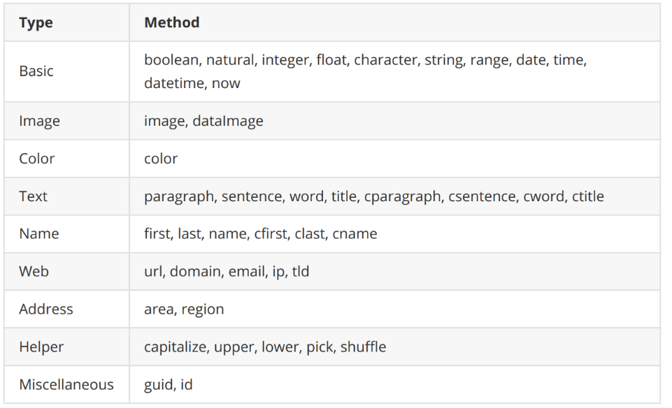


### 14.4.1 Basic

- `Random.boolean(min?max?current?)`随机生成布尔值

```Python
varbool1 = Random.boolean(); //true false各一半
varbool2 = Random.boolean( 1 , 2 ，false) //1/3的可能性是false 2/3是true
```
- `Random.natural(min?,max?)`随机生成一个自然数，什么叫自然数，就是大于等于 0 的整数

```Python
varnatural1 = Random.natural(); //默认值最大为 9007199254740992
varnatural2 = Random.natural( 4 ); //随机出来的最小值是 4
var natural3 = Random.natural( 6 , 9 );
```
- `Random.Integer(min?,max?)`生成一个随机的整数，可以是负数。
```Python
var integer1 = Random.integer();
varinteger2 = Random.integer(- 10 ); //随机最小值是- 10
var integer3 = Random.integer(- 10 , 20 );
```

- `Random.float(min?,max?,dmin?,dmax?)`随机生成一个小数浮点数,四个参数分别为，整数部分最小值最大值，小数部分最小值最大值。
```Python
var float1 = Random.float();
var float2 = Random.float( 3 , 8 );
var float3 = Random.float( 1 , 3 , 5 , 7 )
```
- `Random.character(pool?)`随机生成一个字符,pool的值可以是：
  -  ○ upper: 26个大写字母
  -  ○ lower: 26个小写字母
  -  ○ number: 0到 9 十个数字
  -  ○ sympol: `"!@#$%^&*()[]"`
```Python
varcharacter1 = Random.character();
varcharacter2 = Random.character('lower');
varcharacter3 = Random.character('upper');
varcharacter4 = Random.character('symbol');
```

- `Random.string(pool?,min?,max?)` 随机生成一个字符串，pool的值同上边四个。
```Python
varstr1 = Random.string(); //长度 3 到 7 位
varstr2 = Random.string( 5 ); //长度 5 位
varstr3 = Random.string('lower', 7 ); //长度 7 位，小写
varstr4 = Random.string( 4 , 6 ); //长度 4 到
varstr5 = Random.string('新的字符串会从这里选择 4 到 5 位', 4 , 6 ); //从第一个参数里选择 4 到 5位
```
- `Random.range(start?,stop,step?)`返回一个整型数组
  - ○ start,可选，数组起始值，闭区间
  - ○ stop,必选，数据结束值，开区间
  - ○ step,可选，数据每一项间隔值
```Python
var range1 = Random.range( 10 ); //[0,1,2,3,4,5,6,7,8,9]
var range2 = Random.range( 14 , 20 ); //[14,15,16,17,18,19]
var range3 = Random.range( 3 , 13 , 2 ); //[3,5,7,9,11]
```
-  `Random.date(format?)`返回一个随机日期的字符串,format的格式是`‘yyyy-MM-dd’`,可以随机组合
```Python
vardate1 = Random.date();
vardate2 = Random.date('yyyy-MM-dd');
vardate3 = Random.date('y-M-d');
vardate4 = Random.date('yy-MM-dd');
```
- `Random.time(format?)`返回时间字符串,format的格式是`‘HH-mm-ss’`
```Python
var time1 = Random.time();
var time2 = Random.time('HH-mm-ss');
var time3 = Random.time('J-m-s');
```
- `Random.datetime(format?)`上边两个的结合版
```Python
vardt1 = Random.datetime();
vardt2 = Random.datetime('yyyy-MM-dd HH-mm-ss');
Random.now(unit?,format?)
```
返回当前时间的字符串

### 14.4.2 Image
>一般情况下，使用dataImage更好,因为更简单，但是如果要生成高度自定义的图片，则最好用image。另外，dataImage生成的是base64编码

- `Random.image(size?,background?,foreground?,format?text?)`
  - ○ size 图片宽高，格式是'宽x高'
  - ○ background:图片的背景色，默认值#000000
  - ○ foreground：图片的文字前景色，默认#FFFFFF
  - ○ format：图片的格式，默认'.png'
  - ○ text:图片上的默认文字，默认值为参数size
- 其中size的取值范围是
```Python
[
'300x250', '250x250', '240x400', '336x280',
'180x150', '720x300', '468x60', '234x60',
'88x31', '120x90', '120x60', '120x240',
'125x125', '728x90', '160x600', '120x600',
'300x600'
]
```
- 图片的格式可以选择` .png、 .gif 、 .jpg`
```Python
var image1 = Random.image();
var image2 = Random.image('128x90');
varimage3 = Random.image('120x660','#ccc'); //前景色#ccc
varimage4 = Random.image('226x280','#eee','第三个参数是文字不是前景色');
varimage5 = Random.image('66x31','#ddd','#123456','四个参数的时候第三个参数是前景
色');
varimage6 = Random.image('240x400','#333','#1483dc','.gif','全部参数的情况下');
```
-  `Random.dataImage(size?,text?)`返回一段base64编码，两个参数同上
```Python
var di1 = Random.dataImage();
var di2 = Random.datImage('300x600');
var di3 = Random.dataImage('180x150','hahahaha');
```
### 14.4.3 Color
- `Random.color()`有好几个相关的方法
```Python
varcolor = Random.color(); //格式'#rrggbb'
varhex = Random.hex(); //好像和color没什么不同
varrgb = Random.rgb(); //生成格式如rgb(133,233,244)
varrgba = Random.rgba(); //生成个事如rgba(111,222,233,0.5)
varhsl = Random.hsl(); //生成格式(345,82,71)
```
### 14.4.4 Text

- `Random.paragraph(in?,max?,len?)`随机生成一段文本
```Python
varpara1 = Random.paragraph(); //随机生成一短文本，范围 3 到 7
varpara2 = Random.paragraph( 10 ); //随机生成长度是 10 的文本
varpara3 = Random.paragraph( 9 , 12 ); //随机生成 9 到 11 位长度的文本
```

-  `Random.sentence(min?,max?,len?)`随机生成一个句子，第一个单词的首字母大写
```Python
varsen1 = Random.sentence(); //默认长度 12 到 18
varsen2 = Random.sentence( 10 ); //随机生成一个单词个数为 10 的句子
varsen3 = Random.sentence( 5 , 10 ); //随机生成一个 5 到 9 单词个数的句子
```

- `Random.word(min?,max?,len?)`随机生成一段标题，每个单词的首字母大写
```Python
vartitle1 = Random.title(); //title中的单词个数
vartitle2 = Random.title( 6 ); //title六个单词
vartitle3 = Random.title( 7 , 12 ); //title7到 11 个单词
```
- 另外还有四个方法，四个方法前边加一个c ,返回中文内容
  - ○ `Random.cparagraph` , 返回中文文本
  - ○ `Random.csentence` , 返回中文句子
  - ○ `Random.cword` , 返回中文文字
  - ○ `Random.ctitle` , 返回中文标题
### 14.4.5 Name
```Python
varfirst = Random.first() 随机生成常见英文名
varlast = Random.last() 随机生成常见英文姓
varname = Random.name() 随机生成常见英文姓名
varcfirst = Random.cfirst() 随机生成常见中文姓
varclast = Random.clast() 随机生成常见中文名
varcname = Random.cname() 随机生成一个常见中文姓名
```

### 14.4.6 Web

- `Random.url(protocol?,host?)`随机生成一个url
  - ○ protocol 可选参数，表示网络协议，如http
  - ○ host 表示域名和端口号
```Python
var url1 = Random.url();
var url2 = Random.url('http');
var url3 = Random.url('http','58.com');
```
-  `Random.protocol()`随机生成一个域名
```Python
var protocol = Random.protocol()
```
protocol可以选的值:
`'http'、'ftp'、'gopher'、'mailto'、'mid'、'cid'、'news'、'nntp'、'prospero'、'telnet'、'rlogin'、'tn3270'、'wais'`。

- `Random.domin()`随机生成一个域名
- `Random.tld()` 随机生成一个顶级域名
```Python
vardomain = Random.domain()
vartld = Random.tld()
```
-  `Random.email(domain?)`随机生成一个email地址，domain表示域名
```Python
var email1 = Random.email();
varemail2 = Random.email('58.com') //生成xxxx@58.com
```
-  `Random.ip()`随机生成一个ip地址
```Python
var ip = Random.ip()
```

### 14.4.7 Address

- `Random.region()`随机生成一个中国的大区，如华北，西南
```Python
var region = Random.region();
```
- `Random.province()`随机生成一个中国省直辖市自治区特别行政区
```Python
var province = Random.province()
```
-  `var province = Random.province()`随机生成一个中国城市，prefix布尔值，表示是否标注所在省
```Python
var city1 = Random.city();
var city2 = Random.city(ture);
Random.country(prefix?)
```
- `Random.country(prefix?)` 随机生成一个中国县， prefix布尔值，表示是否显示所属的省市
```Python
var county1 = Random.county();
var county2 = Random.county(ture);
```

- `Random.zip()`随机生成一个六位数邮政编码
```Python
var zip = Random.zip();
```

### 14.4.8 Helper

- `Random.capitlize(word)`把第一个字母转成大写
```Python
var capitalize = Random.capitalize('hello')
```

- `Random.upper(str)`转成大写
```Python
varupper = Random.upper('zhang');
```

- `Random.lower(str)`转成小写
```Python
varlower = Random.lower('JINGWEI');
```

- `Random.pick(arr)`从数组中随机选取一个元素
```Python
var arr =Python [ 1 , 4 , 5 , 6 , 7 , 8 ];
var pick = Random.pick(arr);
```

- `Random.shuffle(arr)`;打乱数组的顺序并返回

```Python
var arr = [ 1 , 2 , 3 , 4 , 6 ];
var shuffle = Random.shuffle(arr);
```
### 14.4.9 Miscellaneous

- `Random.guid()`随机生成一个GUID
- `Random.id()`随机生成一个 18 位身份证id
```Python
varguid = Random.guid();
varid = Random.id();
```
### 14.4.10 扩展

Mock.Random 中的方法与数据模板的 `@占位符`一一对应，在需要时还可以为Mock.Random 扩展方法，然后在数据模板中通过 `@扩展方法` 引用。例如：
```Python
Random.extend({
constellation: function(date) {
	var constellations = ['白羊座'`, '金牛座', '双子座', '巨蟹座', '狮子座', '处女
	座', '天秤座', '天蝎座', '射手座', '摩羯座', '水瓶座', '双鱼座']
	return this.pick(constellations)
}
})
Random.constellation()
// => "水瓶座"
Mock.mock('@CONSTELLATION')
// => "天蝎座"
Mock.mock({
constellation: '@CONSTELLATION'
})
// => { constellation: "射手座" }
```
# 15. 企业级后台集成方案
**本节内容**
- 第一节vue-element-admin介绍
- 第二节 安装与使用
- 第三节 源码解读

## 15.1. vue-element-admin介绍

- `vue-element-admin`是一个后台前端解决方案，它基于vue 和element-ui实现。
- 内置了i18 国际化解决方案，动态路由，权限验证，提炼了典型的业务模型，提供了丰富的功能组件。
- 可以快速搭建企业级中后台产品原型。
- 地址：https://panjiachen.github.io/vue-element-admin-site/zh/guide/

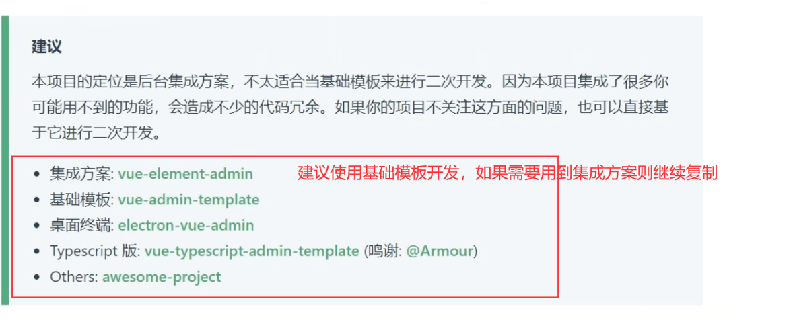

## 15.2 安装与使用

- 克隆项目，`git clone https://github.com/PanJiaChen/vue-element-admin.git%60`
- 进入项目目录，`cd vue-element-admin`
- 安装依赖，`npm install`
- 使用淘宝镜像，`npm install --registry=https://registry.npm.taobao.org`
- 本地开发 启动项目，`npm run dev`


### 15.2.1 注意事项

- 若依赖安装不成功，很大概率是node-sass安装失败。
- node-sass因为其历史原因，安装时极易失败，同时node-sass依赖了Python环境，因此电脑上需要安装配置Python2。
- 建议直接使用课程提供的包含有依赖包的项目，简化学习曲线。

### 15.2.2 项目构建过程
- 项目提供了完成的构建过程，适合前端技术的学习：https://juejin.cn/post/6844903476661583880
- 本课程对其内部的核心流程进行分析。

# 16. 跨域认证
**本节内容**
- 第一节Session认证
- 第二节Token认证
- 第三节JWT的使用

## 16.1  Session认证

互联网服务离不开用户认证。一般流程是下面这样：
- 用户向服务器发送用户名和密码。
- 服务器验证通过后，在当前对话（session）里面保存相关数据，比如用户角色、登录时间等。
- 服务器向用户返回一个session_id，写入用户的Cookie。
- 用户随后的每一次请求，都会通过Cookie，将session_id 传回服务器。
- 服务器收到session_id，找到前期保存的数据，由此得知用户的身份。

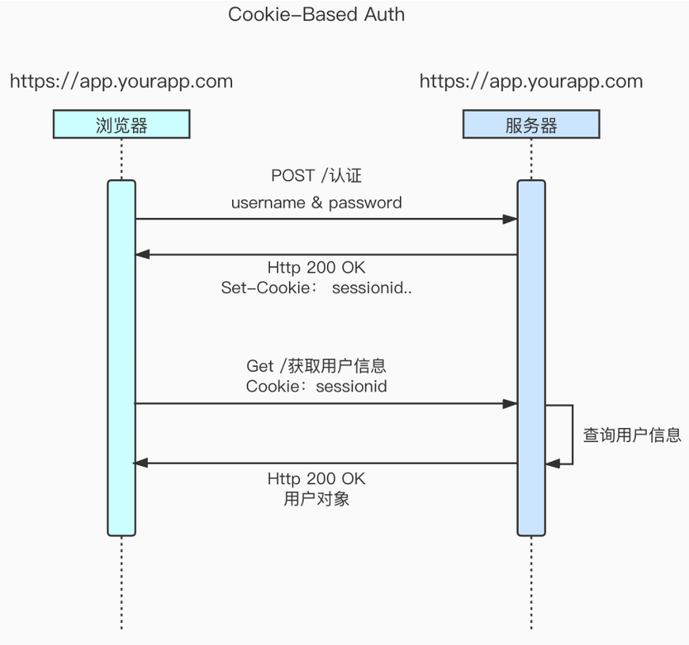

### 16.1.1 Session认证存在的问题
session 认证的方式应用非常普遍，但也存在一些问题，扩展性不好，如果是服务器集群，或者是跨域的服务导向架构，就要求session 数据共享，每台服务器都能够读取session，针对此种问题一般有两种方案：
-  一种解决方案是session 数据持久化，写入数据库或别的持久层。各种服务收到请求后，都向持久层请求数据。这种方案的优点是架构清晰，缺点是工程量比较大。
- 一种方案是服务器不再保存session 数据，所有数据都保存在客户端，每次请求都发回服务器。Token认证就是这种方案的一个代表。


## 16.2 Token认证
Token 是在服务端产生的一串字符串,是客户端访问资源接口（API）时所需要的资源凭证，流程如下：
- 客户端使用用户名跟密码请求登录，服务端收到请求，去验证用户名与密码
- 验证成功后，服务端会签发一个token 并把这个token 发送给客户端
- 客户端收到token 以后，会把它存储起来，比如放在cookie 里或者localStorage 里
- 客户端每次向服务端请求资源的时候需要带着服务端签发的token
- 服务端收到请求，然后去验证客户端请求里面带着的token ，如果验证成功，就向客户端返回请求的数据

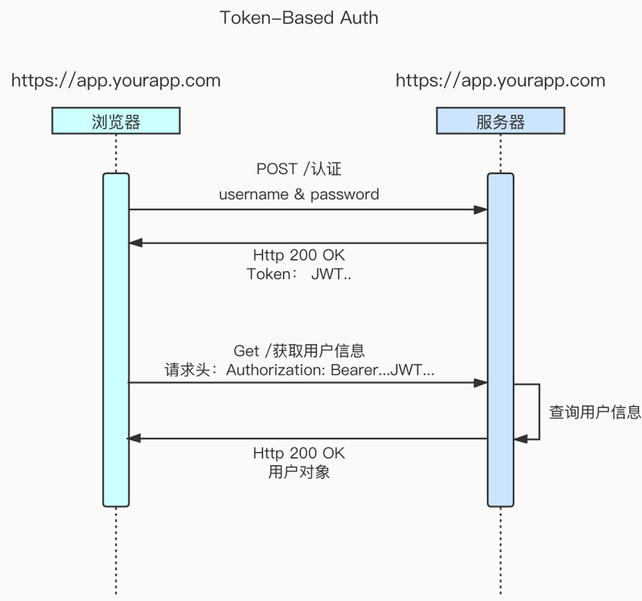

### 16.2.1 Token认证的特点
-  基于token 的用户认证是一种服务端无状态的认证方式，服务端不用存放token 数据。
-  用解析token 的计算时间换取session 的存储空间，从而减轻服务器的压力，减少频繁的查询数据库
- token 完全由应用管理，所以它可以避开同源策略

## 16.3 JWT的使用

-  JSON Web Token（简称JWT）是一个token的具体实现方式，是目前最流行的跨域认证解决方案。
-  JWT 的原理是，服务器认证以后，生成一个JSON 对象，发回给用户，具体如下：

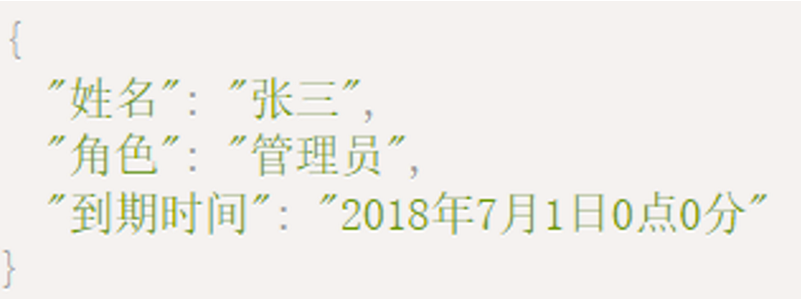

-  用户与服务端通信的时候，都要发回这个JSON 对象。服务器完全只靠这个对象认定用户身份。
-  为了防止用户篡改数据，服务器在生成这个对象的时候，会加上签名。

### 16.3.1 JWT组成
- JWT 的由三个部分组成，依次如下：
  - ○ Header（头部）
  - ○ Payload（负载）
  - ○ Signature（签名）
-  三部分最终组合为完整的字符串，中间使用. 分隔，如下：`Header.Payload.Signature`

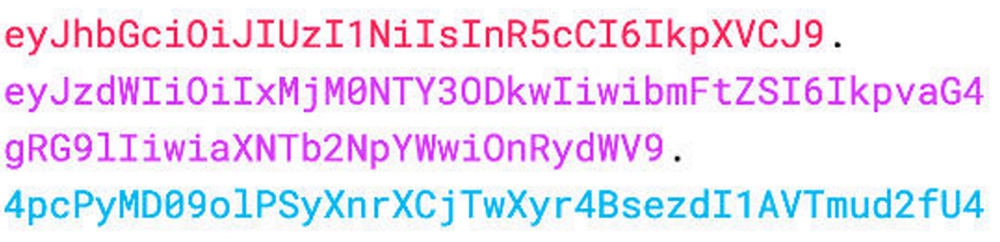

#### 16.3.1.1 Header

- Header 部分是一个JSON 对象，描述JWT 的元数据


- alg属性表示签名的算法（algorithm），默认是HMAC SHA256（写成HS256）
- typ属性表示这个令牌（token）的类型（type），JWT 令牌统一写为JWT
- 最后，将上面的JSON 对象使用Base64URL 算法转成字符串。

#### 16.3.1.2 Payload

- Payload 部分也是一个JSON 对象，用来存放实际需要传递的数据。JWT 规定了 7 个官方字段，供选用。
- 注意，JWT 默认是不加密的，任何人都可以读到，所以不要把秘密信息放在这个部分。
- 这个JSON 对象也要使用Base64URL 算法转成字符串

#### 16.3.1.3 Signature
- Signature 部分是对前两部分的签名，防止数据篡改。
- 首先，需要指定一个密钥（secret）。这个密钥只有服务器才知道，不能泄露给用户
- 然后，使用Header 里面指定的签名算法（默认是HMAC SHA256），按照下面的公式产生签名。

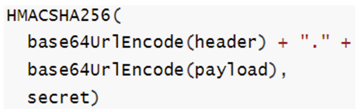

#### 16.3.2 JWT使用

- 算出签名以后，把 `Header、Payload、Signature`三个部分拼成一个字符串，每个部分之间用"点"（.）分隔，就可以返回给用户。

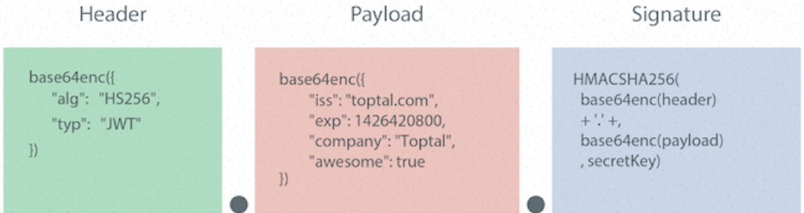

#### 16.3.3 JWT特点

- 客户端收到服务器返回的JWT，可以储存在Cookie 里面，也可以储存在localStorage。
- 客户端每次与服务器通信，都要带上这个JWT，可以把它放在Cookie 里面自动发送，但是这样不能跨域。
- 更好的做法是放在HTTP 请求的头信息Authorization字段里面，单独发送。

#### 16.3.4 JWT实现
-  加入依赖

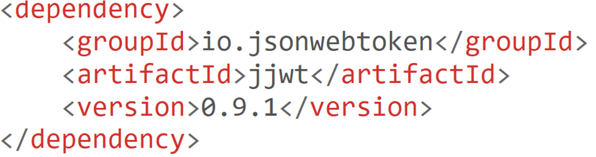

-  生成Token

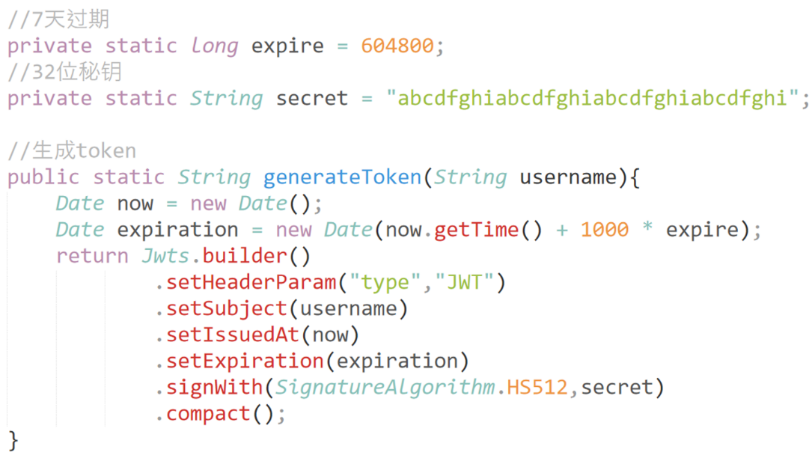

-  解析Token

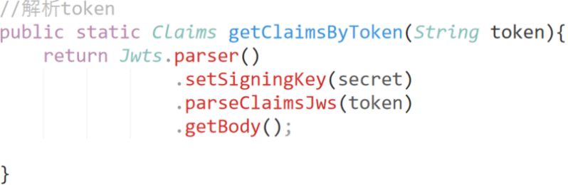


# 17. 综合应用
**本节内容**
- 后台管理系统讲解,参考视频链接即可


# 18. 云服务器使用
**本节内容**
- 第一节 云服务器介绍
- 第二节 阿里云ECS的使用
- 第三节 云服务器远程连接

# 19. 云端环境配置与项目部署
**本节内容**
参考环境配置及部署文档
## 19.1 云端环境准备
>以下部署基于Centos7 系统环境

### 19.1.1 安装MySQL
- 卸载Centos7自带mariadb
``` bash
# 查找
rpm -qa|grep mariadb
# mariadb-libs-5.5.52-1.el7.x86_64
# 卸载
rpm -e mariadb-libs-5.5.52-1.el7.x86_64 --nodeps
```
- 解压mysql
```bash
# 创建mysql安装包存放点
mkdir /usr/server/mysql
# 解压
tar xvf mysql-5.7.34-1.el7.x86_64.rpm-bundle.tar
```
- 执行安装

```bash
# 切换到安装目录
cd /usr/server/mysql/
yum -y install libaio
yum -y install libncurses*
yum -y install perl perl-devel
# 安装
rpm -ivh mysql-community-common-5.7.34-1.el7.x86_64.rpm
rpm -ivh mysql-community-libs-5.7.34-1.el7.x86_64.rpm
rpm -ivh mysql-community-client-5.7.34-1.el7.x86_64.rpm
rpm -ivh mysql-community-server-5.7.34-1.el7.x86_64.rpm
```
- 启动Mysql
```bash
#启动mysql
systemctl start mysqld.service
#查看生成的临时root密码
cat /var/log/mysqld.log| grep password
```
- 修改初始的随机密码
```bash
# 登录mysql
mysql -u root -p
Enter password: #输入在日志中生成的临时密码
# 更新root密码 设置为root
set globalvalidate_password_policy= 0 ;
set globalvalidate_password_length= 1 ;
set password=password('root');
```
- 授予远程连接权限
```bash
grant all privileges on *.* to 'root'@'%'identified by 'root';
# 刷新
flush privileges;
```
- 控制命令
```bash
#mysql的启动和关闭 状态查看
systemctl stop mysqld
systemctl status mysqld
systemctl start mysqld
#建议设置为开机自启动服务
systemctl enable mysqld
#查看是否已经设置自启动成功
systemctl list-unit-files | grep mysqld
```
- 关闭防火墙

```bash
firewall-cmd --state #查看防火墙状态
systemctl stop firewalld.service#停止firewall
systemctl disable firewalld.service#禁止firewall开机启动
```
### 19.1.2 安装nginx
- 安装命令
```bash
yum install epel-release
yum update
yum -y install nginx
```
- nginx命令
```bash
systemctl start nginx #开启nginx服务
systemctl stop nginx #停止nginx服务
systemctl restart nginx #重启nginx服务
```
### 19.1.3 配置JDK
>下载JDK，登录官方https://www.oracle.com/java/technologies/downloads/#java8 下载所需版本的JDK，版本为JDK 1.8

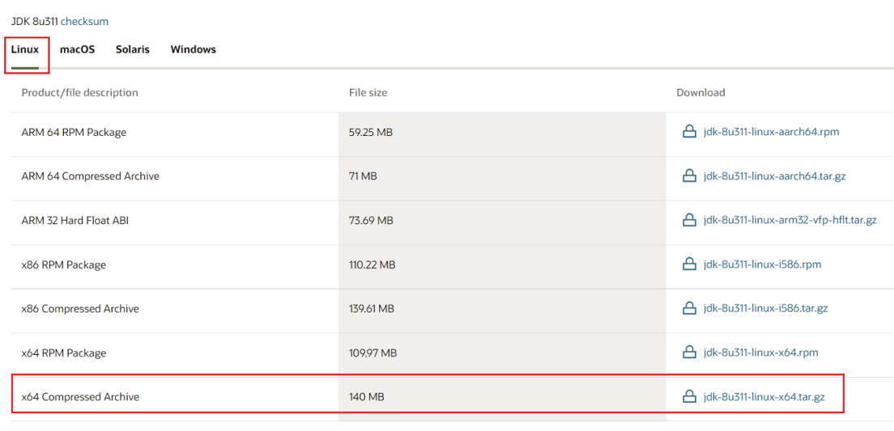

- 解压
```
tar -zvxf jdk-8u131-linux-x64.tar.gz
```
- 编辑/etc/profile 文件
```bash
vi /etc/profile
# 文件末尾增加
export JAVA_HOME=/usr/server/jdk1.8.0_131
export PATH=${JAVA_HOME}/bin:$PATH
```
- 执行source命令，使配置立即生效
```
source /etc/profile
```
- 检查是否安装成功
```
java -version
```
## 19.2.项目部署

### 19.2.1 部署Vue项目
#### 19.2.1.1 打包Vue项目
- 进入到Vue项目目录，执行
```
npm run build
```
- 将生成的dist目录上传至服务器/usr/vue/dist

#### 19.2.1.2 配置nginx
- 进入到/etc/nginx/conf.d目录，创建`vue.conf`文件，内容如下

```
server {
	listen 80;
	server_name locahost;
	location / {
		root /usr/app/dist;
		index index.html;
	}
}
```
- 使配置生效
```
nginx -s reload
```

#### 19.2.2 打包Java程序

- 双击package，会自动打包在项目路径文件夹的/target文件夹下


- 因为springboot有内置tomcat容器，这点比较方便，省去了tomcat的部署。我们到时候直接可以直接把jar包扔到linux上。

```
nohup java -jar shop-0.0.1-SNAPSHOT.jar> logName.log 2 >& 1 &
```
