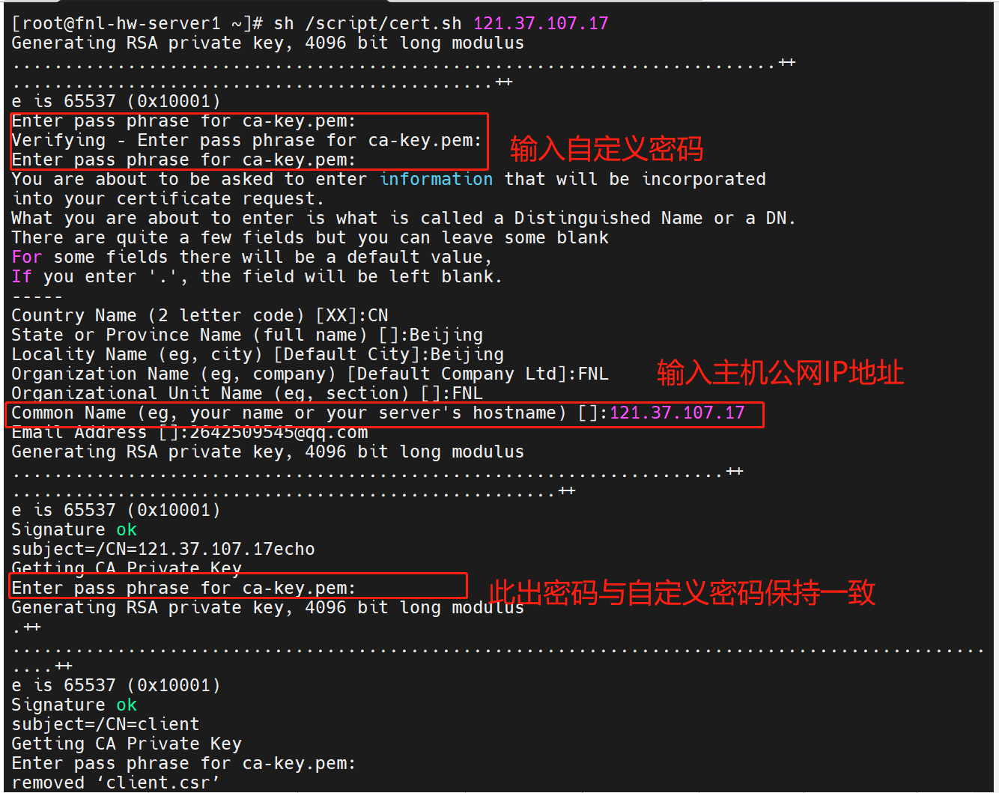
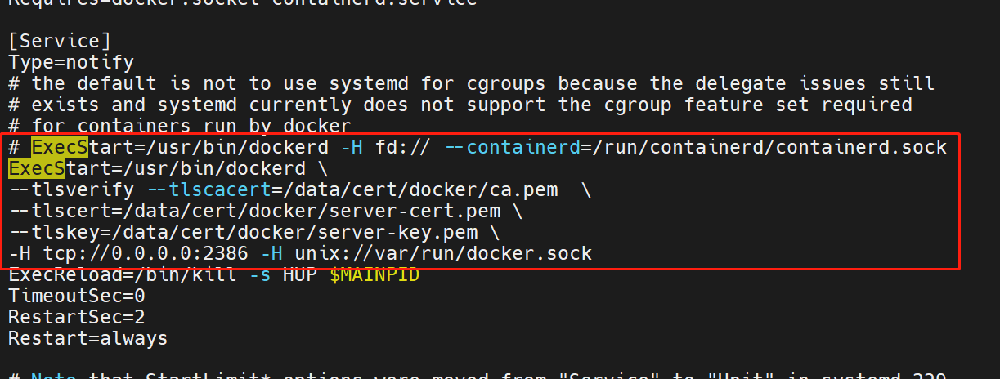
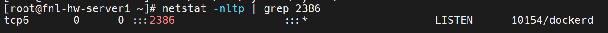
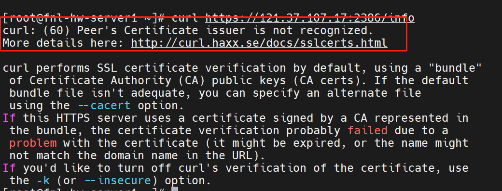
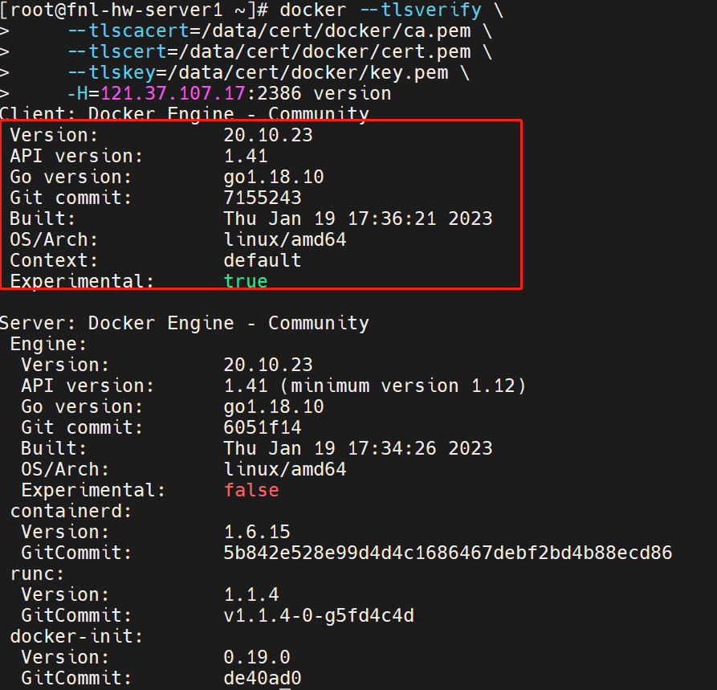
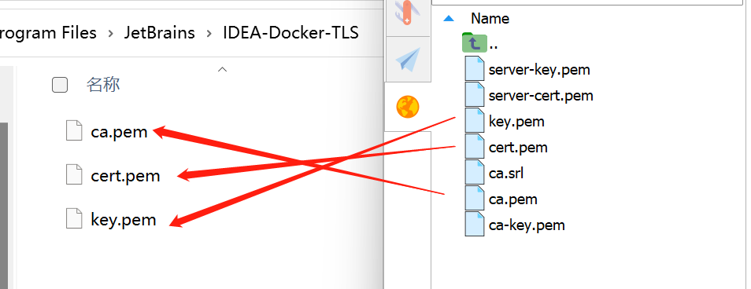
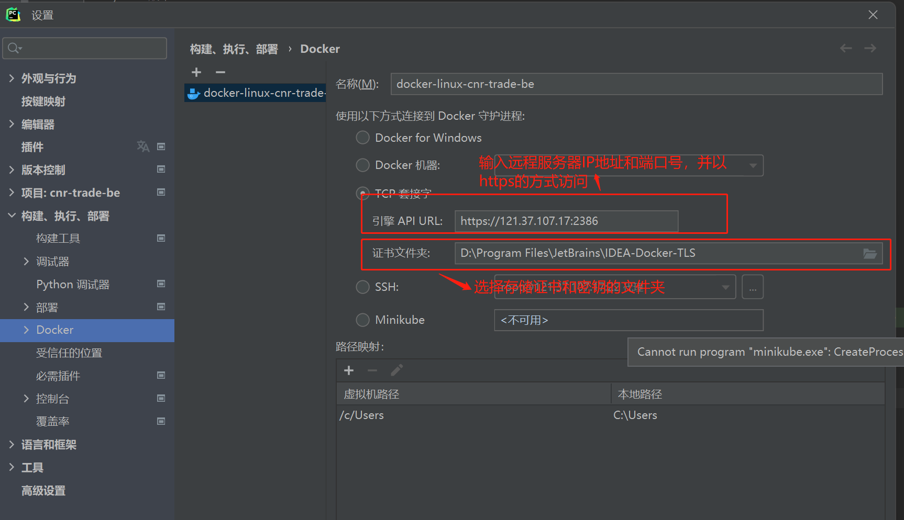
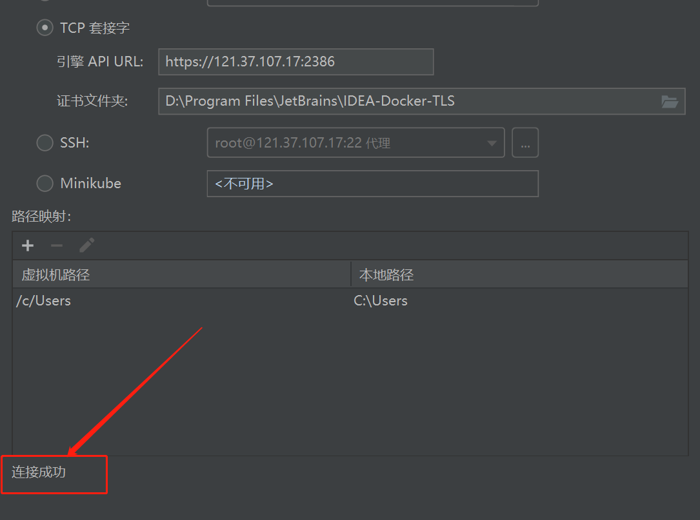
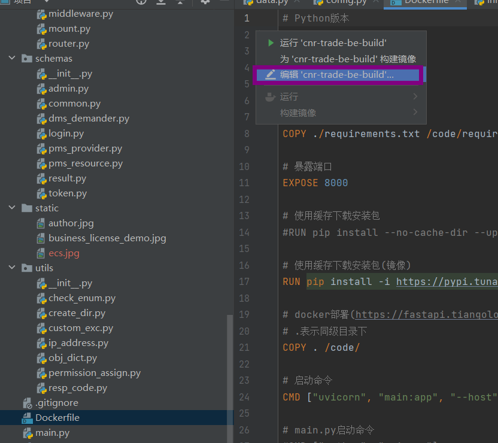

# 云服务器Docker 远程管理接口SSL证书安全接入
>解决：`javax.net.ssl.SSLPeerUnverifiedException: Hostname xxx.app.xxx.com not verified `问题。该问题的产生是因为IP地址未认证，采用本文的Shell脚本，该脚本在`echo subjectAltName = DNS:$HOST,IP:$HOST,IP:0.0.0.0,IP:127.0.0.1 >> extfile.cnf`添加`IP:$HOST`即可解决该问题
>
>参考链接：
>[Docker实战 | 第五篇：Docker启用TLS加密解决暴露2375端口引发的安全漏洞，被黑掉三台云主机的教训总结](https://blog.csdn.net/enterpc/article/details/120608659?utm_medium=distribute.pc_relevant.none-task-blog-2~default~baidujs_baidulandingword~default-1-120608659-blog-121201709.235^v38^pc_relevant_anti_t3&spm=1001.2101.3001.4242.2&utm_relevant_index=4)
>[Docker对外开放2375端口引发安全漏洞分析与解决方案](https://blog.csdn.net/u014776211/article/details/125581725)
>[官网教程](https://docs.docker.com/engine/security/protect-access/)
## 写在前面
因为云服务器开放了Docker 2375远程管理端口，且未加上任何安全措施，导致被攻击由黑客启动了某些漏洞容器。所以大家一定要注意外网环境下不要轻易打开此端口，如果要对外开放此端口，可以参考下面的解决方案，下面就Docker对外开放2375端口引发安全漏洞进行一个详细的说明。

2375：未加密的docker socket,远程root无密码访问主机
为了实现集群管理，Docker提供了远程管理接口。Docker Daemon作为守护进程，运行在后台，可以执行发送到管理接口上的Docker命令。正是因为错误的使用了Docker远端接口，引起安全漏洞。

启动Docker Daemon时，加入-H 0.0.0.0:2375，Docker Daemon就可以接收远端的Docker Client发送的指令。注意，Docker是把2375端口作为非加密端口暴露出来，一般是用在内网环境中。此时，没有任何加密和认证过程，只要知道Docker主机的IP，任何人都可以管理这台主机上的容器和镜像。黑客可以扫描出主机上的暴露的端口，因为没有加密，知道了主机IP以后，黑客就可以为所欲为了。

## 解决方案
通过添加安全传输层协议（TLS）和CA认证对2375端口进行一个验证。这样黑客只要拿不到我们的证书秘钥，就无法进行攻击了。
### 1.创建生成证书密钥的Shell脚本 和该证书密钥的存储文件夹
```bash
mkdir -p /script /data/cert/docker
touch /script/cert.sh
```

### 2.编辑脚本
```bash
vim /script/cert.sh
```
**添加如下内容**

```bash
#!/bin/bash
set -e
if [ -z $1 ];then
        echo "请输入Docker服务器主机地址"
        exit 0
fi
HOST=$1echo
mkdir -p /data/cert/dockerping 
cd /data/cert/docker

# 使用 OpenSSL 创建 CA、服务器和客户端密钥
openssl genrsa -aes256 -out ca-key.pem 4096
# Common Name 必须和 $HOST一致
openssl req -new -x509 -days 365 -key ca-key.pem -sha256 -out ca.pem

openssl genrsa -out server-key.pem 4096
openssl req -subj "/CN=$HOST" -sha256 -new -key server-key.pem -out server.csr

echo subjectAltName = DNS:$HOST,IP:$HOST,IP:0.0.0.0,IP:127.0.0.1 >> extfile.cnf


echo extendedKeyUsage = serverAuth >> extfile.cnf
openssl x509 -req -days 365 -sha256 -in server.csr -CA ca.pem -CAkey ca-key.pem \
  -CAcreateserial -out server-cert.pem -extfile extfile.cnf


openssl genrsa -out key.pem 4096
openssl req -subj '/CN=client' -new -key key.pem -out client.csr
echo extendedKeyUsage = clientAuth > extfile-client.cnf
openssl x509 -req -days 365 -sha256 -in client.csr -CA ca.pem -CAkey ca-key.pem \
  -CAcreateserial -out cert.pem -extfile extfile-client.cnf


rm -v client.csr server.csr extfile.cnf extfile-client.cnf
chmod -v 0400 ca-key.pem key.pem server-key.pem
chmod -v 0444 ca.pem server-cert.pem cert.pem
```

### 3. 执行脚本传递参数为云服务器的公网IP地址
```bash
sh /script/cert.sh 121.37.107.17
```



### 4. 配置Docker启用TLS
```bash
vim /usr/lib/systemd/system/docker.service
```
**在ExecStart属性后追加，注意此出我们不适用2375端口了，而是使用2386端口，端口可自定义，但需要云服务器安全组开放该端口**

```bash
ExecStart=/usr/bin/dockerd \
 --containerd=/run/containerd/containerd.sock \
--tlsverify --tlscacert=/data/cert/docker/ca.pem \
--tlscert=/data/cert/docker/server-cert.pem \
--tlskey=/data/cert/docker/server-key.pem \
-H tcp://0.0.0.0:2386 -H unix://var/run/docker.sock
```


### 5. 重启动Docker

```bash
systemctl daemon-reload 
systemctl restart docker
```

### 6. 查看2376端口是否启动
```bash
netstat -nltp | grep 2386
```



### 7. 不使用证书访问测试

```bash
curl https://121.37.107.17:2386/info
```

****

### 8. 使用证书访问测试
```bash
docker --tlsverify \
    --tlscacert=/data/cert/docker/ca.pem \
    --tlscert=/data/cert/docker/cert.pem \
    --tlskey=/data/cert/docker/key.pem \
    -H=121.37.107.17:2386 version
```



### 9.IDEA配置

**将客户端所需的ca.pem、cert.pem、key.pem3个密钥文件从服务器下载到本地**



**IDEA连接Docker配置修改**





### 10. 使用Dockerfile部署镜像



