# 使用GithubAction转换md文档为知乎格式并生成Gitee在线图像链接

> [md2zhihu github](https://github.com/drmingdrmer/md2zhihu/blob/main/README-cn.md)
>
> [用markdown写知乎文章的完美解决方案](https://blog.openacid.com/toolkit/md2zhihu/)
>
> 

## 1.创建github仓库

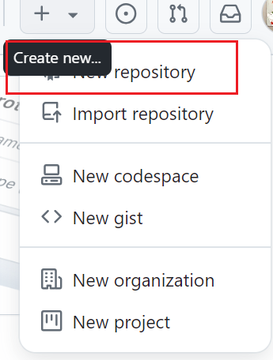

选择创建public仓库，私有仓库github action功能受限

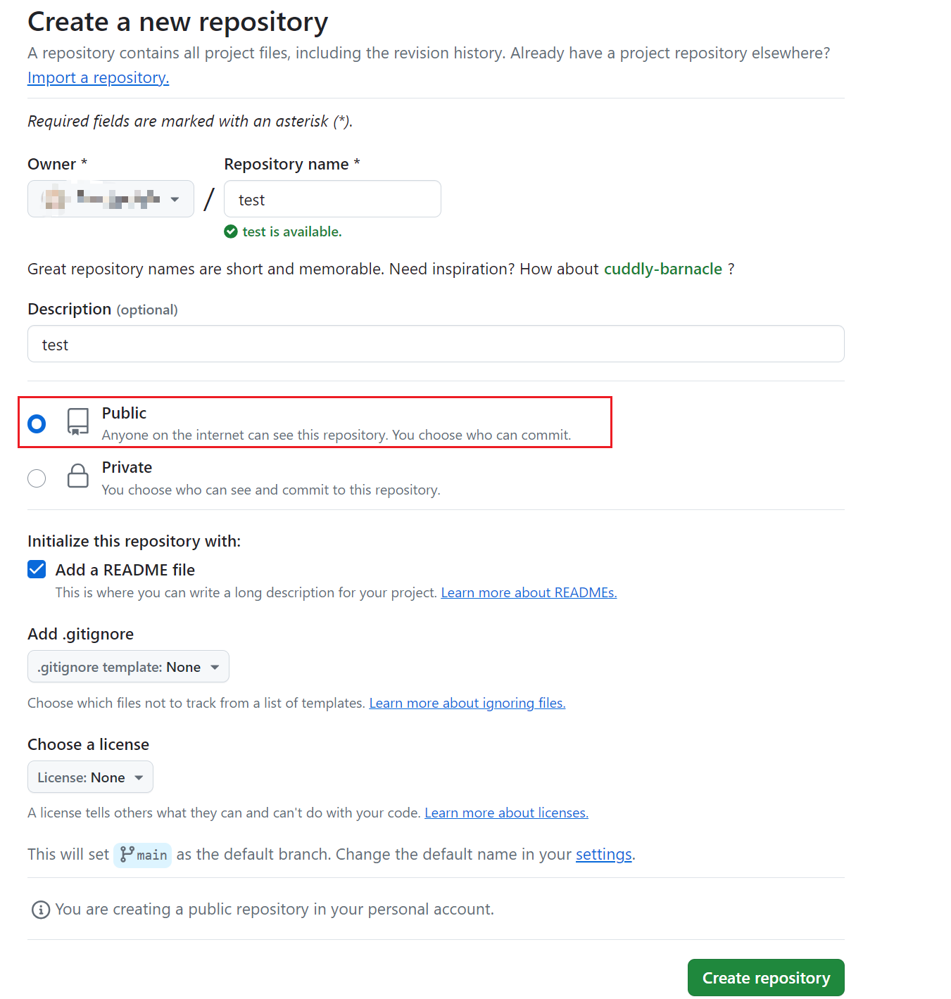

该仓库只有一个分支main


## 2. 创建gitee仓库做在线图片的存储并生成私人Token

- 创建仓库

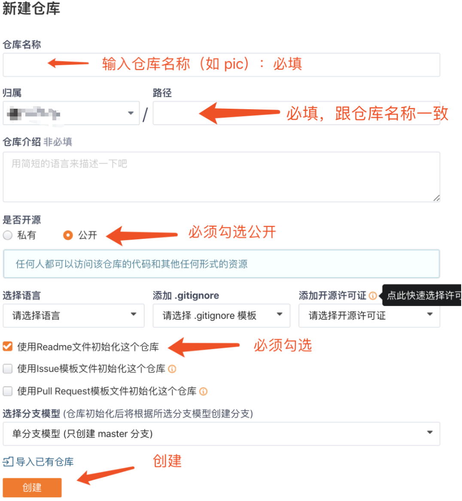

- 点击克隆/下载，保存仓库地址:`https://gitee.com/<ower拥有者>/<repo仓库名>.git`, 使用私人令牌时的用户名

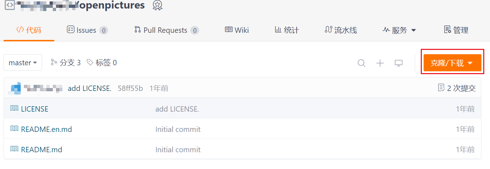

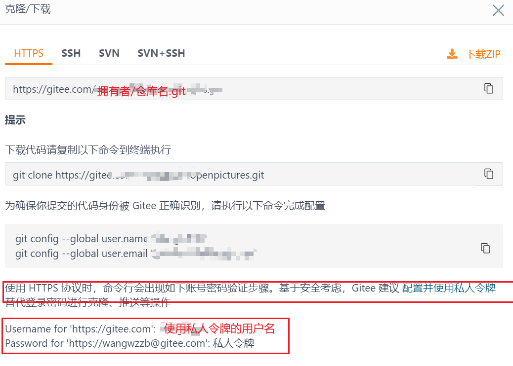

- 创建私人令牌
  - 进入 gitee 主页，点击右上角的个人图标，然后选择弹出菜单的设置选项
  - 选择左侧操作栏的私人令牌一项
  - 点击生成新令牌，然后输入令牌名称，生成 token并及时保存
  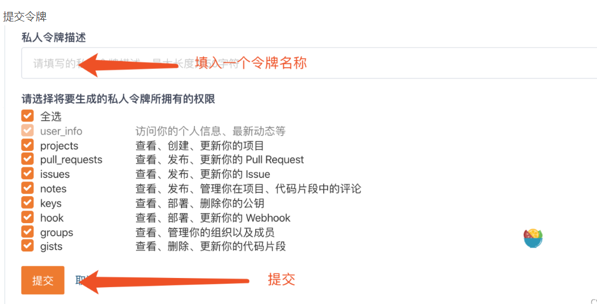
  

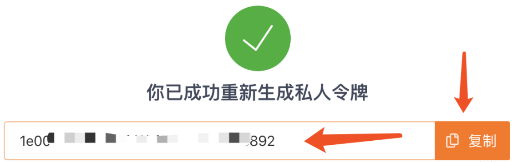


## 3.设置Github

- 设置仓库属性允许github action推送代码
  - settings----> Actions----> General---->Workflow permissions------>勾选Read and write permissions和Allow GitHub Actions to create and approve pull requests--->save


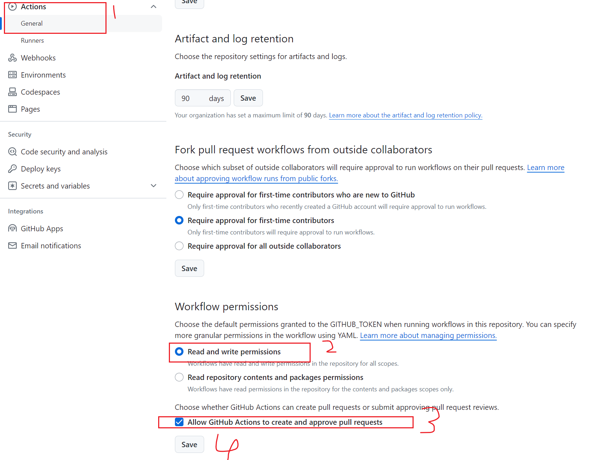


- 进入Action配置工作流yml文件

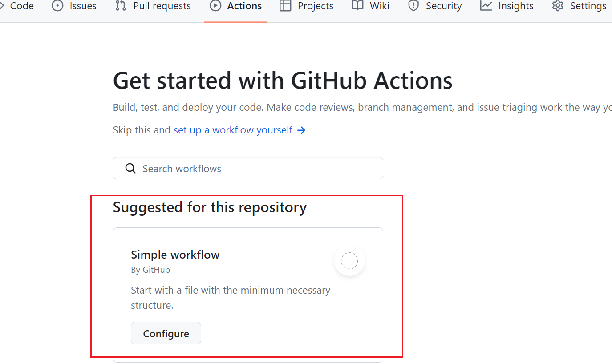


- 将yml命名为md2zhihu.yml, 设置gitee仓库地址: 按照本文第2小节保存的内容替换`asset_repo`地址的拥有者名字和仓库名称， 文件内容如下:

```bash
name: md2zhihu
on: [push]
jobs:
  md2zhihu:
    runs-on: ubuntu-latest
    steps:
    - uses: actions/checkout@v2
    - uses: drmingdrmer/md2zhihu@main
      env:
        GITHUB_USERNAME: ${{ github.repository_owner }}
        GITHUB_TOKEN: ${{ secrets.GITHUB_TOKEN }}
      with:
        pattern: >
            _posts/*.md
            _posts/*.markdown

        asset_repo: https://${{secrets.GITEE_PUSH_PIC_REPO}}@gitee.com/<ower拥有者>/<repo仓库名>.git
```

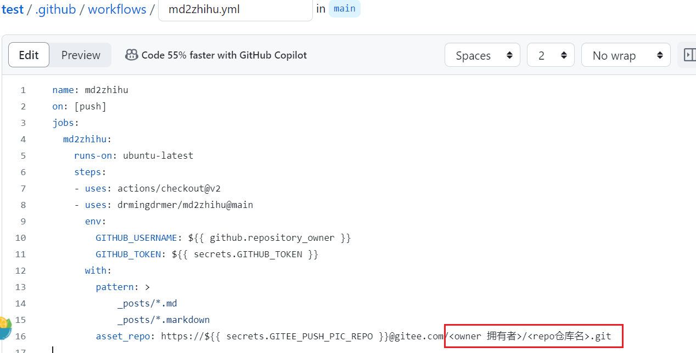

推送代码后， `md2zhihu action`将创建一个新分支 `master-md2zhihu`， 转换项目`_posts/` 目录中的 Markdown 文件，并将它们保存在 `_md2zhihu` 目录中。

- 提交workflow yml文件修改

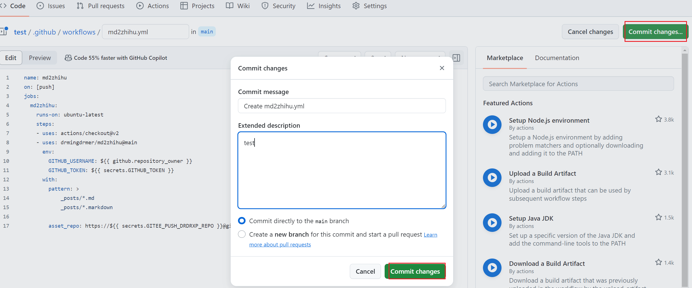

- 设置变量`secrets.GITEE_PUSH_PIC_REPO`为gitee仓库私人令牌

  - 添加actions 仓库 secrets， 设置环境变量

  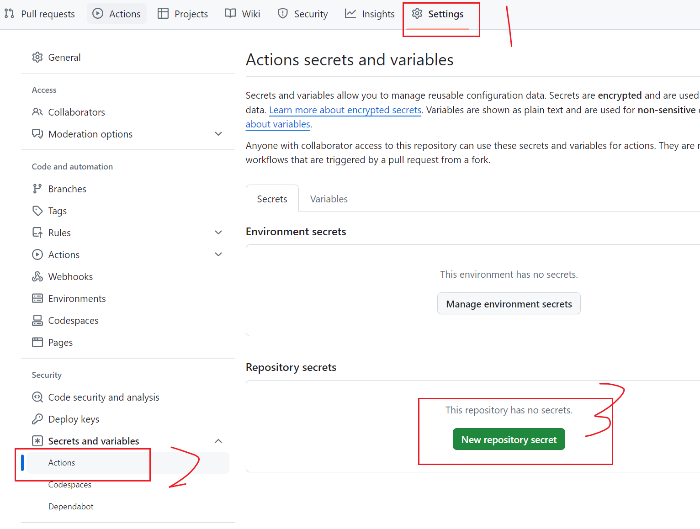

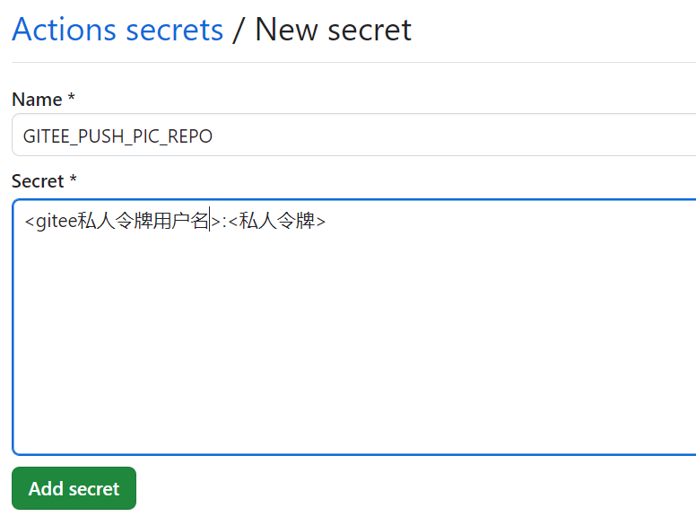


## 3. 创建本地仓库添加目的转换文件并推送本地仓库到远端

- 查看github账户的邮箱

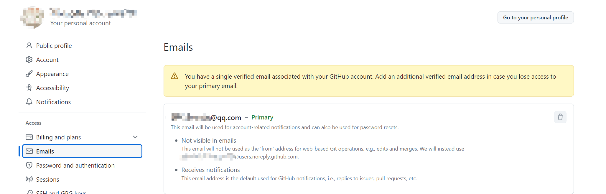

- 配置ssh密钥，保持和github的安全连接

  -  `ls -al ~/.ssh`检查输出中是否存在以下文件：id_rsa（私钥）id_rsa.pub（公钥）

  -  如果`id_rsa.pub`文件存在，` cat ~/.ssh/id_rsa.pub`复制公钥

  -  如果不存在： ①`cd ~/.ssh //进入用户主目录`,②` ssh-keygen -t rsa -C "youremail@example.com"`, ③`cat id_rsa.pub`复制公钥

  -  登录github 右上角账户设置----> SSH and GPG keys---->new ssh key---->添加刚复制的密钥并起一个title 用以标识你的设备（随便命名）

  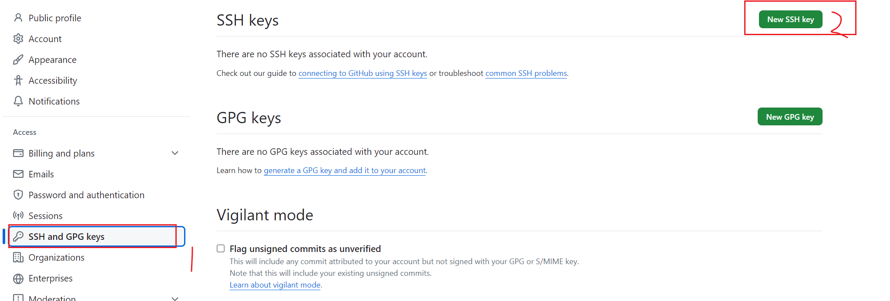

  

- 创建一个本地文件夹（本地项目），专门用于转化md文章为知乎格式，并初始化`git init`(windows可下载 git bash命令行软件)

- 与远程github仓库建立关联: `$ git remote add origin git@github.com:[你的用户名称]/[你的仓库名称].git`

- 切换 分支 到Main `git branch -M main`

- 拉取远程main分支与本地main分支合并`git pull origin main:main`

- 在本地仓库文件夹下创建`_posts`文件夹，并将想要转换的md文件及图片文件夹放入其中

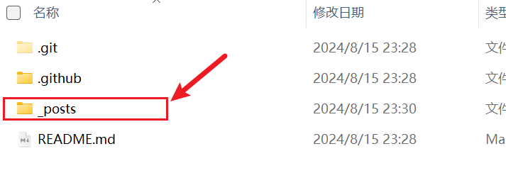

- 更新本地文件仓库下所有文件`git add -A`
- 提交此次更新`git commit -m “添加了目的转化md文件及引用本地图片文件”`
- 推送更新到github仓库`git push -u origin main`		

github仓库查看action状况


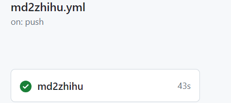


## 4. 获取生成后文件

- 查看仓库分支

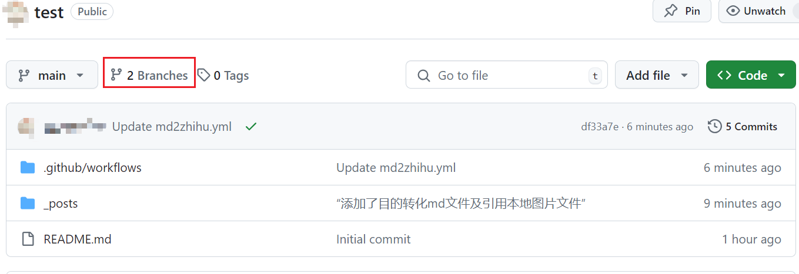

- 进入 `main-md2zhihu`分支 `_md2zhihu`文件夹

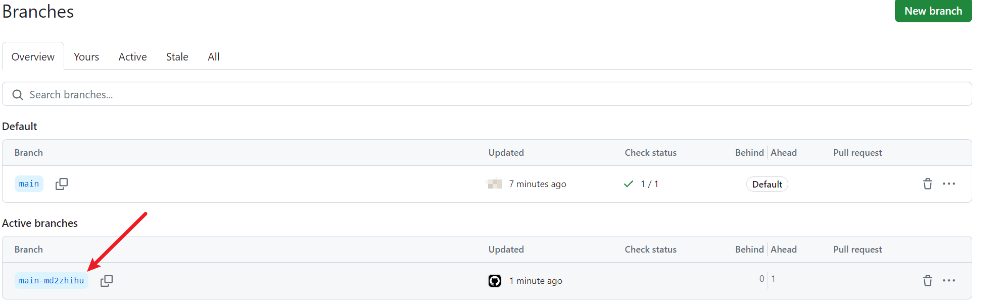

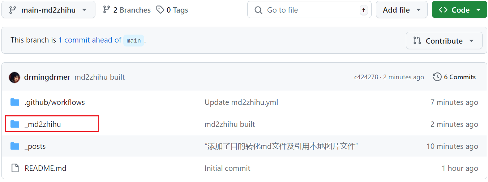

- 以下就是转换出来的文件

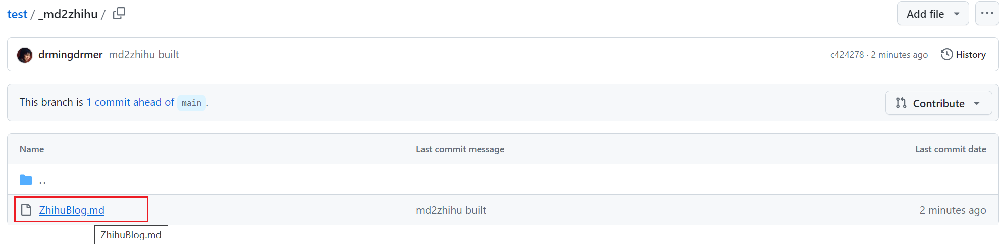

- 点击文件，并点击下载按钮，下载到本地后，在知乎编辑器中以md文件方式导入

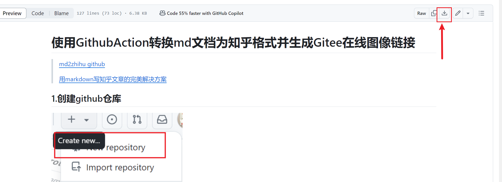


## 5. 后记

每次在本地写完一篇新的文章， 只需要替换`_post`文件夹下内容，然后重新执行后续步骤即可


